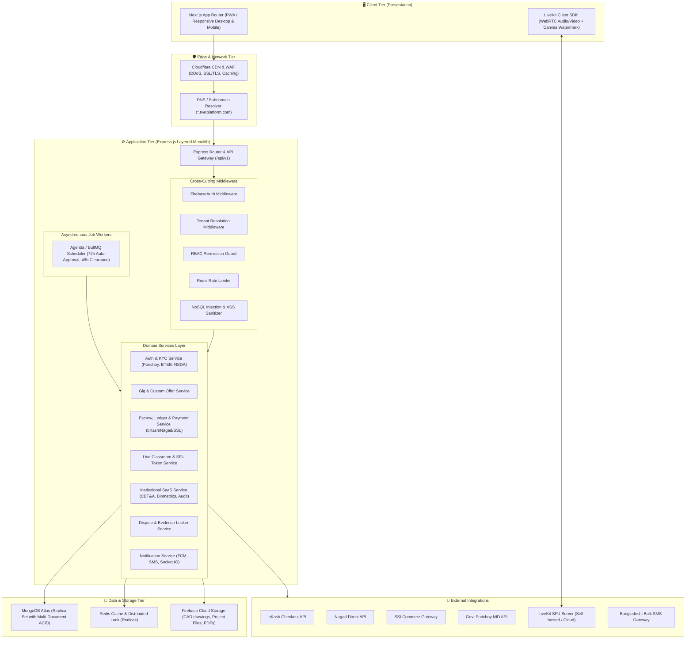
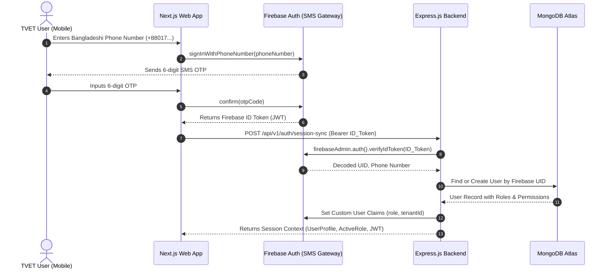
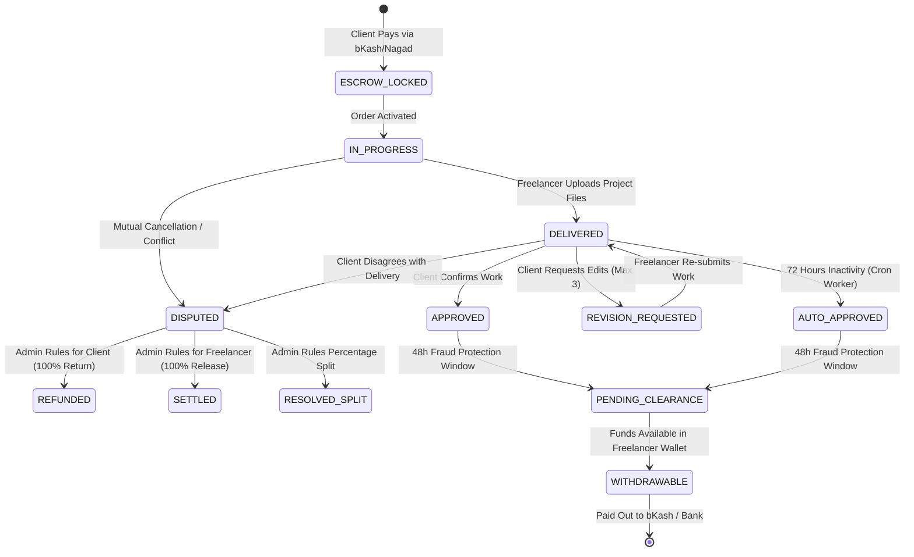
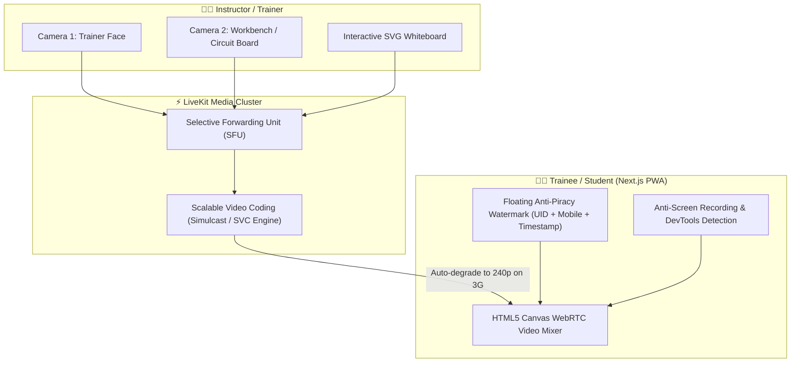
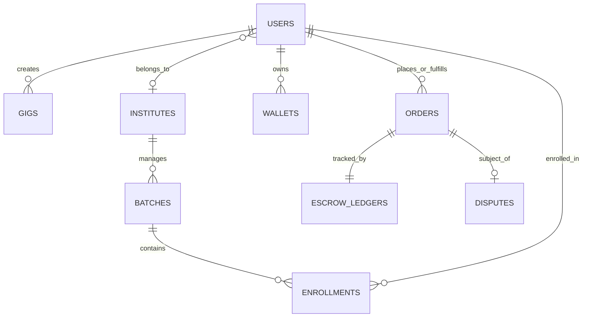

# 🏛️ System Architecture Document (Technical Blueprint)
## 🇧🇩 TVET Freelancing & Live Skill-Training SaaS Platform

**Version:** 1.0.0  
**Pattern:** Layered Monolith Architecture (Modulith)  
**Core Technologies:** Next.js (Frontend & PWA) + Express.js (Core Backend) + MongoDB Atlas (Multi-Document ACID) + Firebase (Auth, FCM, Storage) + LiveKit (WebRTC SFU)  
**Target Domain:** TVET Marketplace, Live Practical Labs & Multi-Tenant Institutional SaaS (BTEB & NSDA Alignment)

---

## 1. 🌐 Architectural Philosophy & System Overview

The platform is designed as a **Layered Monolith (Modular Monolith)**. A modular monolith provides the operational simplicity of a single deployable unit while enforcing strict boundaries between functional modules (Marketplace, Escrow, Classroom, and Institutional SaaS). This avoids the latency, network complexity, and operational overhead of microservices while ensuring that financial ACID guarantees and multi-tenant data isolations are strictly maintained.


---

## 2. 🧱 Comprehensive Layered Monolith Architecture (End-to-End Tiers)

The application follows a rigorous **6-Tier Layered Architecture**. Each incoming request flows sequentially through well-defined boundaries, preventing leaky abstractions and ensuring that domain logic, security policies, and database transactions remain isolated and easily testable.

```mermaid
flowchart TD
    subgraph L1 ["1️⃣ Client Layer (Next.js 14+ PWA / Web Client)"]
        RSC["React Server Components (SSR / SEO)"]
        RCC["Client Components (State, LiveKit Player, Canvas Watermark)"]
        AxiosClient["Axios Interceptor (Bearer Token & Subdomain Injection)"]
    end

    subgraph L2 ["2️⃣ API Gateway & Middleware Layer (Express.js Entry)"]
        ReverseProxy["Cloudflare CDN & Reverse Proxy (*.tvetplatform.com)"]
        SubdomainGuard["Subdomain & Tenant Resolver (req.tenantId)"]
        SecurityWAF["Helmet, CORS, NoSQL Sanitizer & Redis Rate Limiter"]
        AuthMiddleware["Firebase Auth Token Validator (JWT Verify)"]
        RBACMiddleware["Role & Permission Guard (checkRole)"]
        ValidationGuard["Zod DTO Request Body Validator"]
        ChatFilter["Anti-Disintermediation Regex Filter Middleware"]
    end

    subgraph L3 ["3️⃣ Controller Layer (HTTP Orchestration)"]
        BaseController["Standardized Controller Base (asyncHandler)"]
        ReqParser["Request Params / Query / DTO Extraction"]
        RespFormatter["Unified JSON Response Formatter (200, 201, 400, 500)"]
    end

    subgraph L4 ["4️⃣ Service / Business Logic Layer (Domain Services)"]
        OrderService["Order & Milestone Service (FSM Coordinator)"]
        EscrowService["Escrow & Double-Entry Ledger Service"]
        KYCService["KYC & Porichoy Verification Service"]
        LiveKitService["LiveKit WebRTC SFU Token Service"]
        InstituteService["Institutional Multi-Tenant SaaS Service"]
        TransactionBoundary["ACID Transaction Boundary Manager (session.withTransaction)"]
    end

    subgraph L5 ["5️⃣ Data Access Layer (Repository Pattern / DAL)"]
        BaseRepo["BaseRepository<T> (Generic CRUD)"]
        TenantScopedRepo["TenantAwareRepository (Auto-injects { tenantId })"]
        OrderRepo["OrderRepository (Atomic status transitions)"]
        LedgerRepo["LedgerRepository (Double-entry credit/debit pairs)"]
        InstituteRepo["InstituteRepository (Complex aggregation pipelines)"]
    end

    subgraph L6 ["6️⃣ Database & Storage Layer (Persistence Tier)"]
        MongoCluster["MongoDB Atlas Replica Set (Multi-Document ACID)"]
        RedisCluster["Redis Cache & Distributed Mutex Lock (Redlock)"]
        FirebaseBucket["Firebase Cloud Storage (CAD Drawings, Private Signed URLs)"]
    end

    L1 --> L2
    L2 --> L3
    L3 --> L4
    L4 --> L5
    L5 --> L6
```



---

### 2.1 🖥️ Layer 1: Client Layer (Frontend Presentation Tier - Next.js 14+)

* **Framework & Core Engine:** Next.js 14 App Router, TypeScript, React 18+.
* **Rendering Strategy:**
  * **React Server Components (RSC):** Utilized for public marketplace gig catalogs, trainer landing pages, and institutional portal homepages for instant First Contentful Paint ($<2.5\text{s}$) and maximum SEO indexability.
  * **React Client Components (RCC):** Utilized for dynamic interactive modules (LiveKit video rooms, chat rooms, custom offer negotiation forms, and order escrow status timers).
* **State Management & Network Caching:**
  * **TanStack Query (React Query):** Manages server-state caching, automatic background revalidation, and optimistic UI updates for orders and gigs.
  * **Zustand:** Lightweight global store for client-side transient state (active user session, current user role context, LiveKit media devices, and unread notification counters).
* **PWA & Low-Bandwidth Optimizations:**
  * Configured as a Progressive Web App (PWA) with service workers caching static assets (icons, typography, CSS tokens) for offline reliability in rural regions.
  * Native dynamic import / code-splitting ensuring initial JavaScript execution bundle remains $< 150\text{ KB}$.
* **Canvas Dynamic Watermark Player:**
  * Custom WebRTC video component mixing the LiveKit media stream into an off-screen HTML5 Canvas. Overlays user metadata (`Name`, `Phone`, `Firebase UID`) with pseudo-random vector paths, accompanied by DevTools opening detection to mitigate screen recording.

---

### 2.2 🛡️ Layer 2: API Gateway & Middleware Layer (Express.js Entry & Security)

The Gateway is the first point of contact for all backend HTTP and WebSocket requests, enforcing security, rate limiting, and contextual routing before any controller is reached:

1. **Subdomain & Tenant Resolution Middleware (`tenantResolver`):**
   * Inspects the `Host` header (e.g. `mirpur-ttc.tvetplatform.com`).
   * Queries Redis for cached tenant records.
   * If valid, injects `req.tenantId` and `req.tenant` into the Express request context; otherwise falls back to the public marketplace context (`req.tenantId = null`).
2. **Security & Rate Limiting Guard:**
   * **`helmet()`**: Sets secure HTTP headers (Content-Security-Policy, HSTS, X-Content-Type-Options).
   * **`express-rate-limit` + Redis Store:** Enforces sliding-window rate limits (100 requests per 15 minutes per IP; 5 attempts per 10 minutes for SMS OTP endpoints).
   * **`express-mongo-sanitize`**: Strips out prohibited characters (e.g., `$`, `.`) to completely prevent NoSQL injection attacks.
3. **Authentication Token Verification Middleware (`verifyFirebaseAuth`):**
   * Extracts the `Bearer <token>` from the `Authorization` header.
   * Uses the Firebase Admin SDK to cryptographically verify token signature and validity.
   * Decodes claims and binds the authenticated user payload to `req.user`.
4. **Role-Based Authorization Guard (`authorizeRoles`):**
   * Higher-order middleware checking whether `req.user.activeRole` satisfies the required route permissions (e.g. `authorizeRoles("INSTITUTE_ADMIN", "SUPER_ADMIN")`).
5. **Request Body Validation Guard (`validateDto`):**
   * Leverages Zod schemas to validate incoming DTOs (`req.body`, `req.query`, `req.params`) before reaching the controller. Automatically responds with HTTP 422 and field-level error messages upon schema violations.
6. **Anti-Disintermediation Chat Shield:**
   * Specialized regex scanning middleware for chat endpoints that blocks phone numbers (`013-019`, Bengali numerals `০-৯`), personal bKash/Nagad keywords, and email strings.

---

### 2.3 🎮 Layer 3: Controller Layer (HTTP Request & Response Orchestration)

The Controller Layer is strictly responsible for HTTP protocol mapping and contains **zero business logic**:

* **Core Responsibilities:**
  1. Extracting path parameters, query strings, and validated DTO bodies from `req`.
  2. Extracting context (`req.user.id`, `req.tenantId`).
  3. Invoking the appropriate Domain Service method.
  4. Packaging domain output into a standardized JSON API envelope.
  5. Setting appropriate HTTP status codes (`200 OK`, `201 Created`, `204 No Content`).
* **Unified Error Handling (`asyncHandler` Wrapper):**
  * All controller methods are wrapped with an asynchronous error boundary, passing unhandled exceptions to the Global Error Handler:
    ```typescript
    export const asyncHandler = (fn: RequestHandler) => 
      (req: Request, res: Response, next: NextFunction) => {
        Promise.resolve(fn(req, res, next)).catch(next);
      };
    ```
* **Standardized API Response Structure:**
  ```typescript
  interface ApiResponse<T> {
    success: boolean;
    statusCode: number;
    message: string;
    data?: T;
    meta?: { page?: number; limit?: number; total?: number };
    timestamp: string;
  }
  ```

---

### 2.4 ⚙️ Layer 4: Service / Business Logic Layer (Domain Services)

The Service Layer encapsulates all business rules, domain workflows, and ACID transaction boundaries. Controllers delegate 100% of functional requirements to this layer:

* **Key Domain Services:**
  * **`OrderService`:** Manages the order lifecycle state machine (`ESCROW_LOCKED` $\rightarrow$ `IN_PROGRESS` $\rightarrow$ `DELIVERED` $\rightarrow$ `APPROVED`). Validates revision quotas, delivery file extensions, and triggers 72-hour auto-approval timers.
  * **`EscrowService`:** Coordinates the double-entry accounting ledger. Calculates 15% freelancer commission and 5% client/institutional platform fees. Wraps multi-account money movements in MongoDB Atlas multi-document ACID transactions.
  * **`KYCService`:** Coordinates NID verification via Porichoy API, processes BTEB roll/reg uploads, and validates NSDA NTVQF certificate expiration dates.
  * **`LiveKitService`:** Manages video room life-cycles, generates cryptographically signed LiveKit Access Tokens, and aggregates attendee session durations for digital attendance records.
  * **`InstituteService`:** Manages multi-shift departments, batch scheduling, CBT&A competency assessments (Competent / Not Yet Competent), and compiles official 1-click SEIP/ASSET audit reports.
* **ACID Transaction Boundary Pattern:**
  * Any service operation impacting financial balances or multi-document state executes inside an explicit transaction session:
    ```typescript
    public async approveOrder(orderId: string, clientId: string): Promise<IOrder> {
      const session = await mongoose.startSession();
      session.startTransaction();
      try {
        const order = await this.orderRepo.findByIdWithLock(orderId, session);
        // Business rule checks (ownership, current state DELIVERED)
        // Execute Double-Entry ledger allocations
        await this.ledgerRepo.createEntry({ ... }, session);
        // Update order state to APPROVED
        await this.orderRepo.updateStatus(orderId, "APPROVED", session);
        
        await session.commitTransaction();
        return order;
      } catch (error) {
        await session.abortTransaction();
        throw error;
      } finally {
        session.endSession();
      }
    }
    ```

---

### 2.5 📦 Layer 5: Data Access Layer (Repository Pattern / DAL)

The Data Access Layer abstracts Mongoose and MongoDB Atlas database queries behind clean repository interfaces:

* **Generic Base Repository (`BaseRepository<T>`):**
  * Provides boilerplate CRUD operations (`findById`, `create`, `update`, `delete`, `paginate`).
* **Multi-Tenant Scoped Repository (`TenantAwareRepository<T>`):**
  * Automatically intercepts every query and mutation, injecting `{ tenantId: this.tenantId }` into the filter criteria. This guarantees that an Institute Admin in Chittagong cannot inadvertently query student or batch records from Dhaka Polytechnic.
* **Transaction Session Injection:**
  * Every repository method accepts an optional `ClientSession` argument, enabling seamless propagation of ACID transactions initiated by the Service Layer.
* **Optimistic Concurrency Control:**
  * Critical collections (Wallets, Orders) utilize document versioning (`__v`) to detect and abort concurrent modification attempts (e.g., race conditions on double-withdrawals).

---

### 2.6 💾 Layer 6: Database & Storage Layer (Persistence Tier)

The physical persistence tier is composed of three complementary engines tailored for specific data access patterns:

1. **MongoDB Atlas (Primary ACID Document Store):**
   * **Topology:** 3-Node Replica Set (Primary-Secondary-Secondary) offering 99.9% uptime SLA.
   * **Write/Read Concerns:** Configured with `writeConcern: "majority"` and `readConcern: "majority"` to guarantee linearizable consistency for all financial transactions and escrow movements.
   * **Compound Indexing Strategy:**
     * `orders`: `{ client: 1, escrowStatus: 1 }`, `{ freelancer: 1, escrowStatus: 1 }`
     * `institutes`: `{ subdomain: 1 }` (Unique), `{ tenantId: 1, batchId: 1 }`
     * `ledgers`: `{ idempotencyKey: 1 }` (Unique), `{ account: 1, clearedAt: 1 }`
2. **Redis Cluster (In-Memory Caching & Distributed Locks):**
   * **Subdomain & Tenant Cache:** Caches subdomain-to-tenant mapping with a 1-hour TTL to eliminate database lookups on every incoming request.
   * **Redlock (Distributed Mutex):** Applied on wallet payout endpoints to guarantee that concurrent withdrawal clicks from multiple devices cannot result in negative balances.
   * **Sliding-Window Rate Limiting:** Maintains request timestamps for IP and user-based throttling.
3. **Firebase Cloud Storage (Object Storage):**
   * **Bucket Architecture:**
     * `public-assets/`: Profile pictures, gig cover images, institution logos (Served via global CDN).
     * `secure-cad-vault/`: Raw CAD drawings (`.dwg`, `.step`, `.sldprt`), project deliverables, and NID documents.
   * **Access Control:** All files in `secure-cad-vault/` are strictly private; users access deliverables only via short-lived (15-minute) signed download URLs generated by the API after validating order participation.

## 3. 📂 Recommended Project Codebase Structure

```
tvetbangladesh/
├── apps/
│   ├── web/                           # Next.js 14+ Frontend (App Router)
│   │   ├── src/
│   │   │   ├── app/                   # App Router pages & layouts
│   │   │   │   ├── (auth)/            # Login, OTP verification
│   │   │   │   ├── (marketplace)/     # Gigs, search, order checkout
│   │   │   │   ├── (classroom)/       # LiveKit WebRTC practical room
│   │   │   │   ├── (institute)/       # Multi-tenant white-label dashboard
│   │   │   │   └── (admin)/           # Super admin arbitration panel
│   │   │   ├── components/            # Reusable UI components
│   │   │   │   ├── classroom/         # Canvas watermark, dual-camera player
│   │   │   │   ├── marketplace/       # Gig cards, 3-tier pricing table
│   │   │   │   └── shared/            # Buttons, modals, forms
│   │   │   ├── hooks/                 # React custom hooks
│   │   │   ├── lib/                   # Firebase client, LiveKit client, Axios
│   │   │   └── styles/                # CSS modules / Vanilla design tokens
│   │   └── public/                    # PWA icons, manifest, static assets
│   │
│   └── api/                           # Express.js Backend Server
│       ├── src/
│       │   ├── config/                # Environment, Firebase Admin, Mongo, Redis
│       │   ├── common/                # Shared utilities, constants, base classes
│       │   │   ├── errors/            # Custom AppError, NotFoundError, etc.
│       │   │   ├── guards/            # RBAC, tenant isolation guards
│       │   │   └── utils/             # AES-256 crypto, regex chat filters
│       │   ├── middlewares/           # Auth, Tenant, Role, Rate-limit, Error
│       │   ├── modules/               # Domain-driven modular monolith units
│       │   │   ├── auth/              # Auth routes, controllers, services
│       │   │   ├── kyc/               # Porichoy, BTEB & NSDA verification
│       │   │   ├── gigs/              # TVET gigs & custom offer negotiations
│       │   │   ├── orders/            # Order state machine & milestones
│       │   │   ├── escrow/            # Double-entry ledger & payment handlers
│       │   │   ├── livekit/           # WebRTC SFU room token & analytics
│       │   │   ├── institutes/        # Multi-tenant SaaS, CBT&A, audit export
│       │   │   ├── disputes/          # Evidence locker & arbitration
│       │   │   └── notifications/     # FCM, Socket.IO, Bulk SMS
│       │   ├── jobs/                  # Agenda / BullMQ workers (Cron jobs)
│       │   │   ├── autoApproval.job.ts
│       │   │   ├── payoutClearance.job.ts
│       │   │   └── certificateExpiry.job.ts
│       │   ├── server.ts              # HTTP & WebSocket initialization
│       │   └── app.ts                 # Express middleware assembly
│       └── tests/                     # Unit & integration test suites
```

---

## 4. 🔐 Authentication & Authorization Architecture

### 4.1 Authentication Lifecycle (Firebase Phone OTP + Express Backend)



### 4.2 Role-Based Access Control (RBAC) & Custom Claims

Firebase Custom Claims encode authorization directly into the signed client token:
```typescript
interface CustomUserClaims {
  uid: string;
  roles: Array<"CLIENT" | "FREELANCER" | "STUDENT" | "INSTITUTE_ADMIN" | "INSTITUTE_INSTRUCTOR" | "ENTERPRISE_RECRUITER" | "SUPER_ADMIN">;
  activeRole: string;
  tenantId?: string; // Present if user belongs to an institute tenant
  isVerifiedTVETPro: boolean;
}
```

### 4.3 Dual-Profile Context Switching
Faculty members (`INSTITUTE_INSTRUCTOR`) can operate as independent freelance sellers (`FREELANCER`). The backend enforces strict cryptographic separation:
* When `activeRole === "INSTITUTE_INSTRUCTOR"`, all data queries automatically append `{ tenantId: user.tenantId }`.
* When switching via `POST /api/v1/auth/switch-role` to `"FREELANCER"`, the session context drops the `tenantId` scope, ensuring the teacher cannot access institutional students for private solicitation.

---

## 5. 🏢 Multi-Tenant SaaS Architecture (Subdomain & Data Isolation)

Institutions (Dhaka Polytechnic, Mirpur TTC, Uttara STP) access their dedicated workspace via subdomains:
* `https://dpi.tvetplatform.com` $\rightarrow$ Dhaka Polytechnic Institute
* `https://mirpur-ttc.tvetplatform.com` $\rightarrow$ Technical Training Center Mirpur

```mermaid
flowchart TD
    Req[Incoming HTTP Request] --> ResolveHost{Check Hostname}
    ResolveHost -- "api.tvetplatform.com" --> SystemContext[Root / Public Context: tenantId = null]
    ResolveHost -- "dpi.tvetplatform.com" --> LookupTenant[Lookup Subdomain in Redis Cache]
    LookupTenant --> AttachContext[Inject req.tenantId = 'inst_dpi_123']
    AttachContext --> QueryFilter[Mongoose Query Middleware: Auto-append { tenantId }]
    QueryFilter --> IsolatedData[(Institution Isolated MongoDB Collection)]
```

### Tenant Isolation Enforcement Middleware
```typescript
export const tenantResolver = async (req: Request, res: Response, next: NextFunction) => {
  const host = req.headers.host || "";
  const parts = host.split(".");
  
  if (parts.length >= 3 && parts[0] !== "www" && parts[0] !== "api") {
    const subdomain = parts[0].toLowerCase();
    const tenant = await TenantService.findBySubdomain(subdomain);
    if (!tenant) {
      return res.status(404).json({ success: false, message: "Institution not found" });
    }
    req.tenantId = tenant._id.toString();
    req.tenant = tenant;
  }
  next();
};
```

---

## 6. 💳 Financial Escrow & Double-Entry Ledger Engine

### 6.1 Finite State Machine (FSM) of Escrow Orders



### 6.2 Double-Entry Accounting Ledger Model
To guarantee zero financial discrepancies, every monetary movement creates balanced, immutable **Credit** and **Debit** entries inside a single MongoDB ACID Transaction:

```typescript
// Example: Client pays ৳1,000 for a CAD Gig (+5% client fee = ৳1,050 total paid)
// When work is approved (15% platform commission = ৳150, Freelancer net = ৳850):

await session.withTransaction(async () => {
  // 1. Debit Escrow Holding Account
  await Ledger.create([{
    account: "ESCROW_HOLDING",
    type: "DEBIT",
    amount: 1000,
    orderId,
    description: "Release of escrow funds"
  }], { session });

  // 2. Credit Freelancer Pending Balance (85%)
  await Ledger.create([{
    account: "FREELANCER_PENDING",
    userId: freelancerId,
    type: "CREDIT",
    amount: 850,
    orderId,
    description: "Net earnings credited"
  }], { session });

  // 3. Credit Platform Revenue Account (15%)
  await Ledger.create([{
    account: "PLATFORM_REVENUE",
    type: "CREDIT",
    amount: 150,
    orderId,
    description: "Platform commission fee"
  }], { session });
});
```

### 6.3 Webhook Idempotency Engine
Duplicate gateway notifications from bKash or Nagad are filtered via atomic idempotency keys:
```typescript
const idempotencyKey = `webhook:${gateway}:${trxID}:${orderId}`;
const acquired = await redisClient.set(idempotencyKey, "LOCKED", "NX", "EX", 300);
if (!acquired) {
  return res.status(200).json({ status: "ALREADY_PROCESSED" });
}
```

---

## 7. 📹 LiveKit SFU Classroom & Anti-Piracy Architecture



### Dynamic Watermark Implementation Strategy
The dynamic watermark avoids easily inspectable DOM overlays by directly rendering into an HTML5 Canvas pipeline:
* An off-screen canvas blends the decoded WebRTC stream frame with a pseudo-randomly traversing vector text containing:
  `[Trainee Name] | [Mobile: 017XXXXXXXX] | [UID] | [Live Timestamp]`.
* Attempts to inspect elements or record the screen trigger an immediate canvas black-out.

---

## 8. 📡 Comprehensive RESTful API Catalog

### 8.1 Authentication & Profile Module (`/api/v1/auth`)
* `POST /api/v1/auth/session-sync`: Exchange Firebase ID Token for session context and set custom claims.
* `POST /api/v1/auth/switch-role`: Toggle between active contexts (`FREELANCER` $\leftrightarrow$ `INSTITUTE_INSTRUCTOR`).
* `POST /api/v1/auth/logout`: Revoke active session tokens.

### 8.2 KYC & Verification Module (`/api/v1/kyc`)
* `POST /api/v1/kyc/porichoy-verify`: Automated NID verification against Government Porichoy API.
* `POST /api/v1/kyc/bteb-submit`: Upload BTEB roll, registration, and diploma transcript.
* `POST /api/v1/kyc/nsda-submit`: Upload NSDA registration, NTVQF level (1-6), certificate expiry date, and assessor ID.
* `GET /api/v1/kyc/admin/queue`: Super Admin queue for pending credential verifications ($<24$h SLA).
* `PATCH /api/v1/kyc/admin/review/:id`: Approve/Reject credential documents and award "Verified TVET Pro" badge.

### 8.3 Marketplace & Gigs Module (`/api/v1/gigs`)
* `GET /api/v1/gigs`: Query and filter technical gigs by category (CAD, Circuit, PLC, HVAC).
* `POST /api/v1/gigs`: Create a new 3-tier technical gig (Verified TVET Pros only).
* `GET /api/v1/gigs/:slug`: Fetch detailed gig specifications, tier deliverables, and instructor reviews.
* `POST /api/v1/gigs/custom-offer`: Freelancer sends custom contract terms within a chat conversation.

### 8.4 Orders & Milestones Module (`/api/v1/orders`)
* `POST /api/v1/orders/initiate`: Initiate a gig purchase or accepted custom offer.
* `GET /api/v1/orders/:id`: Fetch order status, active milestone, and countdown timer.
* `POST /api/v1/orders/:id/deliver`: Freelancer submits project drawings (`.dwg`, `.dxf`, `.step`, `.zip`).
* `POST /api/v1/orders/:id/approve`: Client approves delivery; triggers escrow settlement.
* `POST /api/v1/orders/:id/request-revision`: Client requests modifications (subject to tier revision limits).
* `POST /api/v1/orders/:id/milestones/:mId/release`: Release a single milestone in high-value orders ($> ৳15,000$).

### 8.5 Escrow & Payments Module (`/api/v1/payments`)
* `POST /api/v1/payments/bkash/create`: Generate bKash checkout payment URL.
* `POST /api/v1/payments/bkash/callback`: bKash Webhook callback handler (Idempotent).
* `POST /api/v1/payments/nagad/callback`: Nagad payment confirmation handler.
* `POST /api/v1/payments/sslcommerz/ipn`: SSLCommerz Instant Payment Notification (IPN).
* `GET /api/v1/payments/wallet`: Fetch freelancer/institute balance (`PENDING`, `WITHDRAWABLE`, `LOCKED`).
* `POST /api/v1/payments/withdraw`: Request funds payout to bKash or BEFTN bank account.

### 8.6 LiveKit Classroom Module (`/api/v1/classroom`)
* `POST /api/v1/classroom/rooms/create`: Provision an interactive WebRTC practical lab session.
* `GET /api/v1/classroom/rooms/:id/token`: Mint participant JWT token with anti-piracy metadata.
* `POST /api/v1/classroom/rooms/:id/end`: Terminate session, record attendance duration, and process recordings.

### 8.7 Institutional SaaS Suite Module (`/api/v1/institutes`)
* `POST /api/v1/institutes/register`: Register new Polytechnic/TTC with subdomain configuration.
* `GET /api/v1/institutes/dashboard`: Institutional overview (active batches, enrolled trainees, storage quota).
* `POST /api/v1/institutes/batches`: Create multi-shift department batches (Civil, Mechanical, Electrical).
* `POST /api/v1/institutes/students/enroll`: Bulk student enrollment and online tuition fee collection.
* `POST /api/v1/institutes/cbta/evaluate`: Log Competency Based Assessment (Competent / Not Yet Competent).
* `GET /api/v1/institutes/audit/export`: 1-Click export of official SEIP, ASSET, NSDA, and BTEB compliance reports (PDF/Excel).

### 8.8 Disputes & Arbitration Module (`/api/v1/disputes`)
* `POST /api/v1/disputes/open`: Open a formal dispute ticket (locks escrow and chat room).
* `GET /api/v1/disputes/:id/evidence-locker`: View immutable SHA-256 file hashes, chat transcripts, and logs.
* `POST /api/v1/disputes/:id/arbitrate`: Super Admin ruling: 100% refund, 100% release, or percentage split.

---

## 9. 🗄️ Database Schemas & Data Modeling (MongoDB Atlas)



### Core Schema Structures (TypeScript / Mongoose Models)

#### 1. User & Credential Schema (`User.ts`)
```typescript
interface IUser {
  _id: Types.ObjectId;
  firebaseUid: string;
  phoneNumber: string;
  fullName: string;
  roles: Array<"CLIENT" | "FREELANCER" | "STUDENT" | "INSTITUTE_ADMIN" | "INSTITUTE_INSTRUCTOR" | "ENTERPRISE_RECRUITER" | "SUPER_ADMIN">;
  tenantId?: Types.ObjectId; // Scoped for institutional staff/students
  isVerifiedTVETPro: boolean;
  kyc: {
    nidEncrypted?: string; // AES-256-GCM encrypted
    dobEncrypted?: string;
    porichoyVerified: boolean;
    track: "BTEB" | "NSDA" | "BOTH" | "NONE";
    bteb?: { rollNumber: string; regNumber: string; certificateUrl: string };
    nsda?: { regNumber: string; level: number; certificateUrl: string; expiresAt: Date; assessorId?: string };
    verifiedAt?: Date;
    verifiedBy?: Types.ObjectId;
  };
  reputation: { averageRating: number; completedOrders: number; onTimeDeliveryRate: number };
  createdAt: Date;
}
```

#### 2. Order & Milestone Schema (`Order.ts`)
```typescript
interface IOrder {
  _id: Types.ObjectId;
  orderNumber: string; // e.g. "ORD-2026-00124"
  client: Types.ObjectId;
  freelancer: Types.ObjectId;
  gig?: Types.ObjectId;
  isCustomOffer: boolean;
  tier: "BASIC" | "STANDARD" | "PREMIUM" | "CUSTOM";
  totalAmount: number;
  platformFee: number; // 5%
  freelancerCommission: number; // 15%
  escrowStatus: "ESCROW_LOCKED" | "IN_PROGRESS" | "DELIVERED" | "REVISION_REQUESTED" | "DISPUTED" | "APPROVED" | "AUTO_APPROVED" | "SETTLED" | "REFUNDED";
  deliveryDeadline: Date;
  autoApprovalDeadline: Date; // Triggered 72 hours post-delivery
  revisionsAllowed: number;
  revisionsUsed: number;
  milestones: Array<{
    title: string;
    amount: number;
    status: "LOCKED" | "IN_PROGRESS" | "DELIVERED" | "RELEASED";
    deliverablesUrl?: string;
    fileHash?: string; // SHA-256
  }>;
  deliveries: Array<{
    fileUrl: string;
    fileHash: string;
    fileSize: number;
    submittedAt: Date;
    notes: string;
  }>;
}
```

#### 3. Double-Entry Ledger Schema (`Ledger.ts`)
```typescript
interface ILedgerEntry {
  _id: Types.ObjectId;
  transactionId: string; // Idempotency reference
  orderId?: Types.ObjectId;
  account: "ESCROW_HOLDING" | "FREELANCER_PENDING" | "FREELANCER_WITHDRAWABLE" | "PLATFORM_REVENUE" | "GATEWAY_CLEARING";
  type: "DEBIT" | "CREDIT";
  amount: number;
  currency: "BDT";
  idempotencyKey: string;
  clearedAt?: Date; // Unlocks after 48-hour hold
  createdAt: Date;
}
```

#### 4. Institutional SaaS Tenant Schema (`Institute.ts`)
```typescript
interface IInstitute {
  _id: Types.ObjectId;
  name: string; // e.g. "Dhaka Polytechnic Institute"
  subdomain: string; // "dpi" -> dpi.tvetplatform.com
  subscriptionTier: "STARTER" | "PRO_TTC" | "PRO_POLYTECHNIC" | "ENTERPRISE";
  subscriptionStatus: "ACTIVE" | "GRACE_PERIOD" | "SUSPENDED";
  storageQuota: {
    limitBytes: number; // e.g. 500 GB = 536870912000
    usedBytes: number;
    lastCheckedAt: Date;
  };
  branding: { logoUrl: string; primaryColor: string; bannerUrl: string; welcomeMessage: string };
  trades: Array<{ name: string; ntvqfLevelAligned: number; code: string }>;
  donorProjectAffiliations: Array<"SEIP" | "ASSET" | "STEP" | "NONE">;
}
```

---

## 10. ⚙️ Asynchronous Job Workers & Cron Architecture

Background workers run via an Agenda / BullMQ scheduler backed by Redis:

| Job Name | Trigger Frequency | Responsibility |
| :--- | :--- | :--- |
| **`autoApprovalWorker`** | Every 15 minutes | Scans orders where `escrowStatus === "DELIVERED"` and `autoApprovalDeadline <= now()`. Executes ACID release of funds to `FREELANCER_PENDING`. |
| **`payoutClearanceWorker`** | Every 30 minutes | Scans ledger entries in `FREELANCER_PENDING` older than 48 hours. Transitions funds to `FREELANCER_WITHDRAWABLE`. |
| **`storageQuotaWorker`** | Every 6 hours | Re-calculates total S3/Firebase byte usage per `tenantId`. Dispatches 80%, 95%, and 100% quota alerts to Institute Admins. |
| **`nsdaExpiryWorker`** | Daily at 02:00 AM | Finds NSDA credentials expiring in 30 days or 7 days; sends renewal alerts. Automatically downgrades badges expired $>30$ days. |
| **`batchAttendanceSync`** | Hourly | Aggregates LiveKit session logs into institutional CBT&A digital attendance records and calculates 80% criteria for QR certification. |

---

## 11. 🛡️ Security, Performance & Scalability Design

```mermaid
flowchart LR
    subgraph Edge ["Cloudflare Edge"]
        DDoS[DDoS & Bot Mitigation]
        SSL[TLS 1.3 Termination]
        CDN[Static Asset Caching]
    end

    subgraph AppSecurity ["Express Security Layer"]
        Helmet[Helmet HTTP Headers]
        Sanitizer[NoSQL Sanitizer]
        RateLimit[Redis Sliding-Window Rate Limiter]
        RegexChatFilter[Anti-Disintermediation Regex Filter]
    end

    subgraph DatabaseSecurity ["Database & Storage Security"]
        FieldCrypto[Field-Level AES-256-GCM Crypto]
        ReplicaACID[3-Node Replica Set Majority Concern]
        SignedURLs[Firebase Storage Time-Limited Signed URLs]
    end

    Edge --> AppSecurity --> DatabaseSecurity
```



1. **Anti-Disintermediation Chat Shield:**
   All real-time chat messages pass through an Express middleware utilizing a multi-pattern regex detector:
   * Identifies Bengali digits (`০-৯`), English digits, phone numbers (`013-019`), spaces/dots between digits, and phrases like "bKash personal", "ইনবক্সে আসেন", or emails.
   * Blocks transmission and flags the user with a strike counter.
2. **Field-Level Encryption (AES-256-GCM):**
   * Government NIDs and bank account credentials are encrypted prior to database writes and decrypted only when requested by verified Super Admins.
3. **Low-Bandwidth Mobile PWA Optimization:**
   * Next.js compiles to a lightweight Progressive Web App (PWA) with service workers caching shell assets.
   * Total initial JS bundle is kept under 150 KB to ensure a sub-2.5s First Contentful Paint (FCP) across 3G cellular connections in rural Bangladesh.

---

## 12. 🏁 Architectural Verification & Next Steps

This document formally establishes the technical design standards for the TVET Freelance & SaaS platform.

* **Immediate Next Step:** Implementation of Milestone 1 (`M1: Foundation & Auth`) comprising Firebase Phone Auth synchronization, Express Layered Monolith skeleton, and MongoDB Atlas schemas.
* **Review Gate:** The architecture directly implements all requirements from [prd.md](file:///c:/Users/USER/OneDrive/Documents/tvetbangladesh/prd.md) (v1.2.0) and validates all constraints formulated in [requirement-validation.md](file:///c:/Users/USER/OneDrive/Documents/tvetbangladesh/requirement-validation.md).
