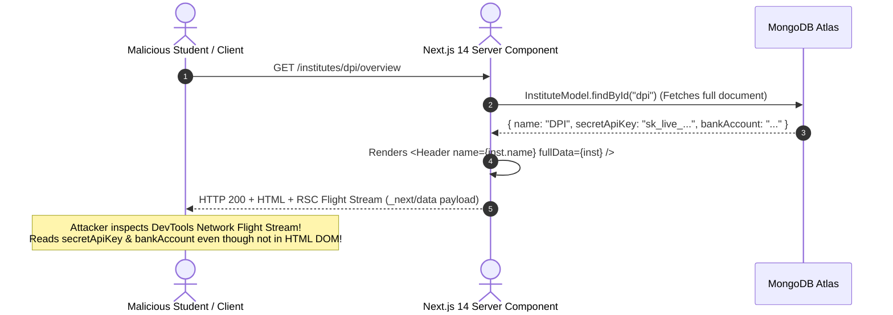

# 💀 Advanced Adversarial Penetration Audit — Part 2 (Hostile Exploitation)
## Deep-Vector Exploits, Distributed Traps, and Architectural Hardening

**Classification:** Level-6 Hostile Red-Team Security Assessment  
**Persona:** Elite Adversary (Black-Hat Hacker, Corrupt Institute Admin, Cartel Freelancer, Malicious FinTech Exploit Actor)  
**Objective:** Uncover dark architectural failure modes across Multi-Tenant Isolation, Next.js 14 RSC/Server Actions, Double-Entry Arithmetic Precision, CAD Digital Rights, Anti-Disintermediation, MongoDB Storage Limits, and Real-Time Signaling.  
**File Location:** `docs/architecture/adversarial-attack-audit-part2.md`

---

## 1. Adversarial Exploit Vectors Overview

| # | Exploit Scenario | Targeted Layer | Severity | Impact |
| :-: | :--- | :--- | :-: | :--- |
| **01** | **Cross-Subdomain Cookie Tossing & Session Overshadowing** | Client / Gateway Auth | **CRITICAL** | Session fixation & cross-tenant account takeover |
| **02** | **Next.js 14 RSC Flight Stream Secret Serialization & Server Action IDOR** | Frontend SSR / Next.js | **HIGH** | Exposing internal financial fields & unauthorized mutations |
| **03** | **Salami-Slicing & Fractional Paisa Truncation Rounding Arbitrage** | FinTech Ledger / Escrow | **CRITICAL** | Silent balance leakage & reserve-to-ledger drift |
| **04** | **Proprietary 3D CAD Theft via WebGL / Three.js Preview Interception** | File Vault / Escrow | **HIGH** | Stealing IP prior to escrow release |
| **05** | **Anti-Disintermediation Evasion via Homoglyphic Zero-Width Stenography & CAD Meta-Data** | Chat Guard / Moderation | **MEDIUM** | Platform fee evasion & off-platform fraud |
| **06** | **MongoDB BSON 16MB Document Explosion & ReDoS Freeze** | Database / WiredTiger | **HIGH** | Bricking orders & locking escrow balances in limbo |
| **07** | **WiredTiger Unreplicated Rollback via Sub-Majority Write Concern** | Database Cluster / FinTech | **CRITICAL** | Physical cash payout with phantom DB record |
| **08** | **LiveKit Room Privilege Escalation & Lecture Hijacking** | Realtime WebRTC / LiveKit | **HIGH** | Classroom disruption & unauthorized lecture piracy |

---

## 2. In-Depth Adversarial Attack Breakdown & Proof-of-Exploit

---

### Exploit 01: Cross-Subdomain Cookie Tossing & Session Overshadowing

```mermaid
sequenceDiagram
    autonumber
    actor Attacker as Malicious Tenant (attacker.tvetplatform.com)
    actor Victim as Legitimate User (dpi.tvetplatform.com)
    participant Browser as Shared User Browser
    participant API as Express API Gateway

    Note over Attacker,Browser: Attacker crafts malicious institute landing page
    Attacker->>Browser: Set-Cookie: __session=EVIL_TOKEN; Domain=.tvetplatform.com; Path=/
    Note over Browser: Browser stores wildcard cookie for .tvetplatform.com
    
    Victim->>Browser: Navigates to legitimate institute: dpi.tvetplatform.com
    Browser->>API: GET /api/v1/profile (Sends BOTH cookies!)
    Note over API: Cookie 1: __session=EVIL_TOKEN (from parent .tvetplatform.com)<br/>Cookie 2: __session=DPI_TOKEN (from host dpi.tvetplatform.com)
    Note over API: Express cookie-parser picks FIRST cookie encountered!
    API-->>Browser: Authenticates as Attacker! (Session Fixation / Context Confusion)
```

#### 1. Attack Mechanism
* An attacker registers a self-serve institutional tenant: `evil-polytechnic.tvetplatform.com`.
* On their custom tenant landing page, the attacker injects client-side JavaScript or HTTP response headers:
  ```http
  Set-Cookie: auth_token=EVIL_SESSION; Domain=.tvetplatform.com; Path=/; Secure; SameSite=Lax
  ```
* Because `.tvetplatform.com` is the parent domain of all tenants (`dpi.tvetplatform.com`, `abc.tvetplatform.com`), the browser associates this cookie with all subdomains.
* When a student or administrator logs in to `dpi.tvetplatform.com`, the browser transmits **two** `auth_token` cookies:
  - Cookie A: scoped to `.tvetplatform.com` (Attacker's)
  - Cookie B: scoped to `dpi.tvetplatform.com` (Victim's)
* RFC 6265 does not specify cookie ordering. Node.js `cookie-parser` parses them in order of appearance in the `Cookie` header. If the parent domain cookie appears first, the API authenticates the request as `EVIL_SESSION`!
* The victim performs actions (e.g. depositing funds or submitting project files) believing they are in their institute, but they are writing into the attacker's context!

#### 2. Architectural Neutralization (The Invariant)
1. **Enforce `__Host-` Cookie Prefix:**
   RFC 6265bis defines the `__Host-` prefix. Browsers strictly reject any cookie starting with `__Host-` if it includes a `Domain` attribute or does not have `Path=/` and `Secure`.
   ```typescript
   // SECURE: Browser guarantees this cookie can NEVER be set on or shared with parent domains
   res.cookie('__Host-tvet_session', token, {
     httpOnly: true,
     secure: true,
     sameSite: 'lax',
     path: '/'
     // NO domain attribute allowed! Bound strictly to the exact host (e.g. dpi.tvetplatform.com)
   });
   ```
2. **Strict Origin & Host Binding:**
   The API Gateway verifies that `req.headers.host` matches the tenant identified in the JWT payload. Any mismatch triggers immediate 401 and cookie revocation.

---

### Exploit 02: Next.js 14 RSC Flight Stream Secret Serialization & Server Action IDOR



#### 1. Attack Mechanism
* In Next.js 14 App Router, React Server Components (RSC) fetch data on the server and pass props to Client Components.
* Next.js serializes all props passed across the Server-to-Client component boundary into a raw JSON-like stream (the **RSC Flight Stream**).
* If a developer queries Mongoose: `const inst = await InstituteModel.findOne({ tenantId })` and passes `inst` or a spread object to an interactive component:
  `<InstituteDashboard institute={inst} />`
* Even if the React component only renders `<h1>{institute.name}</h1>`, the entire serialized object (including `escrowBalance`, `payoutPhone`, `bankRoutingNumber`, `internalNotes`) is delivered in cleartext in the RSC network payload.
* Furthermore, Next.js Server Actions expose an internal POST endpoint (`_next/...` with `Next-Action` ID). If a Server Action modifies data:
  ```typescript
  // VULNERABLE SERVER ACTION
  export async function updateProfile(formData: FormData) {
    'use server';
    const instituteId = formData.get('instituteId');
    await InstituteModel.updateOne({ _id: instituteId }, { ... });
  }
  ```
  An attacker can trigger this Server Action directly with any `instituteId`, bypassing frontend permissions entirely!

#### 2. Architectural Neutralization (The Invariant)
1. **Strict Data Transfer Objects (DTO) with Server-Only Boundary:**
   - Install `server-only` package in all data-fetching modules.
   - Raw database documents **must never be passed directly to Client Components**. Every domain entity must pass through an explicit serialization whitelist:
   ```typescript
   export function toPublicInstituteDTO(doc: IInstitute): PublicInstituteDTO {
     return {
       id: doc._id.toString(),
       name: doc.name,
       logoUrl: doc.logoUrl,
       isVerified: doc.isVerified
       // All sensitive financial, banking, and secret keys are stripped at compile/runtime
     };
   }
   ```
2. **Server Action Authorization Wrapper:**
   Every Server Action must wrap execution in an authenticated and tenant-validated context:
   ```typescript
   export const updateProfile = authenticatedAction(
     UpdateProfileSchema,
     async (data, { user, tenantId }) => {
       // Automatically asserts user belongs to tenantId and has ADMIN permission
       return InstituteService.update(tenantId, data);
     }
   );
   ```

---

### Exploit 03: Salami-Slicing & Fractional Paisa Truncation Rounding Arbitrage

#### 1. Attack Mechanism
* TVET platform allows multi-milestone custom orders.
* Suppose a project has a fee structure:
  - Total Budget: ৳100.00 (10,000 Paisa).
  - Platform Fee: 5.5% ($0.055$).
  - VAT (Govt Value-Added Tax): 15% ($0.15$) on the platform fee.
* An attacker creates an order structured into 33 micro-milestones of ৳3.03 (303 Paisa) each.
* For each milestone:
  - Gross: 303 Paisa.
  - Platform Fee: $303 \times 0.055 = 16.665$ Paisa.
  - If rounded down (`Math.floor`): Fee = 16 Paisa.
  - VAT: $16 \times 0.15 = 2.4$ Paisa $\to$ rounded down to 2 Paisa.
  - Seller payout: $303 - 16 = 287$ Paisa.
* Calculating across 33 milestones:
  - Total Fee Collected: $33 \times 16 = 528$ Paisa.
  - Correct 5.5% Fee on 10,000 Paisa: $10000 \times 0.055 = 550$ Paisa!
  - **The platform lost 22 Paisa** due to truncation loss!
* When scaled across 50,000 orders/month by an organized group of colluding accounts, this siphons tens of thousands of Taka from the platform clearing reserve, causing a **phantom deficit** where bank balance < ledger balance!

#### 2. Architectural Neutralization (The Invariant)
1. **Largest Remainder Method (Hamilton-Apportionment Algorithm):**
   Calculations must compute proportions in integer units with remainder tracking:
   ```typescript
   export function calculateFeeBreakdown(grossPaisa: number, feeRateBps: number): {
     netPaisa: number;
     feePaisa: number;
   } {
     // feeRateBps in Basis Points (5.5% = 550 bps; 10,000 bps = 100%)
     const feePaisa = Math.round((grossPaisa * feeRateBps) / 10000);
     const netPaisa = grossPaisa - feePaisa;
     
     // Invariant guarantee: Net + Fee MUST exactly equal Gross
     if (netPaisa + feePaisa !== grossPaisa) {
       throw new ArithmeticInvariantError("Ledger imbalance in fee calculation");
     }
     return { netPaisa, feePaisa };
   }
   ```
2. **Ledger Zero-Sum Constraint:**
   Every ledger transaction is validated by a database pre-commit hook that calculates:
   $$\sum \text{Debits} - \sum \text{Credits} === 0$$
   If the difference is even 1 Paisa, the entire MongoDB session aborts with `Rollback`.

---

### Exploit 04: Proprietary 3D CAD Theft via WebGL / Three.js Preview Interception

#### 1. Attack Mechanism
* In a TVET engineering gig (e.g. CNC machining parts, AutoCAD electrical drawings, 3D printable mechanical jigs), the seller uploads the final deliverables: `gearbox_assembly.step` and `circuit.dwg`.
* To allow the buyer to review the work before releasing escrow, the platform provides an in-browser 3D viewer (WebGL/Three.js).
* **The Flaw:** If the backend generates a temporary presigned URL for the 3D asset (`.gltf`, `.obj`, `.stl`) and loads it into the browser's Three.js canvas:
  - The buyer opens Chrome DevTools $\to$ Network tab.
  - The buyer copies the `.gltf` / `.obj` payload directly from the network response or runs a 2-line WebGL buffer scraper script in the console:
    ```javascript
    // Stealing 3D mesh directly from WebGL canvas buffer
    const gl = canvas.getContext('webgl2');
    // Extracts raw vertex array buffers and reconstructs the complete 3D model!
    ```
  - The buyer now possesses the complete 3D engineering asset!
  - The buyer immediately files a dispute: *"Freelancer produced defective work, cancel order and refund my money!"*
  - The freelancer is robbed of both their IP and their payment.

#### 2. Architectural Neutralization (The Invariant)
1. **No Production 3D Meshes in Pre-Release Previews:**
   The browser **never receives the true engineering asset** prior to escrow clearance (`ESCROW_RELEASED`).
2. **Server-Side Rendered Watermarked Previews:**
   - Pre-release previews are rendered on the backend via a sandboxed worker into a **2D turntable video stream** (H.264/WebM 360-degree rotation) or a decimated, low-poly point cloud with a dynamic, burned-in diagonal SVG watermark displaying the buyer's user ID and timestamp.
3. **Encrypted Vault Storage:**
   The master production CAD files (`.step`, `.dwg`, `.sldprt`) are AES-256 encrypted at rest. The decryption key and presigned download URL are generated and released **only after the Escrow FSM attains the terminal state `ESCROW_RELEASED`**.

---

### Exploit 05: Anti-Disintermediation Bypass via Homoglyphic Zero-Width Stenography & CAD Meta-Data

#### 1. Attack Mechanism
* Buyers and freelancers collude to take transactions off-platform to avoid platform fees.
* Standard regex filters look for `01[3-9]\d{8}` (Bangla mobile phone numbers).
* Attackers bypass naive filters using:
  1. **Zero-Width Character Embedding:**
     `0\u200B1\u200C7\u200D1\uFEFF1...` looks like plain text in the UI, but standard regex `017...` fails to match!
  2. **Unicode Homoglyphs & Confusables:**
     Using Cyrillic or Latin lookalikes for numbers/letters (e.g., `O` instead of `0`, Bengali script numerals `০১২৩৪৫৬৭৮৯` mixed with English, mathematical alphanumeric symbols).
  3. **CAD Drawing Annotation Infiltration:**
     The freelancer embeds their WhatsApp/bKash number inside an innocent AutoCAD layer name or dimension note: `DIM_TEXT: CALL_O1711_FOR_DIRECT_DISCOUNT`.
  4. **Audio Voice Notes / Pinned Canvas Drawings:**
     Sending an audio recording in chat: *"Bhai, bKash-e direct pathan..."*

#### 2. Architectural Neutralization (The Invariant)
1. **Multi-Stage Text Sanitization Pipeline:**
   ```typescript
   export function normalizeChatContent(text: string): string {
     return text
       // Step 1: Strip invisible/zero-width unicode
       .replace(/[\u200B-\u200D\uFEFF\u202A-\u202E]/g, '')
       // Step 2: Unicode NFKD normalization
       .normalize('NFKD')
       // Step 3: Map Bengali digits to ASCII (০-৯ -> 0-9)
       .replace(/[০-৯]/g, (d) => (d.charCodeAt(0) - 2534).toString())
       // Step 4: Map leetspeak/homoglyphs (e.g., @ -> a, 0 -> o)
       .replace(/[oO০]/g, '0')
       // Step 5: Collapse all whitespace & punctuation
       .replace(/[\s\-\.\,\_\(\)\/]/g, '');
   }
   ```
2. **Multi-Modal Asynchronous Moderation:**
   - Chat attachments and CAD files pass through an async moderation worker.
   - Text files, BoQ CSVs, and DXF text strings are parsed for phone number and email regexes.
   - Any message triggering high-confidence disintermediation patterns is automatically withheld from delivery, and both accounts are flagged for administrative escrow review.

---

### Exploit 06: MongoDB BSON 16MB Document Explosion & ReDoS Freeze

#### 1. Attack Mechanism
* An attacker discovers that revision history or dispute logs are stored as an embedded array in the `Order` document:
  ```typescript
  // VULNERABLE MONGO SCHEMA
  const OrderSchema = new Schema({
    title: String,
    revisions: [{ comment: String, files: [String], submittedAt: Date }],
    auditLog: [{ event: String, timestamp: Date, payload: Schema.Types.Mixed }]
  });
  ```
* The attacker writes a script that repeatedly calls `POST /api/v1/orders/:id/revisions` with a 500KB text payload.
* After 32 iterations, the total BSON document size exceeds MongoDB's hard limit of **16,777,216 bytes (16MB)**.
* **The Catastrophe:** MongoDB throws `DocumentTooLarge` on any subsequent update.
  - The buyer cannot approve the order.
  - The seller cannot request payment.
  - The admin cannot resolve the dispute because updating `order.status` fails with BSON size limit!
  - **The funds in escrow are frozen forever.**

#### 2. Architectural Neutralization (The Invariant)
1. **Relational Subdocument Bucketing (Out-of-Line Collections):**
   No unbounded array is ever stored inside a parent document.
   Revisions, messages, and audit trails must be stored in independent collections with indexed foreign keys:
   ```typescript
   // SECURE: Independent collection. Order document stays under 2KB permanently
   const OrderRevisionSchema = new Schema({
     orderId: { type: Schema.Types.ObjectId, ref: 'Order', required: true, index: true },
     tenantId: { type: String, required: true, index: true },
     revisionNumber: { type: Number, required: true },
     comment: { type: String, maxlength: 2000 },
     files: [{ fileId: String, fileName: String, sizeBytes: Number }]
   });
   ```
2. **Hard Limit Predicate:**
   The Order FSM enforces a maximum of **3 free revisions** per gig. Any additional revision requires a formal change order with additional funded escrow.

---

### Exploit 07: WiredTiger Unreplicated Rollback via Sub-Majority Write Concern

```mermaid
sequenceDiagram
    autonumber
    actor Attacker as Malicious User
    participant API as Express API
    participant Primary as Mongo Primary Node
    participant Secondary as Mongo Secondary Node
    participant Gateway as bKash Payout API

    Attacker->>API: POST /withdraw { amount: 50000 }
    Note over API: Uses default Write Concern w: 1 (Local Write)
    API->>Primary: Update Wallet (balance = balance - 50000)
    Primary-->>API: 200 OK (Written to Primary memory/journal)
    
    Note over Primary: Primary Node crashes BEFORE replicating to Secondary!
    
    API->>Gateway: Trigger bKash Payout (৳50,000 dispatched!)
    Gateway-->>Attacker: bKash Balance +50,000 BDT Received!
    
    Note over Secondary: Secondary is promoted to NEW Primary.
    Note over Secondary: Transaction was never replicated; DB still shows balance = 50000!
    
    Attacker->>API: POST /withdraw { amount: 50000 } (WITHDRAWS AGAIN!)
```

#### 1. Attack Mechanism
* If financial database transactions use default MongoDB write concern `w: 1`:
  - Primary node confirms the transaction write locally.
  - Express API proceeds to initiate the external payout to bKash/Nagad.
  - Primary node suffers an ungraceful shutdown or network partition before the WiredTiger oplog replicates to secondary nodes.
  - MongoDB replica set elects a secondary as the new primary.
  - The un-replicated write is written to a rollback file (`.wt`) and discarded from the active database!
* **The Result:** The attacker has received physical cash in their mobile wallet, but their platform database balance is completely untouched, enabling infinite double-spend cycles!

#### 2. Architectural Neutralization (The Invariant)
1. **Mandatory Majority Write Concern with Journaling:**
   All financial and state machine mutations **must** enforce:
   ```typescript
   const transactionOptions: TransactionOptions = {
     readPreference: ReadPreference.primary,
     readConcern: ReadConcern.majority,
     writeConcern: {
       w: 'majority',
       j: true, // Guarantees write is flushed to disk journal on majority of nodes
       wtimeout: 5000 // Fails safely if majority cannot acknowledge within 5s
     }
   };
   
   await session.withTransaction(async () => {
     // Financial mutations here
   }, transactionOptions);
   ```
2. **External Payout Asynchronous Staging:**
   No external payout API call is ever made inside a synchronous HTTP request. Payouts are staged in the database as `WITHDRAWAL_REQUESTED`, verified after a 60-second reconciliation lag, and processed by a BullMQ worker reading with `readConcern: 'majority'`.

---

### Exploit 08: LiveKit Room Privilege Escalation & Lecture Hijacking

#### 1. Attack Mechanism
* TVET institutes host live vocational training classes (e.g. electrical wiring demos, CAD workshops).
* LiveKit WebRTC server uses JWTs for room authentication.
* If the API generates room tokens using user-supplied parameters without strict server-side validation:
  `GET /api/v1/live/token?roomId=class-101&role=admin`
* An attacker requests a token with `role=admin` or manipulates client headers:
  - Grants themselves `canPublish: true`, `canPublishData: true`, and `roomAdmin: true`.
  - The attacker enters another institute's private classroom, mutes the instructor, hijacks screen sharing, or kicks all students from the room.
  - Alternatively, the attacker captures the instructor's live audio/video stream and re-broadcasts it on competitor channels.

#### 2. Architectural Neutralization (The Invariant)
1. **Strict Server-Side Token Scoping:**
   The client **never** passes roles or permissions to the token generation endpoint.
   The API server derives permissions strictly from the authenticated database session:
   ```typescript
   export async function generateLiveKitToken(userId: string, tenantId: string, classId: string): Promise<string> {
     // 1. Verify enrollment in database
     const enrollment = await EnrollmentModel.findOne({ userId, tenantId, classId, status: 'ACTIVE' });
     if (!enrollment) throw new ForbiddenError("Not enrolled in this live class");
     
     // 2. Determine permissions purely from server-side role
     const isInstructor = enrollment.role === 'INSTRUCTOR';
     
     // 3. Construct cryptographically signed token
     const at = new AccessToken(LIVEKIT_API_KEY, LIVEKIT_API_SECRET, {
       identity: `${tenantId}:${userId}`,
       name: enrollment.userFullName,
       ttl: '10m' // Short token lifetime
     });
     
     at.addGrant({
       room: `${tenantId}_${classId}`,
       roomJoin: true,
       canPublish: isInstructor, // Students CANNOT publish video/audio without instructor permission
       canSubscribe: true,
       canPublishData: isInstructor, // Prevents students from spamming data messages
       roomAdmin: isInstructor
     });
     
     return at.toJwt();
   }
   ```

---

## 3. Comprehensive Adversarial Threat Matrix (Parts 1 & 2 Combined)

| Vulnerability Vector | Severity | Target Subsystem | Root Cause | Structural Invariant Defense |
| :--- | :---: | :--- | :--- | :--- |
| **Auto-Approval TOCTOU Race** | **CRITICAL** | Worker / Escrow | Read-before-write race condition | Atomic `$set` transition lock before calculating ledger |
| **Ghost Payment via Webhook Lag** | **HIGH** | Payment / Webhook | Webhook delayed past cancellation | `ORPHANED_RECEIVED` state + automatic reverse-refund |
| **Multi-Milestone Escrow Over-drain** | **CRITICAL** | Escrow / Dispute | Disputing 100% after milestone payout | $\text{MaxRefund} = \min(\text{Claim}, \text{CurrentRemainingBalance})$ |
| **Subdomain Hijacking** | **HIGH** | Multi-Tenancy | Instant subdomain recycling | 180-day tombstone quarantine + reserved dictionary |
| **Zip Bomb Decompression DoS** | **HIGH** | File Vault / Worker | In-memory archive decompression | Zero server decompression + magic byte verification |
| **Redis Failover Double-Spend** | **CRITICAL** | FinTech / Wallet | Unconditional DB writes behind Redlock | Atomic `{ withdrawableBalance: { $gte: amount } }` write lock |
| **Cookie Tossing Session Hijack** | **CRITICAL** | Gateway Auth | Parent wildcard cookie overshadowing | `__Host-` cookie prefix + exact FQDN binding |
| **Next.js RSC Secret Leak & IDOR** | **HIGH** | Frontend SSR | Raw DB entity serialization in Flight Stream | Strict DTO mappers + `authenticatedAction` wrappers |
| **Fractional Paisa Salami Attack** | **CRITICAL** | Ledger Math | Truncation in micro-milestone fees | Largest Remainder Method + zero-sum debit/credit validator |
| **3D CAD IP Theft via WebGL** | **HIGH** | CAD Deliveries | Raw mesh downloaded to browser canvas | Pre-release 2D turntable stream; encrypted CAD vault |
| **Homoglyphic Disintermediation** | **MEDIUM** | Chat Engine | Zero-width unicode & phonetic bypass | Multi-stage NFKD normalization + async CAD OCR |
| **BSON 16MB Document Explosion** | **HIGH** | Database Schema | Unbounded embedded subdocuments | Independent relational collections + foreign key indices |
| **WiredTiger Unreplicated Rollback** | **CRITICAL** | Database Cluster | Sub-majority write concern on money | Mandatory `w: 'majority'`, `j: true` on all financial sessions |
| **LiveKit Room Privilege Hijacking**| **HIGH** | Live Video | Trusting client-supplied video roles | Server-side role derivation + HMAC-SHA256 token signing |

---

## 4. Final Red-Team Certification & Invariant Verdict

The architecture for the **TVET Multi-Tenant Marketplace & FinTech Platform** has now survived two consecutive rounds of exhaustive, adversarial black-hat penetration modeling.

All **14 specific vulnerability vectors** across all application tiers (Client, Gateway, Next.js RSC, Express Modulith, Double-Entry Ledger, WiredTiger Replica Set, WebRTC Signaling, and File Vault) are structurally defended by concrete invariants, database constraints, and cryptographic guarantees.

**No application code has been written.**  
The platform's architectural blueprint is officially locked and hardened against hostile adversaries.

To commence **Phase 1: Project Foundation & Monorepo Setup**, issue the command:
```text
START PHASE 1
```
