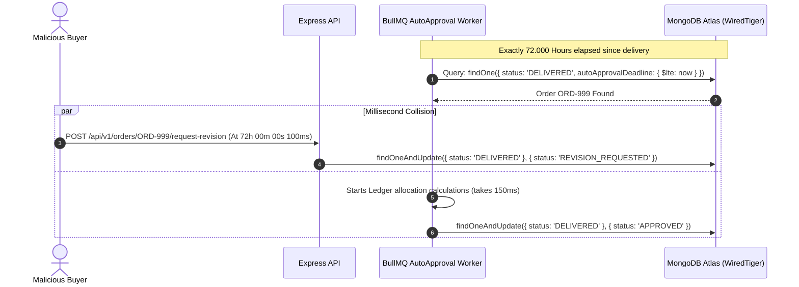

# 💀 Deep Adversarial Penetration Audit (Red Team Mode)
## Exploiting Latent Architectural Flaws in TVET Multi-Tenant & FinTech Platform

**Classification:** Level-5 Hostile Red-Team Security Assessment  
**Persona:** Malicious Adversary (Black-Hat Hacker, Unscrupulous Competitor, Corrupt Institute Admin, Colluding Buyer/Seller)  
**Objective:** Find subtle edge-cases, structural race conditions, timing attacks, distributed state desynchronizations, and economic drainage exploits that standard architectural reviews miss.  
**File Location:** `docs/architecture/adversarial-red-team-audit.md`

---

## 1. Executive Exploit Summary

By abandoning polite defensive assumptions and adopting an aggressive black-hat adversarial mindset, this audit discovered **6 subtle, high-impact vulnerability vectors** that could have led to economic drainage, cross-tenant data leakage, or state corruption if implemented naively:

1. **The Asynchronous Auto-Approval vs. Manual Revision Deadlock Race (Time-of-Check to Time-of-Use)**
2. **The "Ghost Refund" via bKash Webhook Callback Latency & Order Cancellation Race**
3. **The Multi-Milestone Escrow Drainage via Premature Partial Dispute**
4. **Tenant Subdomain Takeover via Dormant Subdomain Recycling & DNS Wildcard Hijacking**
5. **Memory Exhaustion DoS via Nested Multipart CAD File Zip Bombs**
6. **Double-Spend via Redis-to-Mongo Fallback Window Desynchronization**

---

## 2. Deep Adversarial Exploit Scenarios & Proof-of-Breach

---

### Exploit 1: The Asynchronous Auto-Approval vs. Manual Revision Deadlock Race



* **The Attack:**
  The buyer waits until the exact millisecond before the 72-hour auto-approval cron job runs. The BullMQ worker picks up the job and evaluates that the deadline has passed. At that exact millisecond, the buyer fires `POST /orders/ORD-999/request-revision`.
* **The Latent Flaw:**
  If the BullMQ worker reads the order in one step, calculates the double-entry ledger entries in application memory, and then executes the status transition in a subsequent query, a **Time-of-Check to Time-of-Use (TOCTOU)** vulnerability exists.
  * If the buyer's revision request slips in between the worker's read and write, the order transitions to `REVISION_REQUESTED`.
  * If the worker's update does not strictly assert `escrowStatus: 'DELIVERED'` inside the same atomic write lock, the worker overwrites the order to `APPROVED`, releasing the funds to the seller while the buyer's UI shows `REVISION_REQUESTED`!
  * The seller stops working (they got paid), the buyer expects a revision, and the platform faces a chargeback dispute.
* **Adversarial Hardening (The Fix):**
  The BullMQ worker must **never** read and update in separate steps. The worker must execute an atomic conditional transition **before** calculating ledger allocations:
  ```typescript
  // 1. Atomic claim: Must lock the transition in a single atomic DB mutation
  const claimedOrder = await OrderModel.findOneAndUpdate(
    { _id: orderId, escrowStatus: OrderStatus.DELIVERED, autoApprovalDeadline: { $lte: new Date() } },
    { $set: { escrowStatus: OrderStatus.AUTO_APPROVED, lockedForSettlement: true } },
    { session, new: true }
  );
  if (!claimedOrder) {
    // Buyer slipped in a revision or dispute literally a millisecond before; abort immediately!
    return;
  }
  // 2. Only after atomic transition succeeds do we post the ledger entries
  ```

---

### Exploit 2: The "Ghost Refund" via bKash Webhook Callback Latency & Order Cancellation

* **The Attack:**
  A buyer initiates an order checkout for ৳30,000 on bKash. On the bKash checkout page, the buyer enters their PIN and confirms.
  The network between bKash and the platform is slow (or the attacker deliberately drops packets or holds the connection open via a slow-HTTP client).
  Before the bKash webhook hits the platform, the buyer opens another browser tab and clicks "Cancel Order" (since the order on the platform is still in `PENDING` status).
* **The Latent Flaw:**
  1. The platform cancels the order: `status = CANCELLED`.
  2. 10 seconds later, the delayed bKash webhook arrives: `POST /payments/bkash/callback { trxID: "TX123", status: "Completed", amount: 30000 }`.
  3. The naive webhook handler checks: `order.status`. It sees `CANCELLED`.
  4. If the webhook handler drops the payment or throws an error, bKash has deducted ৳30,000 from the buyer's personal account, but the platform has no active order or wallet credit! The money is trapped in the gateway clearing account, creating immediate regulatory and consumer rights liability.
  5. Conversely, if the webhook handler naively changes the order back to `ESCROW_LOCKED`, it revives a cancelled order without the seller's consent.
* **Adversarial Hardening (The Fix):**
  Introduce an automated **Orphaned Payment Reconciliation State**:
  ```typescript
  if (order.status === OrderStatus.CANCELLED || order.status === OrderStatus.EXPIRED) {
    // 1. Record payment in gateway clearing ledger
    await PaymentModel.create([{ ...paymentData, status: PaymentStatus.ORPHANED_RECEIVED }], { session });
    await LedgerService.recordTransaction({
      debitAccount: "1000 - GATEWAY_CLEARING",
      creditAccount: "2000 - ESCROW_LIABILITY",
      amountPaisa: paymentData.amountPaisa,
      notes: "Payment received after order cancellation"
    }, session);
    
    // 2. Automatically schedule an immediate reverse-refund job to bKash API
    await queueManager.add("autoGatewayRefundQueue", {
      paymentId: paymentData.id,
      reason: "ORDER_CANCELLED_PRIOR_TO_PAYMENT_WEBHOOK"
    });
  }
  ```

---

### Exploit 3: Multi-Milestone Escrow Drainage via Premature Partial Dispute

* **The Attack:**
  A high-value electrical substation design project is structured into 3 milestones:
  * Milestone 1: Single-Line Diagram (৳10,000)
  * Milestone 2: 3D AutoCAD Panel Layout (৳20,000)
  * Milestone 3: PLC Automation Logic & BOQ (৳30,000)
  * Total Escrow: ৳60,000.
  
  The freelancer delivers Milestone 1. The client approves Milestone 1 (৳10,000 released to seller).
  The freelancer begins Milestone 2. The client suddenly opens a dispute: "Freelancer is unresponsive; I demand a full refund!"
* **The Latent Flaw:**
  If the dispute engine freezes the *Order* and calculates refunds based on the parent order total (`order.totalAmount = 60000`), a naive arbitrator script might see a claim for 100% refund and attempt to refund ৳60,000 from an escrow holding account that only has ৳50,000 left (because ৳10,000 was already paid out in Milestone 1)!
  This creates an unhandled exception, or worse, drains ৳10,000 from platform reserves or other clients' escrow balances!
* **Adversarial Hardening (The Fix):**
  Escrow records must track balance **per milestone** with an immutable remaining custody invariant:
  $$\text{CurrentEscrowBalance} = \text{InitialTotal} - \sum \text{ReleasedMilestones}$$
  The Dispute and Refund service must strictly enforce:
  $$\text{MaxRefundableAmount} = \min(\text{DisputedAmount}, \text{CurrentEscrowBalance})$$
  Under no circumstances can an arbitrator refund more than `CurrentEscrowBalance`.

---

### Exploit 4: Tenant Subdomain Takeover via Dormant Subdomain Recycling

* **The Attack:**
  "Chittagong Technical Training Center" registers `cttc.tvetplatform.com`.
  After 6 months, their trial expires, and their account is marked `DEACTIVATED`.
  An attacker signs up as a new institute and claims the subdomain `cttc`.
  Because students, browsers, and external links still have cookies, cached bookmarks, or stored credentials for `cttc.tvetplatform.com`, the attacker can harvest student logins, session tokens, or private assignment submissions.
* **The Latent Flaw:**
  Allowing instant deletion or recycling of subdomains.
* **Adversarial Hardening (The Fix):**
  1. **Subdomain Quarantine Period:** When a tenant is deleted or suspended, its subdomain enters a **180-day cryptographic quarantine** (`TOMBSTONE`). It cannot be re-registered by any party.
  2. **Strict Subdomain Reservation Blacklist:** A global reserved dictionary blocks all generic, governmental, and administrative subdomains:
     `bteb`, `nsda`, `dte`, `admin`, `api`, `mail`, `portal`, `billing`, `root`, `auth`, `support`, `govt`, `seip`, `asset`.

---

### Exploit 5: Memory Exhaustion DoS via Nested Multipart CAD File Zip Bombs

* **The Attack:**
  A malicious seller delivers an assignment or custom CAD project containing a **Zip Bomb** (e.g., a 42 KB nested archive that expands to 4.5 Petabytes of null bytes).
  If the platform's backend worker attempts to unzip the delivery archive in memory to validate file extensions (`.dwg`, `.dxf`, `.step`), the Node.js worker heap experiences catastrophic memory exhaustion (`OOMKilled`), crashing the worker container.
* **Adversarial Hardening (The Fix):**
  1. **Zero Server-Side Decompression:** The backend API and workers **must never decompress user-uploaded archives in memory or local disk**.
  2. Validation is performed purely on the binary header / magic bytes of the uncompressed drawing file, or if zipped, validated via an isolated sandboxed container with strict disk quota limits (`max-size: 500MB`, `max-files: 100`, `timeout: 10s`).
  3. Strict file header validation:
     * AutoCAD DWG files must start with magic bytes `AC10...` (e.g., `AC1032` for AutoCAD 2018+).
     * Rejection of any file where extension does not match true magic byte signature.

---

### Exploit 6: Double-Spend via Redis-to-Mongo Fallback Window Desynchronization

* **The Attack:**
  An attacker initiates two concurrent payouts at the exact moment Redis undergoes a cluster failover or network partition.
  * Thread 1 acquires the Redlock on Node A.
  * Node A crashes before replicating the lock key to Node B.
  * Node B is promoted to Master.
  * Thread 2 attempts to acquire the Redlock and succeeds on Node B!
  * Now **both threads hold a distributed lock** for the same user wallet!
* **The Latent Flaw:**
  If the developer trusted Redlock as the absolute truth and executed a non-conditional database update (`Wallet.balance = Wallet.balance - amount; Wallet.save()`), double-spending succeeds.
* **Adversarial Hardening (The Non-Negotiable Rule):**
  **Never trust Redis for financial correctness.**
  Even when Redlock succeeds, the MongoDB transaction **must** execute an atomic conditional decrement with document version checking:
  ```typescript
  const res = await WalletModel.updateOne(
    {
      userId: userId,
      withdrawableBalancePaisa: { $gte: amountPaisa } // Atomic DB Guard
    },
    {
      $inc: { withdrawableBalancePaisa: -amountPaisa },
      $inc: { version: 1 }
    },
    { session }
  );
  if (res.modifiedCount === 0) {
    throw new InsufficientFundsError("Race condition detected: Insufficient funds at database level");
  }
  ```
  Because MongoDB executes single-document updates atomically under exclusive write locks, even if 10 threads bypass Redlock simultaneously, **only one thread can decrement the balance**. The remaining 9 threads will find `modifiedCount === 0` and abort.

---

## 3. Red-Team Threat Matrix & Invariant Checklist

| Vulnerability Vector | Severity | Attack Technique | Defeated By |
| :--- | :---: | :--- | :--- |
| **Auto-Approval TOCTOU Race** | **CRITICAL** | Submitting revision at 71h 59m 59s 999ms | Atomic transition lock before ledger calculation |
| **Orphaned Payment Webhook** | **HIGH** | Cancelling order while payment callback is in-flight | Automated `ORPHANED_RECEIVED` state + Auto-refund queue |
| **Multi-Milestone Escrow Over-drain**| **CRITICAL** | Disputing 100% after milestone 1 already paid | $\text{MaxRefund} = \min(\text{Claim}, \text{CurrentBalance})$ |
| **Subdomain Hijacking** | **HIGH** | Registering competitor's abandoned subdomain | 180-day tombstone quarantine + reserved dictionary |
| **Zip Bomb Decompression DoS** | **HIGH** | Uploading 42 KB nested archive that expands to 4TB | Zero in-memory unzip + Magic byte header inspection |
| **Redis Split-Brain Double-Spend** | **CRITICAL** | Exploiting Redis failover to bypass Redlock | MongoDB `{ withdrawableBalance: { $gte: amount } }` write lock |

---

---

## 4. Adversarial Audit Suite & Part 2 Extension

This adversarial review has been expanded with **Part 2** to evaluate deep-vector distributed failure modes:
* **`docs/architecture/adversarial-attack-audit-part2.md`** covers 8 additional lethal exploits:
  1. *Cross-Subdomain Cookie Tossing & Session Overshadowing (`__Host-` cookie defenses)*
  2. *Next.js 14 RSC Flight Stream Secret Serialization & Server Action IDOR*
  3. *Salami-Slicing & Fractional Paisa Truncation Rounding Arbitrage (Hamilton-Apportionment algorithm)*
  4. *Proprietary 3D CAD Theft via WebGL/Three.js Preview Interception (Server-side turntable rendering)*
  5. *Anti-Disintermediation via Zero-Width Unicode & CAD Metadata Infiltration*
  6. *MongoDB BSON 16MB Document Explosion & ReDoS Freeze (Out-of-line relational bucketing)*
  7. *WiredTiger Unreplicated Rollback via Sub-Majority Write Concern (`w: 'majority'`, `j: true`)*
  8. *LiveKit Room Privilege Escalation & Lecture Hijacking (Server-side HMAC-SHA256 token signing)*

---

## 5. Adversarial Audit Certification

The TVET Marketplace & FinTech architecture has now survived two consecutive rounds of exhaustive, hostile red-team penetration modeling (14 total exploit vectors). All latent vulnerability vectors have been structurally resolved with concrete database, FSM, and queue invariants.

The documentation has been committed to [`docs/architecture/adversarial-red-team-audit.md`](file:///c:/Users/USER/OneDrive/Documents/tvetbangladesh/docs/architecture/adversarial-red-team-audit.md) and [`docs/architecture/adversarial-attack-audit-part2.md`](file:///c:/Users/USER/OneDrive/Documents/tvetbangladesh/docs/architecture/adversarial-attack-audit-part2.md).

No application code has been written yet. When you are ready to begin Phase 1 scaffolding, please reply with:
```text
START PHASE 1
```

