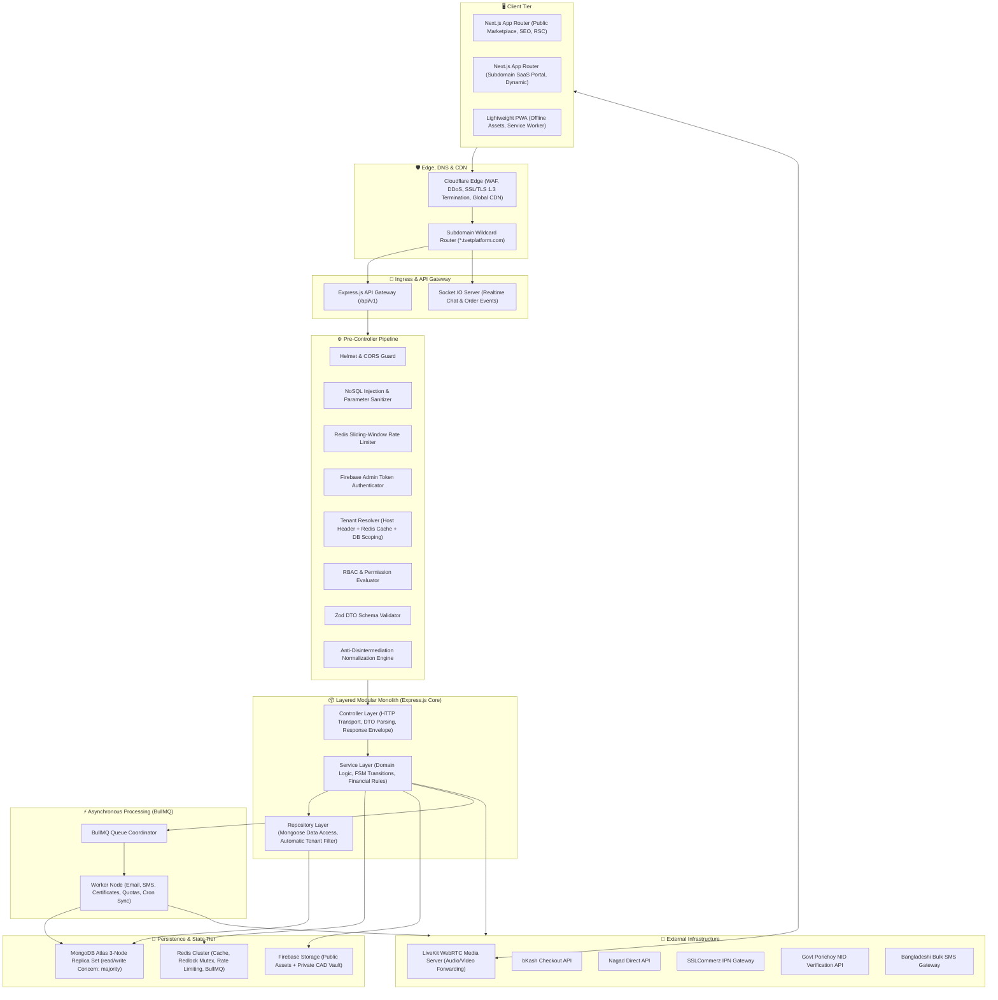
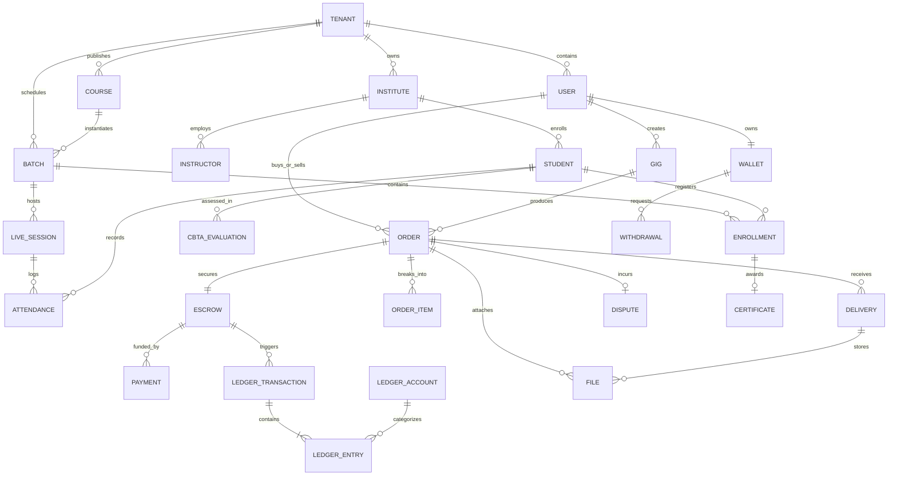
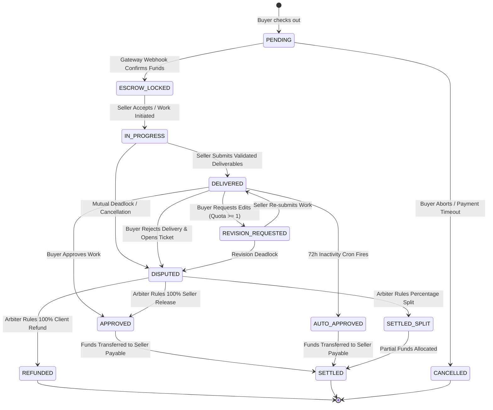
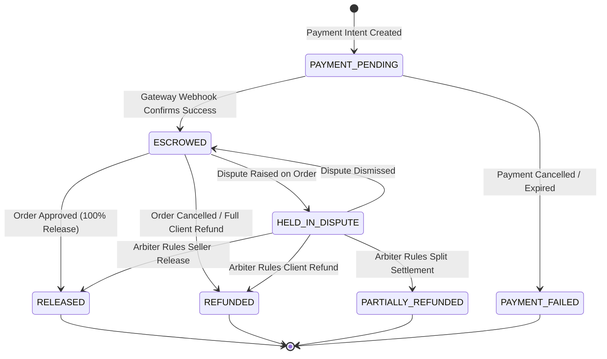
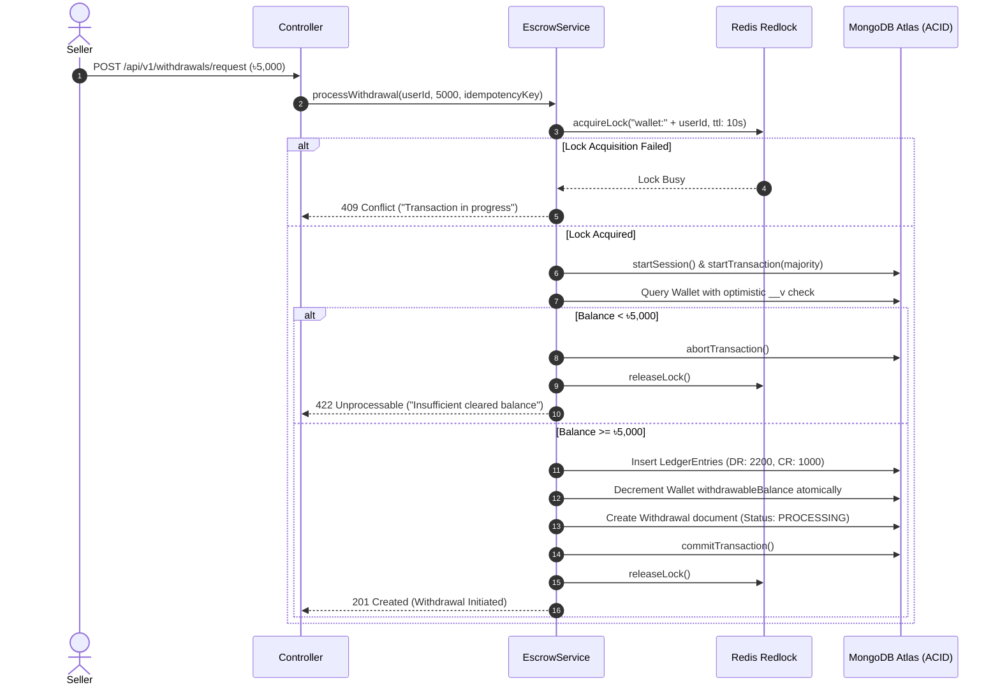
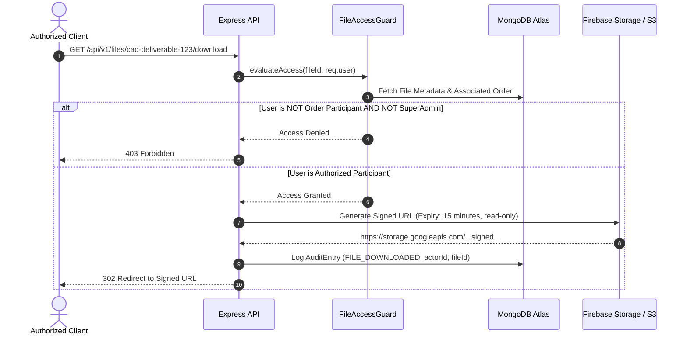

# 🏛️ PHASE 0: Master Architectural Blueprint & System Specification
## Multi-Tenant TVET, Live Practical Skill-Training & Freelance Engineering Platform

---

### Table of Contents
- [A. Complete System Architecture](#a-complete-system-architecture)
- [B. Component Architecture](#b-component-architecture)
- [C. Database Model Overview](#c-database-model-overview)
- [D. Entity Relationship Diagram (ERD)](#d-entity-relationship-diagram-erd)
- [E. API Module Map](#e-api-module-map)
- [F. RBAC & Permissions Matrix](#f-rbac--permissions-matrix)
- [G. Tenant Isolation Strategy](#g-tenant-isolation-strategy)
- [H. Order State Machine](#h-order-state-machine)
- [I. Payment & Escrow State Machine](#i-payment--escrow-state-machine)
- [J. Financial Ledger Design](#j-financial-ledger-design)
- [K. Transaction Boundaries & Concurrency Control](#k-transaction-boundaries--concurrency-control)
- [L. Redis Architecture & Caching Topology](#l-redis-architecture--caching-topology)
- [M. Security Threat Model & Chat Anti-Disintermediation](#m-security-threat-model--chat-anti-disintermediation)
- [N. Secure File System Model](#n-secure-file-system-model)
- [O. LiveKit WebRTC Security Model](#o-livekit-webrtc-security-model)
- [P. Production Monorepo Folder Structure](#p-production-monorepo-folder-structure)
- [Q. 16-Phase Development Roadmap](#q-16-phase-development-roadmap)
- [R. Assumptions & Unresolved Business Decisions](#r-assumptions--unresolved-business-decisions)

---

## A. Complete System Architecture



---

## B. Component Architecture

The backend strictly enforces clean unidirectional dependency injection:
$$\text{HTTP Request} \longrightarrow \text{Middleware} \longrightarrow \text{Controller} \longrightarrow \text{Service} \longrightarrow \text{Repository} \longrightarrow \text{MongoDB/Storage}$$

1. **Client Tier (Next.js 14+)**:
   * **Server Components (RSC)**: Used exclusively for stateless read-heavy public landing pages, category trees, and institutional showcase portals.
   * **Client Components (RCC)**: Used for stateful client boundaries: LiveKit media player, chat rooms, checkout workflows, and interactive CBT&A assessment forms.
   * **State Separation**:
     * Server state handled exclusively by **TanStack Query** (React Query) with aggressive query invalidation and optimistic mutations.
     * Client session/UI state handled by **Zustand** (role toggles, modal dialogs, drawer states).

2. **Ingress & Middleware Tier**:
   * Every request is stamped with an immutable `x-request-id` (UUIDv4) logged across all execution layers.
   * Host inspection resolves tenancy without trusting user-supplied parameters.

3. **Controller Tier**:
   * Encapsulated inside `asyncHandler` wrappers.
   * Accepts validated DTOs from Zod middleware.
   * Formats output into a standard envelope. Never executes Mongoose queries or financial math.

4. **Service Tier**:
   * Contains 100% of domain logic.
   * Explicitly demarcates MongoDB transaction sessions (`session.withTransaction()`).
   * Interacts with Redis for distributed locks and publishes async background tasks to BullMQ.

5. **Repository Tier**:
   * Extends `BaseRepository<T>` and `TenantAwareRepository<T>`.
   * Automatically appends `{ tenantId: currentTenantId }` to every query when a tenant context is active.
   * Accepts session parameters to participate in active transactions.

---

## C. Database Model Overview (30 Core Collections)

1. **`User`**: Core identities, Firebase UID, roles array, active role, primary tenant affiliation, profile metadata, reputation ratings.
2. **`Tenant`**: Multi-tenant organizations (Politechnic/TTC/STP), subdomain, custom domain, subscription tier, status, storage limits.
3. **`Institute`**: Institutional profile, official affiliations (BTEB, DTE, NSDA), principal/director contact, branding theme.
4. **`Student`**: Trainee profile, academic roll, registration number, NTVQF level, cohort/shift mapping, institutional attendance records.
5. **`Instructor`**: Faculty details, CBT&A assessor credentials, assigned departments, timetable mappings.
6. **`Course`**: Institutional curriculums, syllabus, competency units, trade modules, prerequisites.
7. **`Category`**: Hierarchical TVET disciplines (Electrical, Mechanical/CAD, Civil/Architecture, HVAC/RAC, PLC/Automation).
8. **`Enrollment`**: Student-course bindings, enrollment status, progress percentage, completion timestamps.
9. **`Gig`**: Marketplace freelance service listings, 3-tier pricing configurations, deliverable specifications, FAQs.
10. **`Order`**: Marketplace and course purchase agreements, order number, client ID, freelancer ID, milestone references, deadlines.
11. **`OrderItem`**: Specific milestone deliverables, price allocations, revision limits.
12. **`Payment`**: Inbound payment transactions, gateway tracking IDs, status (`PENDING`, `ESCROWED`, `RELEASED`, `REFUNDED`, `FAILED`).
13. **`Escrow`**: Escrow record tied to orders, total locked amount, platform fee, freelancer net, release schedules.
14. **`Wallet`**: User financial accounts, pending balance, withdrawable balance, locked balance, version tag (`__v`).
15. **`LedgerAccount`**: Chart of accounts (Asset, Liability, Equity, Revenue, Expense).
16. **`LedgerTransaction`**: Grouping document for double-entry operations, transaction hash, idempotency reference.
17. **`LedgerEntry`**: Immutable append-only debit/credit lines with symmetric balance validation.
18. **`Withdrawal`**: Outbound payout requests, target gateway (bKash/Nagad/Bank), payout status, fee deductions.
19. **`Delivery`**: File submissions from freelancers, cryptographic SHA-256 hashes, file byte sizes, submission notes.
20. **`Dispute`**: Formal conflict tickets, dispute reason, evidence locker reference, arbitrator ruling records.
21. **`ChatRoom`**: 1-on-1 or batch chat conversations, participant bindings, moderation flags.
22. **`ChatMessage`**: Individual messages, sanitized body, disintermediation risk flags, attachments.
23. **`LiveSession`**: Scheduled/active WebRTC live classrooms, room ID, instructor host, recording status.
24. **`Attendance`**: Timestamped join/leave events, total duration in minutes, percentage calculation against 80% criteria.
25. **`Certificate`**: Issued credentials, certificate UUID, cryptographic signature, public QR verification code.
26. **`File`**: File vault records, bucket path, mime type, byte size, access classification (`PUBLIC` vs `PRIVATE_CAD`).
27. **`AuditLog`**: Immutable append-only audit trail capturing actor, IP, action, resource, diffs, and timestamp.
28. **`Notification`**: System notifications, delivery channel (Push, SMS, In-App), read status.
29. **`IdempotencyKey`**: Financial and critical mutation locks, request hash, response snapshot, TTL index.
30. **`CBTAEvaluation`**: Competency-based assessment logbook entries (`Competent` vs `Not Yet Competent`).

---

## D. Entity Relationship Diagram (ERD)



---

## E. API Module Map

All endpoints conform to `/api/v1/...` naming conventions:

| Module Base | Method & Route Pattern | Primary Responsibility |
| :--- | :--- | :--- |
| **Auth** | `POST /auth/session-sync`<br>`POST /auth/switch-role`<br>`POST /auth/logout` | Token exchange, custom claims sync, context switching |
| **Users** | `GET /users/me`<br>`PATCH /users/me/profile`<br>`POST /users/kyc/porichoy` | Profile management, Porichoy NID verification |
| **Tenants** | `GET /tenants/lookup`<br>`POST /tenants/register`<br>`PATCH /tenants/settings` | Subdomain resolution, institution workspace onboarding |
| **Courses** | `GET /courses`<br>`POST /courses`<br>`GET /courses/:id/curriculum` | Course syllabus, NTVQF alignment, trade catalogs |
| **Gigs** | `GET /gigs`<br>`POST /gigs`<br>`POST /gigs/custom-offer` | Freelance TVET gig listings, custom quotation generator |
| **Orders** | `POST /orders/initiate`<br>`GET /orders/:id`<br>`POST /orders/:id/deliver`<br>`POST /orders/:id/approve`<br>`POST /orders/:id/revision` | Order lifecycle, milestone approvals, delivery file submission |
| **Escrow** | `POST /escrow/lock`<br>`POST /escrow/:id/release`<br>`POST /escrow/:id/refund` | Transactional funds locking and milestone payouts |
| **Payments** | `POST /payments/bkash/init`<br>`POST /payments/bkash/callback`<br>`POST /payments/nagad/callback`<br>`POST /payments/ssl/ipn` | Local payment gateway checkout and idempotent webhook listeners |
| **Ledger** | `GET /ledger/accounts`<br>`GET /ledger/statement/:accountId`<br>`GET /ledger/audit` | Double-entry journal statements, financial balance verification |
| **Withdrawals**| `POST /withdrawals/request`<br>`GET /withdrawals/history`<br>`PATCH /withdrawals/:id/process` | Payout requests, Redlock concurrency checks, bank transfers |
| **Classroom** | `POST /classroom/rooms`<br>`GET /classroom/rooms/:id/token`<br>`POST /classroom/rooms/:id/end` | LiveKit SFU room provisioning, watermarked access tokens |
| **Institutes** | `GET /institutes/dashboard`<br>`POST /institutes/batches`<br>`POST /institutes/cbta/grade`<br>`GET /institutes/audit-export` | Multi-shift management, CBT&A evaluations, 1-click SEIP/ASSET export |
| **Disputes** | `POST /disputes/open`<br>`GET /disputes/:id/evidence`<br>`POST /disputes/:id/arbitrate` | Dispute tickets, SHA-256 evidence locker, admin settlements |
| **Chat** | `GET /chat/rooms`<br>`POST /chat/rooms/:id/messages`<br>`GET /chat/rooms/:id/history` | Realtime messaging, anti-disintermediation filtering |
| **Files** | `POST /files/upload-ticket`<br>`GET /files/:id/signed-url`<br>`DELETE /files/:id` | Private CAD drawing storage, 15-minute signed URL generator |
| **Certificates**| `POST /certificates/issue`<br>`GET /certificates/verify/:uuid` | QR-verifiable certificate issuance and public verification |
| **Audit** | `GET /audit/logs`<br>`GET /audit/resources/:type/:id` | Append-only security audit trail querying for Super Admins |

---

## F. RBAC & Permissions Matrix

| System Action / Resource | `SUPER_ADMIN` | `INSTITUTE_ADMIN` | `INSTRUCTOR` | `STUDENT` | `CLIENT` | `FREELANCER` |
| :--- | :---: | :---: | :---: | :---: | :---: | :---: |
| **Manage Tenant Configuration** | ✅ | ✅ (Own Tenant) | ❌ | ❌ | ❌ | ❌ |
| **Create & Publish Courses** | ✅ | ✅ | ❌ | ❌ | ❌ | ❌ |
| **Conduct CBT&A Assessments** | ❌ | ✅ | ✅ | ❌ | ❌ | ❌ |
| **Export Govt/Donor Audit Reports**| ✅ | ✅ (Own Tenant) | ❌ | ❌ | ❌ | ❌ |
| **Host Live Classroom (Broadcaster)**| ❌ | ✅ | ✅ | ❌ | ❌ | ✅ (Public Gigs)|
| **Join Live Classroom (Subscriber)** | ❌ | ❌ | ❌ | ✅ | ❌ | ❌ |
| **Publish Marketplace Gigs** | ❌ | ❌ | ❌ | ❌ | ❌ | ✅ (Verified Pro)|
| **Fund Escrow / Purchase Service** | ❌ | ❌ | ❌ | ❌ | ✅ | ❌ |
| **Submit Project CAD Deliveries** | ❌ | ❌ | ❌ | ❌ | ❌ | ✅ |
| **Approve Delivery & Release Funds**| ❌ | ❌ | ❌ | ❌ | ✅ | ❌ |
| **Arbitrate Disputes / Force Split**| ✅ | ❌ | ❌ | ❌ | ❌ | ❌ |
| **Request Balance Withdrawal** | ❌ | ❌ | ❌ | ❌ | ❌ | ✅ |
| **View Immutable Financial Ledger**| ✅ | ✅ (Tenant Sub-ledger)| ❌ | ❌ | ❌ | ❌ |
| **View Audit Trail Logs** | ✅ | ✅ (Tenant Events) | ❌ | ❌ | ❌ | ❌ |

---

## G. Tenant Isolation Strategy

Multi-tenancy uses a strict **Shared Process, Shared Database, Scoped Collections with Logical Separation** strategy.

```mermaid
flowchart TD
    Req[Incoming HTTP Request] --> HostCheck{Read Host Header}
    HostCheck -- "dpi.tvetplatform.com" --> Subdomain[Extract Subdomain: dpi]
    Subdomain --> RedisCheck{Check Redis Tenant Cache}
    RedisCheck -- Cache Hit --> CachedTenant[Get tenantId & Status]
    RedisCheck -- Cache Miss --> DBCheck[Query Tenant Collection]
    DBCheck --> CacheSet[Set Redis TTL 3600s]
    CacheSet --> CachedTenant
    CachedTenant --> AuthCheck{Is Route Authenticated?}
    AuthCheck -- Yes --> UserCheck{User has access to tenantId?}
    UserCheck -- Denied --> Forbidden[Return 403 Forbidden]
    UserCheck -- Permitted --> AttachContext[Inject req.tenantId = 'tenant_123']
    AuthCheck -- No (Public Page) --> AttachContext
    AttachContext --> RepositoryLayer[Repository Execution]
    RepositoryLayer --> InjectFilter[Auto-append { tenantId: req.tenantId } to Mongoose Query]
    InjectFilter --> IsolatedDocStore[(MongoDB Filtered Documents)]
```

### Defense-in-Depth Measures:
1. **Never Trust the Client**: `tenantId` is never accepted from `req.body`, `req.query`, or route parameters for tenant-owned mutations.
2. **Repository-Level Invariant**: `TenantAwareRepository` automatically throws an `IsolationBreachError` if an operation on a tenant-scoped collection is attempted without an explicit `tenantId`.
3. **Compound Tenant Indexes**: Every tenant-owned collection includes `{ tenantId: 1, ... }` as the prefix of all compound indexes.

---

## H. Order State Machine



### Explicit State Transition Table:
```typescript
export const ORDER_STATE_TRANSITIONS: Record<OrderStatus, OrderStatus[]> = {
  [OrderStatus.PENDING]: [OrderStatus.ESCROW_LOCKED, OrderStatus.CANCELLED],
  [OrderStatus.ESCROW_LOCKED]: [OrderStatus.IN_PROGRESS, OrderStatus.CANCELLED, OrderStatus.DISPUTED],
  [OrderStatus.IN_PROGRESS]: [OrderStatus.DELIVERED, OrderStatus.DISPUTED],
  [OrderStatus.DELIVERED]: [OrderStatus.APPROVED, OrderStatus.AUTO_APPROVED, OrderStatus.REVISION_REQUESTED, OrderStatus.DISPUTED],
  [OrderStatus.REVISION_REQUESTED]: [OrderStatus.DELIVERED, OrderStatus.DISPUTED],
  [OrderStatus.DISPUTED]: [OrderStatus.REFUNDED, OrderStatus.APPROVED, OrderStatus.SETTLED_SPLIT],
  [OrderStatus.APPROVED]: [OrderStatus.SETTLED],
  [OrderStatus.AUTO_APPROVED]: [OrderStatus.SETTLED],
  [OrderStatus.SETTLED_SPLIT]: [OrderStatus.SETTLED],
  [OrderStatus.SETTLED]: [],
  [OrderStatus.CANCELLED]: [],
  [OrderStatus.REFUNDED]: []
};
```

---

## I. Payment & Escrow State Machine

Financial status is decoupled from the operational order workflow:



---

## J. Financial Ledger Design (Double-Entry Chart of Accounts)

The financial engine treats wallet balances as **derived cached projections**; the single source of truth is the immutable, append-only `LedgerEntry` collection.

### 1. Chart of Accounts:
* `1000 - GATEWAY_CLEARING` (Asset): Funds pending settlement from bKash/Nagad/SSLCommerz.
* `2000 - ESCROW_LIABILITY` (Liability): Platform custody of client funds locked in active orders.
* `2100 - SELLER_PAYABLE_PENDING` (Liability): Earnings held in 48-hour anti-fraud holding.
* `2200 - SELLER_PAYABLE_WITHDRAWABLE` (Liability): Cleared funds eligible for payout.
* `3000 - PLATFORM_EQUITY` (Equity): Platform reserves.
* `4000 - PLATFORM_REVENUE_COMMISSION` (Revenue): 15% marketplace commission.
* `4100 - PLATFORM_REVENUE_SURCHARGE` (Revenue): 5% buyer transaction and SaaS tuition fee.

### 2. Double-Entry Transaction Ledger Example:
*Scenario: Client pays ৳10,000 for an AutoCAD gig (+ 5% fee = ৳10,500 total paid via bKash).*

```
Transaction 1: Order Escrow Funding
--------------------------------------------------------------------------
DR: 1000 GATEWAY_CLEARING                ৳ 10,500.00
    CR: 2000 ESCROW_LIABILITY                       ৳ 10,000.00
    CR: 4100 PLATFORM_REVENUE_SURCHARGE             ৳    500.00
(Balance Check: DR ৳10,500 == CR ৳10,500)

Transaction 2: Order Approval (Release 85% to Seller, 15% Platform Commission)
--------------------------------------------------------------------------
DR: 2000 ESCROW_LIABILITY                ৳ 10,000.00
    CR: 2100 SELLER_PAYABLE_PENDING                 ৳  8,500.00
    CR: 4000 PLATFORM_REVENUE_COMMISSION            ৳  1,500.00
(Balance Check: DR ৳10,000 == CR ৳10,000)

Transaction 3: 48-Hour Clearance Cron Execution
--------------------------------------------------------------------------
DR: 2100 SELLER_PAYABLE_PENDING          ৳  8,500.00
    CR: 2200 SELLER_PAYABLE_WITHDRAWABLE            ৳  8,500.00
(Balance Check: DR ৳8,500 == CR ৳8,500)

Transaction 4: Seller Withdrawal via bKash BEFTN
--------------------------------------------------------------------------
DR: 2200 SELLER_PAYABLE_WITHDRAWABLE     ৳  8,500.00
    CR: 1000 GATEWAY_CLEARING                       ৳  8,500.00
(Balance Check: DR ৳8,500 == CR ৳8,500)
```

---

## K. Transaction Boundaries & Concurrency Control



---

## L. Redis Architecture & Caching Topology

1. **Topology**: Redis Cluster with persistence enabled (AOF `everysec` + RDB snapshotting).
2. **Namespacing Standards**:
   * `session:<uid>`: Active Firebase session claims and active tenant context (TTL: 24h).
   * `tenant:subdomain:<name>`: Cached tenant metadata for subdomain resolution (TTL: 1h).
   * `lock:wallet:<uid>`: Redlock distributed mutex for payout operations (TTL: 10s).
   * `lock:order:<orderId>`: Redlock distributed mutex for delivery/approval actions (TTL: 15s).
   * `ratelimit:ip:<ip_address>`: Sliding-window timestamp zset for edge throttling (TTL: 15m).
   * `idempotency:<key>`: Stored request/response payloads for financial endpoints (TTL: 24h).
   * `bullmq:*`: BullMQ queue structures, delayed jobs, and failed dead-letter queues.

---

## M. Security Threat Model & Chat Anti-Disintermediation

### 1. STRIDE Threat Analysis Matrix:
* **Spoofing**: Mitigated via Firebase ID token cryptographic validation on every request.
* **Tampering**: Mitigated via Zod schema enforcement, MongoDB ACID transactions, and HMAC-SHA256 webhook signatures.
* **Repudiation**: Mitigated via an append-only, immutable `AuditLog` storing actor ID, IP, user-agent, and SHA-256 payload digests.
* **Information Disclosure**: Mitigated via AES-256-GCM encryption for NIDs/bank details at rest and TLS 1.3 in transit.
* **Denial of Service**: Mitigated via Cloudflare Layer 7 protection and Redis sliding-window rate limiters.
* **Elevation of Privilege**: Mitigated via strict server-side RBAC guards verifying both user roles and tenant ownership.

### 2. Multi-Stage Chat Anti-Disintermediation Engine:
To prevent freelancers and clients from sharing personal phone numbers or bKash details to evade platform fees, messages undergo multi-pass normalization before routing:

```
Raw Message: "amake eita te bKash koren: ০ ১ ৭ ১ ২ - ৩ ৪ ৫ ৬ ৭ ৮"
   │
   ▼ 1. Unicode Normalization (NFKD)
"amake eita te bKash koren: ০ ১ ৭ ১ ২ - ৩ ৪ ৫ ৬ ৭ ৮"
   │
   ▼ 2. Strip Zero-Width & Invisible Characters ([\u200B-\u200D\uFEFF])
"amake eita te bKash koren: ০ ১ ৭ ১ ২ - ৩ ৪ ৫ ৬ ৭ ৮"
   │
   ▼ 3. Convert Bangla Numerals to English Numerals (০-৯ -> 0-9)
"amake eita te bKash koren: 0 1 7 1 2 - 3 4 5 6 7 8"
   │
   ▼ 4. Whitespace & Punctuation Collapse between Digits
"amake eita te bKash koren: 01712345678"
   │
   ▼ 5. Regex Pattern Detection (Bangladeshi Mobile: /01[3-9]\d{8}/)
MATCH DETECTED: Disintermediation Risk Flagged
   │
   ▼ 6. Action: Block Message (HTTP 422) + Issue Security Strike to User
```

---

## N. Secure File System Model (Private CAD Vault)



* **Storage Rules**: The CAD vault bucket has all public access blocked at the bucket policy level.
* **Malware Scanning Hook**: Uploaded archive and drawing files pass an asynchronous ClamAV buffer scan in the BullMQ worker pipeline before the status transitions to `CLEAN`.

---

## O. LiveKit WebRTC Security Model

1. **Room Token Issuance**: LiveKit access tokens are minted server-side using the `livekit-server-sdk`. Tokens specify strict, granular permissions (`canPublish: false` for students, `canPublish: true` for verified instructors).
2. **Session Concurrency Enforcer**: When a student connects to LiveKit, a Redis session key `active_call:<uid>` is set. If the same UID initiates a second room connection from another device, the previous connection is forcibly terminated via the LiveKit Room Service API.
3. **Traceability Watermark Reality**: The canvas dynamic watermark is designed as a **forensic deterrence and traceability tool**. The system embeds:
   `[Student Name] | [Phone: 017...] | [Student ID] | [Timestamp: 2026-09-18 21:40]`.
   *System design acknowledges that determined attackers can use external physical cameras to record screens; the watermark ensures any leaked video can be definitively attributed to the source account for institutional expulsion and legal action.*

---

## P. Production Monorepo Folder Structure

```
tvetbangladesh/
├── apps/
│   ├── web/                               # Next.js 14+ Frontend (App Router, PWA)
│   │   ├── public/                        # Static assets, PWA manifest, service worker
│   │   ├── src/
│   │   │   ├── app/                       # Route groups: (auth), (marketplace), (institute), (classroom)
│   │   │   ├── components/                # React Server & Client Components
│   │   │   ├── hooks/                     # Custom React Query & UI hooks
│   │   │   ├── stores/                    # Zustand client-state stores
│   │   │   └── lib/                       # API clients, Firebase client, LiveKit client
│   │   ├── package.json
│   │   └── tsconfig.json
│   │
│   ├── api/                               # Core Express.js Backend Server
│   │   ├── src/
│   │   │   ├── common/                    # Guards, errors, response envelopes, logger
│   │   │   ├── config/                    # Env vars, DB connection, Redis client, Firebase Admin
│   │   │   ├── middlewares/               # Auth, Tenant, Role, RateLimit, ChatGuard, Zod
│   │   │   ├── modules/                   # 30 Business domain modules (Controller, Service, Repo, Model, DTO)
│   │   │   │   ├── auth/
│   │   │   │   ├── orders/
│   │   │   │   ├── escrow/
│   │   │   │   ├── ledger/
│   │   │   │   ├── institutes/
│   │   │   │   └── ...
│   │   │   ├── server.ts                  # Server entry point
│   │   │   └── app.ts                     # Express pipeline configuration
│   │   ├── package.json
│   │   └── tsconfig.json
│   │
│   └── worker/                            # BullMQ Background Processing Service
│       ├── src/
│       │   ├── queues/                    # Queue definitions (email, sms, cron, certificates)
│       │   ├── workers/                   # Worker implementations
│       │   └── worker.ts                  # Worker cluster entry point
│       ├── package.json
│       └── tsconfig.json
│
├── packages/
│   ├── types/                             # Shared TypeScript interfaces & enums
│   ├── validation/                        # Shared Zod validation DTO schemas
│   ├── config/                            # ESLint, Prettier, TypeScript base configs
│   └── logger/                            # Shared Winston / Pino structured logger
│
├── infrastructure/
│   ├── docker/                            # Dockerfiles for api, web, worker
│   ├── nginx/                             # Reverse proxy & subdomain routing configs
│   └── scripts/                           # Database seed, migration, and backup scripts
│
├── docs/                                  # Architectural specs, API docs, DR procedures
├── package.json                           # Root monorepo workspace package.json
├── turbo.json                             # Turborepo build pipeline orchestration
└── .env.example                           # Canonical environment variable specifications
```

---

## Q. 16-Phase Development Roadmap

* **Phase 1**: Project Foundation (Monorepo setup, TypeScript, ESLint, Turbo, Docker, CI/CD skeleton).
* **Phase 2**: Database Architecture (MongoDB Mongoose base schemas, Redis setup, Repository pattern, Tenant models).
* **Phase 3**: Authentication & RBAC (Firebase Admin SDK, role evaluation guards, tenant resolver middleware).
* **Phase 4**: Core Institutional SaaS (Institutes, departments, shifts, students, instructors).
* **Phase 5**: Academics & Courses (Course catalogs, NTVQF competency mapping, trade modules, enrollment).
* **Phase 6**: Freelance Marketplace (Technical gigs, packages, custom offers, order state machine).
* **Phase 7**: FinTech Escrow & Double-Entry Ledger (Payment gateways, escrow locking, immutable ledger entries).
* **Phase 8**: Withdrawals & Financial Settlement (Redlock mutex locks, payout processing, 48h clearance cron).
* **Phase 9**: Secure Real-time Chat (Socket.IO, multi-pass anti-disintermediation normalization filter).
* **Phase 10**: LiveKit Live Classroom (SFU room provisioning, dynamic canvas watermark, attendance tracking).
* **Phase 11**: Secure File System (Private CAD vault, 15-minute signed URLs, ownership checks).
* **Phase 12**: Asynchronous Processing (BullMQ workers, SMS alerts, automated email pipelines).
* **Phase 13**: Verifiable Credentials (Dual-branded QR digital certificates with BTEB/NSDA verification).
* **Phase 14**: Observability & Audit Logs (Append-only audit trail, health checks `/health`, `/ready`, `/live`).
* **Phase 15**: Comprehensive Verification & Testing (Concurrency tests on double-withdrawals, Playwright E2E).
* **Phase 16**: Production Deployment (Zero-downtime deployment, backup recovery drills, security hardening).

---

## R. Assumptions & Unresolved Business Decisions

1. **Fintech Custody Regulation**: Assumed operating via merchant sub-accounts with licensed aggregators (SSLCommerz, bKash Merchant) satisfies Bangladesh Bank digital commerce guidelines without requiring a full Payment System Operator (PSO) license.
2. **Porichoy API SLA**: Assumed Government Porichoy API credentials and credit allocations will be procured before Phase 3 verification testing; fallback to manual admin review SLA ($<24$h) is architected.
3. **Storage Quota Billing Overages**: In the current design, exceeding institutional quota pauses new recording uploads without terminating active classes. A corporate credit card or auto-debit mechanism for automatic overage billing is left for post-MVP.
4. **Dispute Arbitration Legal Finality**: Assumed Super Admin arbitration rulings represent binding platform settlement; external civil litigation workflows are outside platform software scope.

---
*Phase 0 Master Specification Complete. Awaiting instruction: `"START PHASE 1"` to begin code scaffolding.*
