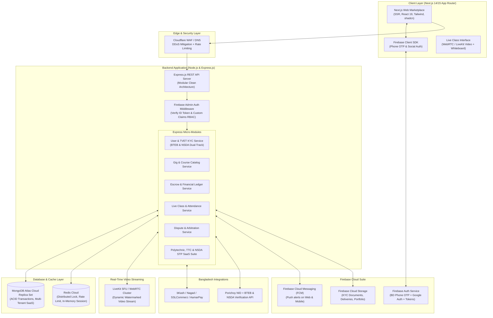
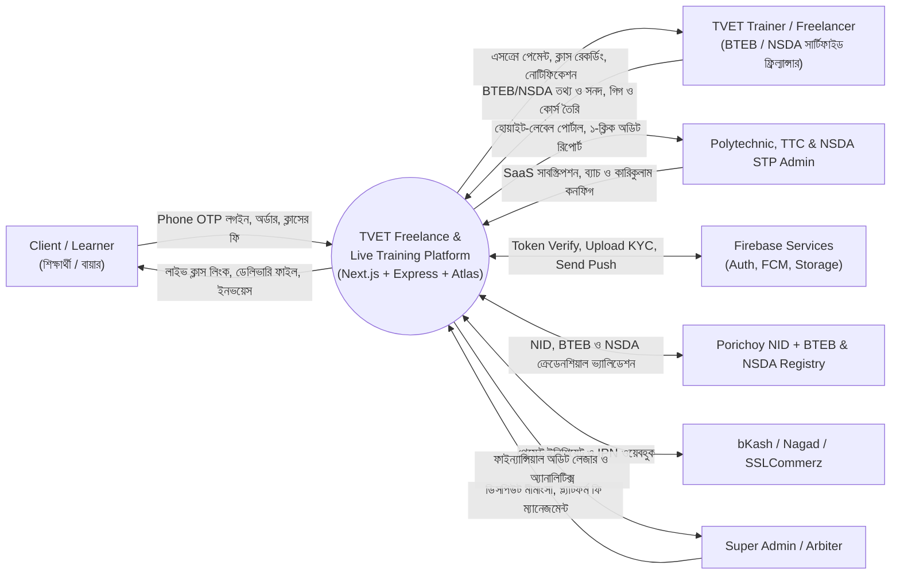
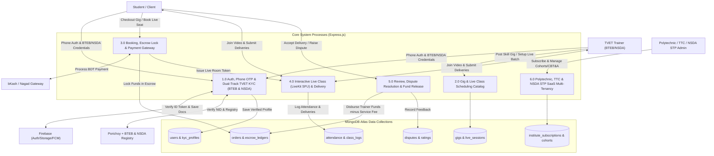
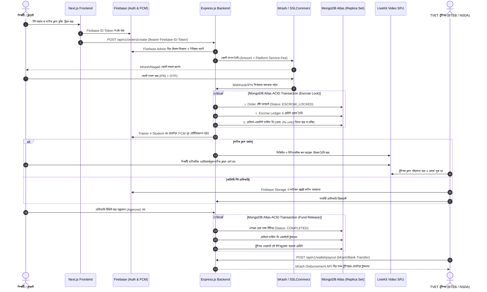
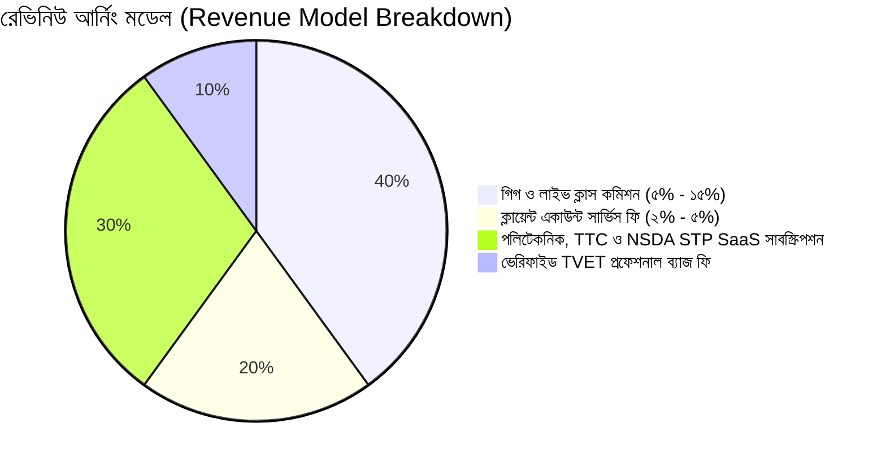

# 🛠️ TVET Freelancing & Live Skill-Training SaaS Platform
## 🇧🇩 Architecture, DFD & Security Blueprint
### 🚀 Core Stack: **Next.js + Express.js + Firebase + MongoDB Atlas**
### 🏛️ Accreditation Support: **BTEB (কারিগরি শিক্ষা বোর্ড) & NSDA (জাতীয় দক্ষতা উন্নয়ন কর্তৃপক্ষ) Dual-Track** — Institutes: **Polytechnic, TTC & NSDA STP**

---

## 📌 Executive Summary (প্রকল্পের রূপরেখা ও উদ্দেশ্য)

বাংলাদেশ প্রেক্ষাপটে কারিগরি ও বৃত্তিমূলক শিক্ষা ও প্রশিক্ষণ (**TVET - Technical and Vocational Education and Training**) খাতে দক্ষ জনবল (ইলেকট্রিশিয়ান, মেকানিক্যাল ড্রাফটার, আরএসি টেকনিশিয়ান, ওয়েল্ডিং স্পেশালিস্ট, ইলেকট্রনিক্স ও আইটি টেকনিশিয়ান ইত্যাদি) তৈরি হচ্ছে, কিন্তু তাদের কাজের সুযোগ ও আন্তর্জাতিক/দেশীয় ক্লায়েন্টদের সাথে সংযোগের কোনো বিশ্বস্ত প্ল্যাটফর্ম নেই।

এই প্ল্যাটফর্মটি একটি **Fiverr-এর মতো সুরক্ষিত ফ্রিল্যান্সিং মার্কেটপ্লেস** এবং একটি **Live Skill-Mentorship SaaS** এর যৌথ রূপ।

### 🎯 নির্বাচিত টেকনোলজি স্ট্যাকের ভূমিকা (Tech Stack Synergy):
1. **Next.js (Frontend & SSR/PWA)**: দ্রুতগতির SEO-ফ্রেন্ডলি মার্কেটপ্লেস, দেশীয় দুর্বল নেটওয়ার্কেও PWA এর মাধ্যমে ফাস্ট ইন্টারফেস।
2. **Firebase (Auth, Storage & Push Notification)**:
   * **Firebase Authentication**: বাংলাদেশি মোবাইল নম্বর দিয়ে সরাসরি **Phone SMS OTP লগইন** এবং Google Social Login।
   * **Firebase Storage**: NID, BTEB/NSDA কারিগরি সার্টিফিকেট, গিগ থাম্বনেইল এবং ডেলিভারি ফাইলের নিরাপদ ও এনক্রিপ্টেড ক্লাউড স্টোরেজ।
   * **Firebase Cloud Messaging (FCM)**: লাইভ ক্লাসের অ্যালার্ট, অর্ডার নোটিফিকেশন ও পেমেন্ট কনফার্মেশনের জন্য পুশ নোটিফিকেশন।
3. **Express.js (Backend Core Engine)**:
   * Firebase Admin SDK দিয়ে সেন্ট্রালাইজড অথোরাইজেশন ও RBAC/Custom Claims।
   * এসক্রো (Escrow) পেমেন্ট ইঞ্জিন ও বাংলাদেশি পেমেন্ট গেটওয়ে (bKash, Nagad, SSLCommerz) প্রসেসিং।
   * প্ল্যাটফর্ম সার্ভিস ফি ও মাল্টি-ওয়ালেট হিসাবরক্ষণ।
   * লাইভ ক্লাস ভিডিও রুম টোকেন ম্যানেজমেন্ট (LiveKit / WebRTC)।
4. **MongoDB Atlas (Cloud Database & ACID Escrow)**:
   * ক্লাউড-হোস্টেড ডিস্ট্রিবিউটেড রেপ্লিকা সেট।
   * মাল্টি-ডকুমেন্ট ACID ট্রানজেকশন যা এসক্রো ব্যালেন্স ও ওয়ালেট লেজারের ১০০% নির্ভুলতা নিশ্চিত করে।

---

## 🏗️ 1. Complete System Architecture (সিস্টেম আর্কিটেকচার)



---

## 🔄 2. Data Flow Diagrams (DFD)

### 2.1 DFD Level 0 (Context Diagram)



---

### 2.2 DFD Level 1 (Process Breakdown)



---

### 2.3 DFD Level 2 (Detailed Escrow Payment & Live Class Execution)

নিচে শিক্ষার্থী কর্তৃক পেমেন্ট থেকে শুরু করে ক্লাউড ডেটাবেস এবং লাইভ ক্লাস পরিচালনার সম্পূর্ণ ইন্টারঅ্যাকশন:



---

## 🛡️ 3. Security Architecture & Advanced Protection (উন্নত নিরাপত্তা ব্যবস্থা)

### 3.1 Firebase + Express Hybrid Authentication Architecture
*   **Firebase Authentication Core**:
    *   **Phone OTP Login**: বাংলাদেশের শিক্ষার্থীদের জন্য ইমেইল/পাসওয়ার্ডের চেয়ে মোবাইল নম্বর বেশি সুবিধাজনক। Firebase Phone Auth সরাসরি রোবাস্ট SMS OTP প্রদান করে।
    *   **Firebase Custom Claims for RBAC**:
        ```typescript
        // Express.js Backend এ রোল সেট করা
        await admin.auth().setCustomUserClaims(firebaseUid, {
          role: 'INSTRUCTOR', // 'CLIENT', 'INSTRUCTOR', 'INSTITUTE_ADMIN', 'SUPER_ADMIN'
          isVerifiedTVET: true
        });
        ```
    *   **Express Middleware Authentication**:
        প্রতিটি রিকোয়েস্টে `Authorization: Bearer <Firebase_ID_Token>` পাঠানো হবে। ব্যাকএন্ডে Firebase Admin SDK দিয়ে টোকেন ডিকোড করা হবে:
        ```typescript
        const decodedToken = await admin.auth().verifyIdToken(idToken);
        req.user = decodedToken; // uid, phone, email, role
        ```
    *   **Short-lived Identity Tokens**: Firebase ID Token প্রতি ৬০ মিনিট পর স্বয়ংক্রিয়ভাবে ক্লায়েন্টে রিফ্রেশ হয়, ফলে দীর্ঘস্থায়ী এক্সেস টোকেন ফাঁসের ঝুঁকি থাকে না।

### 3.2 Bangladesh TVET Specific Identity & Fraud Prevention (BTEB & NSDA Dual-Track)
*   **NID Verification (Porichoy API)**:
    *   ফ্রিল্যান্সার/ইন্সট্রাক্টর রেজিস্ট্রেশনের সময় NID ও জন্মতারিখ সরকারি নির্বাচন কমিশন ডাটাবেসের (Porichoy) সাথে যাচাই করা হবে।
*   **BTEB Verification Track**:
    *   বাংলাদেশ কারিগরি শিক্ষা বোর্ডের রোল, রেজিস্ট্রেশন নম্বর এবং পলিটেকনিক/TTC সনদপত্র সংগ্রহ করে অডিট প্যানেলে ভ্যালিডেট করা হবে।
*   **NSDA Verification Track**:
    *   জাতীয় দক্ষতা উন্নয়ন কর্তৃপক্ষের রেজিস্ট্রেশন নম্বর, NTVQF লেভেল (Level 1-6) এবং CBT&A সার্টিফাইড ট্রেইনার/অ্যাসেসর আইডি যাচাই করা হবে।
*   **Firebase Storage Security Rules**:
    *   KYC ডকুমেন্টস (NID কপি, কারিগরি সনদ) পাবলিকলি এক্সেস করা যাবে না। শুধুমাত্র অরিজিনাল ইউজার এবং সুপার-অ্যাডমিন সাইনড URL (Signed URLs) এর মাধ্যমে দেখতে পারবে।
*   **Dynamic Anti-Piracy Watermarking (লাইভ ক্লাস ও ভিডিওর জন্য)**:
    *   LiveKit ভিডিও ক্যানভাসে শিক্ষার্থীর **নাম, ফোন নম্বর ও Firebase UID** ট্রান্সপারেন্ট ওয়াটারমার্ক হিসেবে ভেসে বেড়াবে। কেউ স্ক্রিন রেকর্ড করলে তার পরিচয় সাথে সাথে ধরা পড়বে।

### 3.3 Financial & Escrow Integrity (MongoDB Atlas ACID Transactions)
*   **Multi-Document Transactions**:
    *   পেমেন্ট ও এসক্রো রিলিজের ক্ষেত্রে MongoDB সেশন ব্যবহার করা হবে:
    ```typescript
    const session = await mongoose.startSession();
    session.startTransaction();
    try {
      await Order.findByIdAndUpdate(orderId, { escrowStatus: 'RELEASED_TO_TRAINER' }, { session });
      await Wallet.findByIdAndUpdate(trainerWalletId, { $inc: { balanceBDT: netPayout } }, { session });
      await FinancialLedger.create([ledgerEntry], { session });
      await session.commitTransaction();
    } catch (error) {
      await session.abortTransaction();
      throw error;
    } finally {
      session.endSession();
    }
    ```
*   **Double-Entry Bookkeeping Ledger**:
    *   কোনো ব্যালেন্স শুধু সংখ্যার যোগ-বিয়োগ দিয়ে পরিবর্তিত হবে না। প্রতিটি ট্রানজেকশনের বিপরীতে অডিটযোগ্য ডেবিট এবং ক্রেডিট রেকর্ড `financial_ledgers` কালেকশনে সংরক্ষিত থাকবে।
*   **Idempotency Protection**:
    *   bKash বা Nagad IPN কলব্যাকের ক্ষেত্রে ডাবল-ক্রেডিট হওয়া রোধে গেটওয়ের `trxID` ইউনিক ইনডেক্স হিসেবে ডেটাবেসে চেক করা হবে।

### 3.4 API & Application Security (OWASP Top 10)
*   **Zod Schema Validation**: Express.js এর প্রতিটি রিকোয়েস্ট বডি `Zod` দিয়ে টাইপ ও ফিল্ড স্যানিটাইজ করা হবে।
*   **Distributed Rate Limiting**: Express এ `express-rate-limit` এবং Redis ব্যবহার করে ব্রুট-ফোর্স এবং স্প্যামিং রোধ।
*   **CORS Whitelisting**: ব্যাকএন্ড এপিআই শুধুমাত্র নির্ধারিত Next.js ডোমেন থেকে এক্সেস করা যাবে।
*   **MongoDB Atlas Network Security**:
    *   IP Access List / VPC Peering ব্যবহার করে ডাটাবেস শুধুমাত্র Express ব্যাকএন্ড সার্ভারের জন্য রেস্ট্রিক্ট রাখা হবে।

---

## 💼 4. Business & Monetization Architecture (ব্যবসায়িক মডেল ও ফি কাঠামো)



1. **গিগ ও লাইভ কোর্স কমিশন (Trainer Commission)**:
   * প্রতিটি অর্ডার বা ক্লাস টিকিট বিক্রির ওপর ১৫% প্ল্যাটফর্ম কমিশন (Authority/SaaS cut)।
2. **ক্লায়েন্ট একাউন্ট সার্ভিস ফি (Client Service Fee)**:
   * প্রতিটি অর্ডারের বিপরীতে ক্লায়েন্ট এবং ইনস্টিটিউট টিউশন ফি থেকে ৫% সিকিউর এসক্রো ও প্রসেসিং চার্জ।
3. **পলিটেকনিক, TTC ও NSDA STP প্রাতিষ্ঠানিক SaaS সাবস্ক্রিপশন**:
   * সরকারি/বেসরকারি পলিটেকনিক, কারিগরি প্রশিক্ষণ কেন্দ্র (TTC) এবং NSDA অনুমোদিত STPs (Skills Training Providers)-এর জন্য কাস্টম সাবডোমেন, CBT&A ট্র্যাকিং, সেন্ট্রাল ওয়ার্কশপ ব্রডকাস্টিং, SEIP/ASSET অডিট রিপোর্ট এবং অনলাইন ফি কালেকশনের জন্য মাসিক ২,৫০০ - ২০,০০০ টাকা সাবস্ক্রিপশন প্ল্যান।
4. **TVET Verified Skill Badge**:
   * ট্রেইনারের ল্যাব এক্সপেরিয়েন্স ও সনদের ফিজিক্যাল অডিট সম্পন্ন করে "Verified TVET Pro" ব্যাজ প্রদানের জন্য এককালীন ফি।

---

## 🗄️ 5. MongoDB Atlas Database Schemas (Mongoose Blueprint)

### 5.1 Users Schema (`users`) - BTEB, NSDA ও TTC (Polytechnic / TTC / NSDA STP) Supported
```javascript
const userSchema = new mongoose.Schema({
  firebaseUid: { type: String, required: true, unique: true, index: true },
  fullName: { type: String, required: true },
  phone: { type: String, required: true, unique: true, index: true },
  email: { type: String, sparse: true, index: true },
  photoURL: String,
  role: { 
    type: String, 
    enum: ['CLIENT', 'FREELANCER', 'INSTRUCTOR', 'INSTITUTE_ADMIN', 'SUPER_ADMIN'], 
    default: 'CLIENT' 
  },
  
  // কারিগরি প্রোফাইল (BTEB ও NSDA উভয় অপশন সাপোর্ট করে)
  tvetProfile: {
    instituteType: {
      type: String,
      enum: ['POLYTECHNIC', 'TTC', 'NSDA_STP', 'OTHER'],
      default: 'POLYTECHNIC'
    },
    accreditationBoard: { 
      type: String, 
      enum: ['BTEB', 'NSDA', 'BOTH', 'OTHER'],
      default: 'BTEB' 
    },
    tradeName: { type: String, required: true }, // e.g., 'Electrical & Electronics', 'RAC', 'Mechanical CAD'
    
    // BTEB Specific Track (Polytechnic / TTC / Vocational)
    btebRoll: String,
    btebRegistration: String,
    btebInstituteName: String,
    ttcInstituteName: String, // TTC (DTE) institution name & registration
    
    // NSDA Specific Track
    nsdaRegistrationNo: String,
    ntvqfLevel: { 
      type: String, 
      enum: ['LEVEL_1', 'LEVEL_2', 'LEVEL_3', 'LEVEL_4', 'LEVEL_5', 'LEVEL_6'] 
    },
    nsdaCertificateExpiry: Date, // Track certificate expiration for renewal
    isCbtTrainerOrAssessor: { type: Boolean, default: false },
    nsdaStpName: String,
    
    experienceYears: { type: Number, default: 0 },
    portfolioUrls: [String],
    verifiedBadge: { type: Boolean, default: false }
  },

  kycVerification: {
    nidNumberEncrypted: String,
    nidFrontPhotoUrl: String,
    nidBackPhotoUrl: String,
    certificatePdfUrl: String,
    status: { 
      type: String, 
      enum: ['UNSUBMITTED', 'PENDING', 'VERIFIED', 'REJECTED'], 
      default: 'UNSUBMITTED' 
    }
  },
  walletBalanceBDT: { type: Number, default: 0 },
  pendingEscrowBDT: { type: Number, default: 0 }
}, { timestamps: true });
```

### 5.2 Gigs & Live Class Sessions Schema (`gigs`)
```javascript
const gigSchema = new mongoose.Schema({
  instructorId: { type: mongoose.Schema.Types.ObjectId, ref: 'User', required: true, index: true },
  title: { type: String, required: true },
  category: { 
    type: String, 
    enum: ['ELECTRICAL', 'MECHANICAL_CAD', 'CIVIL_DRAFTING', 'RAC_HVAC', 'WELDING_FABRICATION', 'IT_GRAPHICS'],
    required: true 
  },
  serviceType: { 
    type: String, 
    enum: ['FREELANCE_GIG', 'LIVE_1ON1_MENTORSHIP', 'LIVE_GROUP_CLASS'],
    required: true 
  },
  packages: [{
    tier: { type: String, enum: ['BASIC', 'STANDARD', 'PREMIUM'] },
    title: String,
    description: String,
    priceBDT: Number,
    deliveryDays: Number,
    liveClassDurationMinutes: Number
  }],
  liveBatchSchedule: {
    startDate: Date,
    maxSeats: Number,
    bookedSeats: { type: Number, default: 0 },
    classTiming: String
  },
  thumbnailUrl: String,
  isActive: { type: Boolean, default: true }
}, { timestamps: true });
```

### 5.3 Orders & Escrow Contract Schema (`orders`)
```javascript
const orderSchema = new mongoose.Schema({
  orderNumber: { type: String, unique: true, required: true },
  clientId: { type: mongoose.Schema.Types.ObjectId, ref: 'User', required: true, index: true },
  trainerId: { type: mongoose.Schema.Types.ObjectId, ref: 'User', required: true, index: true },
  gigId: { type: mongoose.Schema.Types.ObjectId, ref: 'Gig', required: true },
  serviceType: { type: String, required: true },

  // Financial Breakdown
  pricing: {
    baseAmountBDT: { type: Number, required: true },
    clientServiceFeeBDT: { type: Number, required: true }, // Platform fee paid by client
    totalChargedBDT: { type: Number, required: true },     // base + service fee
    trainerCommissionBDT: { type: Number, required: true }, // Platform cut from trainer
    trainerNetPayoutBDT: { type: Number, required: true }  // base - commission
  },

  escrowStatus: {
    type: String,
    enum: ['AWAITING_PAYMENT', 'HELD_IN_ESCROW', 'DISPUTED', 'RELEASED_TO_TRAINER', 'REFUNDED'],
    default: 'AWAITING_PAYMENT',
    index: true
  },

  orderStatus: {
    type: String,
    enum: ['PENDING', 'ACTIVE', 'SUBMITTED', 'REVISION_REQUESTED', 'COMPLETED', 'CANCELLED'],
    default: 'PENDING'
  },
  
  isCustomOffer: { type: Boolean, default: false },
  autoApproveAt: Date, // Scheduled date for 3-day auto-approval after delivery

  liveRoomToken: String,
  deliveries: [{
    fileUrl: String,
    note: String,
    deliveredAt: Date
  }]
}, { timestamps: true });
```

### 5.4 Double-Entry Financial Ledger Schema (`financial_ledgers`)
```javascript
const ledgerSchema = new mongoose.Schema({
  transactionId: { type: String, unique: true, required: true },
  orderId: { type: mongoose.Schema.Types.ObjectId, ref: 'Order' },
  fromUser: { type: mongoose.Schema.Types.ObjectId, ref: 'User' },
  toUser: { type: mongoose.Schema.Types.ObjectId, ref: 'User' },
  amountBDT: { type: Number, required: true },
  entryType: {
    type: String,
    enum: ['CLIENT_DEPOSIT', 'ESCROW_LOCK', 'SERVICE_FEE_CREDIT', 'TRAINER_PAYOUT', 'CLIENT_REFUND'],
    required: true
  },
  gatewayTrxId: String, // e.g. bKash TrxID
  status: { type: String, enum: ['SUCCESS', 'FAILED'], default: 'SUCCESS' }
}, { timestamps: true });
```

---

## 💻 6. Live Class & Technical Mentorship Engine (LiveKit SFU)

1. **Dual-Camera Practical Lab View**:
   * TVET ট্রেইনারদের জন্য গুরুত্বপূর্ণ ফিচার—এক ক্যামে ট্রেইনারের ফেস এবং অন্য ক্যামে হার্ডওয়্যার ল্যাব/মেশিন দেখানো।
2. **Interactive Circuit/Blueprint Whiteboard**:
   * শিক্ষার্থী ও ট্রেইনার একসাথে সার্কিট ডায়াগ্রাম বা ড্রাফটিং এনালাইসিস করতে পারবে।
3. **Automated BTEB & NSDA Verifiable QR Certificate**:
   * ক্লাসের ৮০%+ উপস্থিতি থাকলে স্বয়ংক্রিয়ভাবে যাচাইযোগ্য ডিজিটাল সনদ জেনারেট হয়ে Firebase Storage-এ আপলোড হবে।

---

## 🗺️ 7. Step-by-Step Implementation Roadmap (বাস্তবায়ন রোডম্যাপ)

### 🔹 ধাপ ১: Firebase ও প্রজেক্ট ফাউন্ডেশন সেটআপ (সপ্তাহ ১ - ২)
* [ ] Firebase Console প্রজেক্ট তৈরি (Phone Auth, Firebase Storage, FCM)।
* [ ] Express.js API সার্ভার ইনিশিয়ালাইজেশন ও `firebase-admin` কনফিগারেশন।
* [ ] MongoDB Atlas ক্লাস্টার কানেকশন ও Mongoose মডেল তৈরি (BTEB/NSDA ডুয়েল ফিল্ডসহ)।
* [ ] Next.js 14/15 Frontend ইনিশিয়ালাইজেশন (Tailwind, shadcn/ui, Firebase Client SDK)।

### 🔹 ধাপ ২: অথেন্টিকেশন, রোল ও TVET KYC (সপ্তাহ ৩ - ৪)
* [ ] বাংলাদেশি ফোন নম্বর দিয়ে SMS OTP লগইন এবং Firebase Custom Claims (Roles)।
* [ ] BTEB ও NSDA উভয় ট্র্যাকের জন্য প্রোফাইল ফর্ম এবং সার্টিফিকেট আপলোড পাইপলাইন।
* [ ] Firebase Storage এ সুরক্ষিত ডকুমেন্ট আপলোড (Pre-signed / Security Rules)।

### 🔹 ধাপ ৩: গিগ মার্কেটপ্লেস ও লাইভ ক্লাস বুকিং (সপ্তাহ ৫ - ৬)
* [ ] TVET ক্যাটাগরি ভিত্তিক গিগ ও কোর্স লিস্টিং (Electrical, Mechanical, RAC ইত্যাদি)।
* [ ] গিগ প্যাকেজ (Basic, Standard, Premium) এবং ব্যাচ ক্যালেন্ডার।
* [ ] সার্চ, ফিল্টার এবং পাবলিক প্রোফাইল পেজ।

### 🔹 ধাপ ৪: bKash/Nagad পেমেন্ট ও এসক্রো ইঞ্জিন (সপ্তাহ ৭ - ৮)
* [ ] bKash Merchant API / SSLCommerz ইন্টিগ্রেশন।
* [ ] MongoDB Atlas ACID ট্রানজেকশনে এসক্রো ফান্ড লক ও ডাবল-এন্ট্রি লেজার এন্ট্রি।
* [ ] ক্লায়েন্ট সার্ভিস ফি ও ট্রেইনার কমিশন অটো-ক্যালকুলেশন।

### 🔹 ধাপ ৫: লাইভ ক্লাসরুম ও ডেলিভারি সিস্টেম (সপ্তাহ ৯ - ১০)
* [ ] LiveKit SFU ভিডিও ইঞ্জিন ইন্টিগ্রেশন এবং ডাইনামিক ওয়াটারমার্ক (ইউজার ফোন ও নাম)।
* [ ] ইন্টারঅ্যাকটিভ হোয়াইটবোর্ড ও স্ক্রিন শেয়ারিং।
* [ ] কাজ ডেলিভারি, রিভিশন এবং ক্লায়েন্ট অ্যাপ্রুভাল ফ্লো।

### 🔹 ধাপ ৬: পে-আউট, প্রাতিষ্ঠানিক SaaS পোর্টাল ও টেস্টিং (সপ্তাহ ১১ - ১২)
* [ ] পলিটেকনিক, TTC ও NSDA STP অ্যাডমিন পোর্টাল (কোহর্ট ও ১-ক্লিক অডিট রিপোর্ট এক্সপোর্ট)।
* [ ] ক্লায়েন্ট অনুমোদন শেষে এসক্রো রিলিজ ও ট্রেইনারের bKash ওয়ালেটে পে-আউট।
* [ ] ডিসপিউট ও রিফান্ড ম্যানেজমেন্ট ড্যাশবোর্ড (অ্যাডমিন আরবিট্রেশন)।
* [ ] এন্ড-টু-এন্ড সিকিউরিটি অডিট ও পারফরম্যান্স টেস্টিং।
