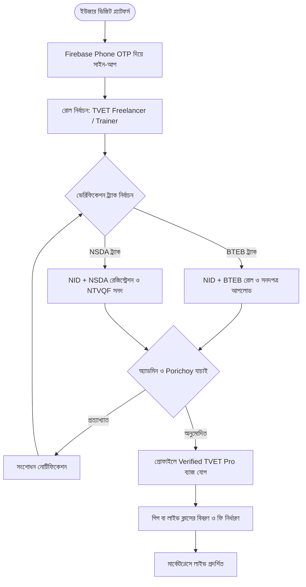
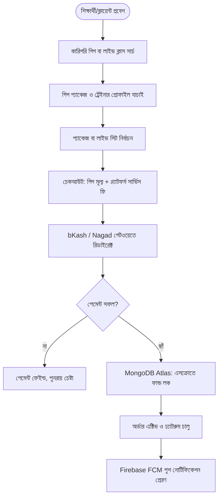
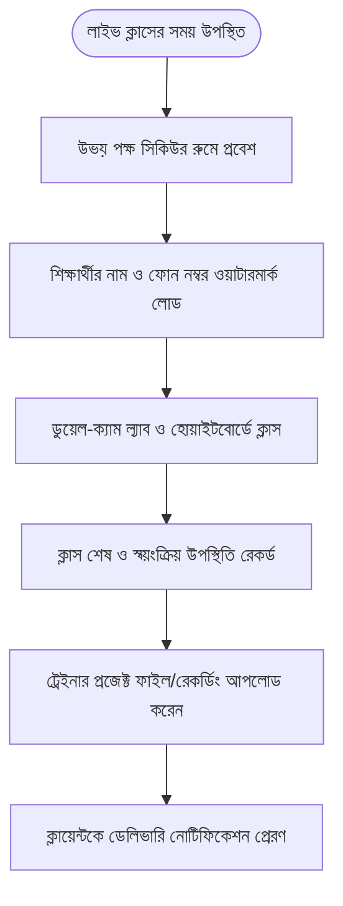
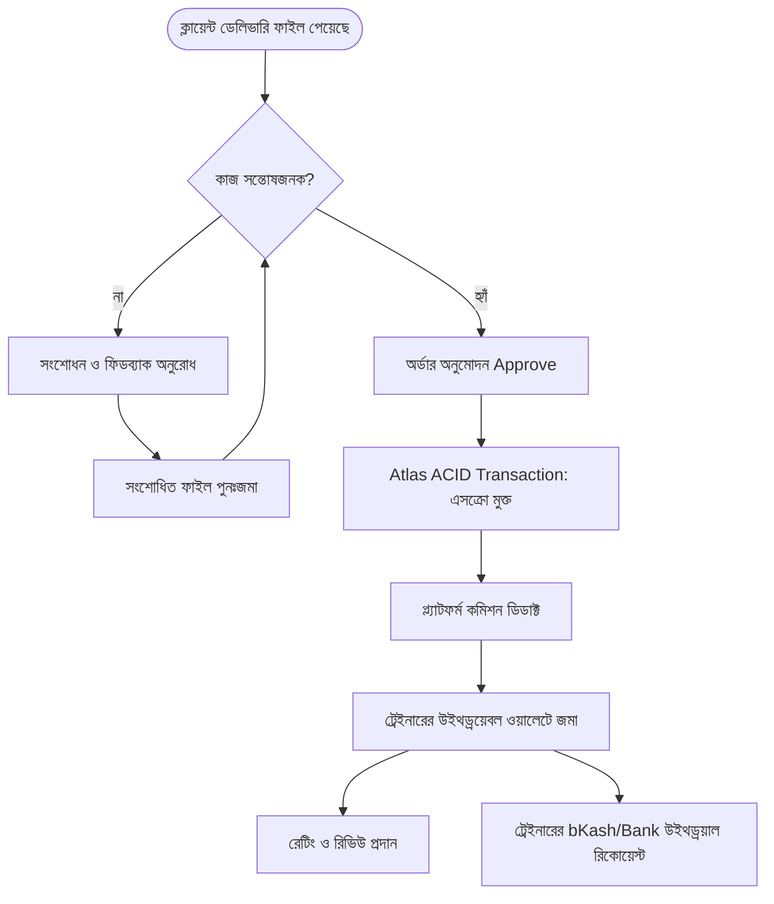
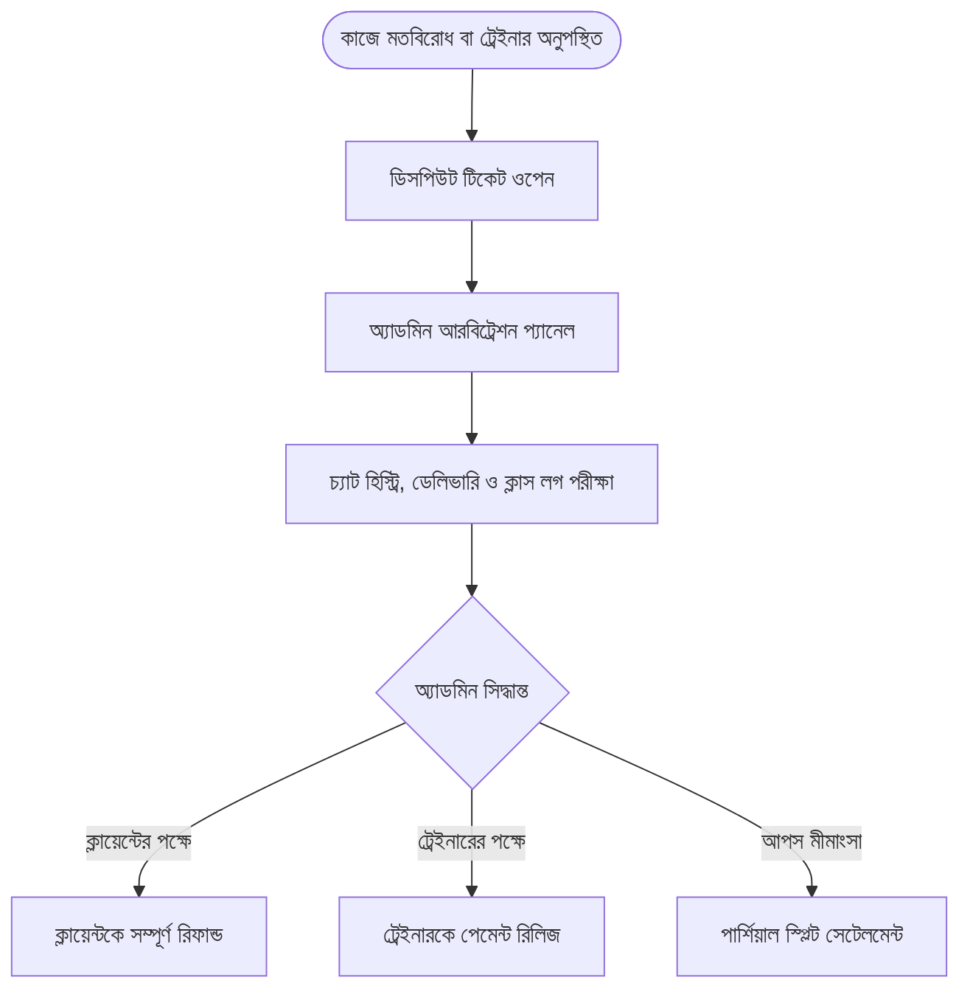
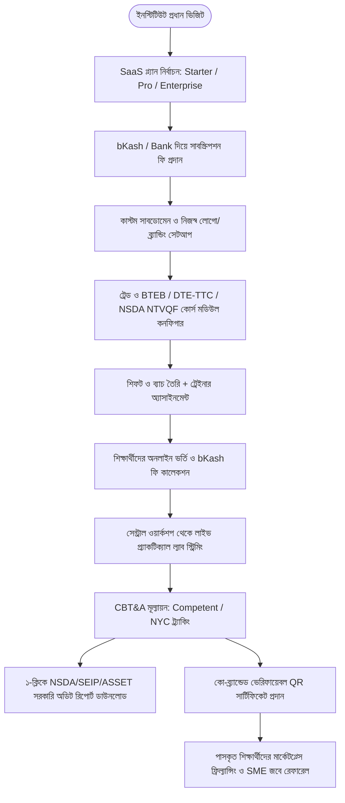

# 📄 Product Requirements Document (PRD)
## 🇧🇩 TVET Freelancing & Live Skill-Training SaaS Platform
**Version:** 1.2.0 | **Status:** Approved for Development | **Target Market:** Bangladesh TVET Sector  
**Core Tech Stack:** Next.js + Express.js + Firebase (Auth/FCM/Storage) + MongoDB Atlas  
**Accreditation Alignment:** BTEB (Bangladesh Technical Education Board) & NSDA (National Skills Development Authority)

---

## 1. 📌 Project Overview (প্রকল্প পরিচিতি ও ভিশন)

### 1.1 প্রেক্ষাপট (Background & Problem Statement)
বাংলাদেশে প্রতি বছর কারিগরি শিক্ষা বোর্ড (**BTEB**)-এর অধীনে পলিটেকনিক/টিটিসি এবং জাতীয় দক্ষতা উন্নয়ন কর্তৃপক্ষ (**NSDA**)-এর নিবন্ধিত দক্ষতা প্রশিক্ষণ প্রদানকারী প্রতিষ্ঠানসমূহ (**STPs - Skills Training Providers**) থেকে লক্ষাধিক শিক্ষার্থী ডিপ্লোমা, ভোকেশনাল ও NTVQF কারিগরি কোর্স সম্পন্ন করে। কিন্তু:
* তাদের জন্য কোনো ডেডিকেটেড স্কিল-বেইজড ফ্রিল্যান্সিং মার্কেটপ্লেস নেই। সাধারণ মার্কেটপ্লেসে (Upwork/Fiverr) সফটওয়্যার বা ওয়েব ডেভেলপমেন্টের প্রাধান্য বেশি থাকায় মেকানিক্যাল ড্রাফটিং, ইলেকট্রিক্যাল ওয়্যারিং, পিএলসি অটোমেশন, রেফ্রিজারেশন/HVAC, সিভিল এস্টিমেশনের মতো কারিগরি পেশাজীবীরা কাজ পান না।
* স্থানীয় ক্ষুদ্র ও মাঝারি শিল্প (SME) এবং কারিগরি শিক্ষার্থীরা অভিজ্ঞ সার্টিফাইড ট্রেইনারদের কাছ থেকে সরাসরি লাইভ প্র্যাকটিক্যাল ল্যাব ও মেন্টরশিপ পাওয়ার সুযোগ পায় না।
* পেমেন্ট প্রতারণা ও কাজের নিশ্চয়তা না থাকায় ফ্রিল্যান্সার এবং ক্লায়েন্ট উভয়েই নিরাপত্তাহীনতায় ভোগে।
* পলিটেকনিক, TTC ও NSDA ট্রেনিং সেন্টারগুলোর অনলাইন ব্যাচ, ব্যবহারিক ল্যাব ও জব প্লেসমেন্ট পরিচালনার আধুনিক ক্লাউড সফটওয়্যার নেই।

### 1.2 সমাধান (Proposed Solution)
একটি সমন্বিত **Dual-Accredited SaaS + Freelance Marketplace** প্ল্যাটফর্ম যা:
1. **Fiverr-এর আদলে কারিগরি গিগ মার্কেটপ্লেস** অফার করবে (AutoCAD/SolidWorks ডিজাইন, সার্কিট লেআউট, PLC কোডিং, আর্কিটেকচারাল এস্টিমেশন ইত্যাদি)।
2. **ইন্টারেক্টিভ লাইভ ক্লাসরুম ও মেন্টরশিপ ইঞ্জিন** সরবরাহ করবে (WebRTC লাইভ স্ট্রিমিং, ডুয়েল-ক্যামেরা প্র্যাকটিক্যাল ল্যাব এবং সার্কিট হোয়াইটবোর্ডের মাধ্যমে)।
3. **নিরাপদ এসক্রো (Escrow) পেমেন্ট ইঞ্জিন** এবং বাংলাদেশি পেমেন্ট চ্যানেল (bKash, Nagad, SSLCommerz) নিশ্চিত করবে।
4. **BTEB (রোল/রেজিস্ট্রেশন) এবং NSDA (NTVQF রেজিস্ট্রেশন/সনদ) উভয় অপশন ও NID ভেরিফিকেশন** দিয়ে শতভাগ অথেনটিক প্রোফাইল নিশ্চিত করবে।
5. প্ল্যাটফর্মের স্থায়িত্ব নিশ্চিত করতে **অ্যাকাউন্ট সার্ভিস ফি, ট্রেইনার কমিশন এবং পলিটেকনিক ইনস্টিটিউট, TTC (Technical Training Center) ও NSDA অনুমোদিত STPs-এর জন্য প্রাতিষ্ঠানিক SaaS সাবস্ক্রিপশন** চালু করবে।

### 1.3 সাকসেস মেট্রিক্স ও KPIs (Success Metrics)
* **User Adoption**: প্রথম ৬ মাসে ৫,০০০+ ভেরিফাইড TVET প্রফেশনাল, ১০০+ পলিটেকনিক/TTC/NSDA STP পার্টনার এবং ১০,০০০+ শিক্ষার্থী নিবন্ধন।
* **Transaction Safety & Escrow**: ০% এসক্রো ফান্ড লিকেজ, ৯৮%+ সফল পেমেন্ট সেটেলমেন্ট এবং ডিসপিউট রেট $< ১.৫\%$।
* **Marketplace Liquidity**: গিগ ও কাস্টম অফার ফুলফিলমেন্ট রেট $\ge ৭৫\%$ (পোস্ট করার ৭ দিনের মধ্যে অর্ডার ম্যাচিং)।
* **Accreditation Throughput**: BTEB ও NSDA ক্রেডেনশিয়াল ভেরিফিকেশন টার্ন-অ্যারাউন্ড টাইম (TAT) $< ২৪$ ঘণ্টা।
* **Platform Revenue**: প্রতি মাসে মোট GMV (Gross Merchandise Value)-এর ৮%-১২% রেভিনিউ জেনারেশন এবং প্রেডিক্টেবল রিকারিং SaaS ফি।
* **Platform Performance**: মোবাইল ৩জি/৪জি নেটওয়ার্কেও ২.৫ সেকেন্ডের নিচে ফার্স্ট কনটেন্টফুল পেইন্ট (FCP) এবং উইথড্রয়াল প্রসেসিং টাইম $< ১২$ ঘণ্টা।

---

## 2. 👥 Actors, Target Users & Personas (অ্যাক্টর, টার্গেট ইউজার ও চরিত্রসমূহ)

### 2.1 System Actors (সিস্টেমের বাহ্যিক ও অভ্যন্তরীণ অ্যাক্টরস)
1. **Primary Human Actors**:
   * **TVET Freelancer / Trainer**: কারিগরি গিগ বিক্রেতা ও লাইভ ক্লাস মেন্টর।
   * **Client / SME Buyer**: কারিগরি কাজের ক্রেতা (ওয়ার্কশপ, কনস্ট্রাকশন ও ডিজাইন ফার্ম)।
   * **Student / Learner**: পলিটেকনিক/TTC শিক্ষার্থী ও স্কিল ডেভেলপমেন্ট ট্রেইনি।
   * **Institute Admin**: পলিটেকনিক, TTC বা NSDA STP-এর অধ্যক্ষ/পরিচালক।
   * **Institute Instructor**: প্রতিষ্ঠানের অভ্যন্তরীণ শিক্ষক/ট্রেইনার যিনি সেন্ট্রাল ক্লাসরুম পরিচালনা করেন।
   * **Corporate Recruiter**: গ্র্যাজুয়েটদের সরাসরি শিক্ষানবিস বা ফ্রিল্যান্স প্রজেক্ট দেওয়ার জন্য বিটুবি পার্টনার।
   * **Super Admin / Arbiter**: সিস্টেম অডিটর ও বিরোধ মীমাংসাকারী।
2. **Automated & External Actors**:
   * **Payment Gateways**: bKash Checkout, Nagad Direct ও SSLCommerz।
   * **Identity Verification Service**: Porichoy API (NID যাচাইকরণ)।
   * **System Scheduler / Cron**: ৭২ ঘণ্টা অটো-অ্যাপ্রুভাল, সাবস্ক্রিপশন রিনিউয়াল ও সার্টিফিকেট মেয়াদ ট্র্যাকার।
   * **Media SFU Engine**: LiveKit WebRTC অডিও-ভিডিও ইনফ্রাস্ট্রাকচার।

### 2.2 User Types & Roles Hierarchy (RBAC মডেল)

| ইউজার রোল (`role`) | ভূমিকা ও উদ্দেশ্য | মূল চাহিদা (Key Needs) | বিশেষ অনুমতি (Permissions) |
| :--- | :--- | :--- | :--- |
| **`FREELANCER`** | ডিপ্লোমা ইঞ্জিনিয়ার, ভোকেশনাল ট্রেইনার, NSDA CBT&A সার্টিফাইড টেকনিশিয়ান | গিগ বিক্রি, কাস্টম অফার প্রেরণ, পেইড লাইভ ক্লাস পরিচালনা, bKash/Bank-এ পে-আউট | গিগ পাবলিশ, লাইভ ক্লাস হোস্টিং, উইথড্রয়াল রিকোয়েস্ট |
| **`CLIENT`** | স্থানীয় ক্ষুদ্র কারখানা, কনস্ট্রাকশন ফার্ম, ওয়ার্কশপ ও সাধারণ বায়ার | স্বল্প খরচে কারিগরি সমাধান নেওয়া, ড্রাফটিং ও ডিজাইন প্রস্তুত করানো | গিগ বুকিং, এসক্রো ফান্ডিং, রিভিশন রিকোয়েস্ট, রিভিউ প্রদান |
| **`STUDENT`** | পলিটেকনিক ছাত্র, কারিগরি শিক্ষার্থী বা স্কিল আপগ্রেডার | সরাসরি লাইভ ক্লাসে অংশ নেওয়া, ডাউট ক্লিয়ারিং, QR সার্টিফিকেট অর্জন | ক্লাসরুমে উপস্থিতি, অ্যাসাইনমেন্ট সাবমিশন, সার্টিফিকেট ডাউনলোড |
| **`INSTITUTE_ADMIN`** | সরকারি/বেসরকারি পলিটেকনিক, TTC ও NSDA STP প্রধান | সেন্ট্রালাইজড অনলাইন ব্যাচ, CBT&A ট্র্যাকিং, হোয়াইট-লেবেল পোর্টাল, অডিট রিপোর্ট | সাব-ডোমেন ব্র্যান্ডিং, শিক্ষক/শিক্ষার্থী ম্যানেজমেন্ট, টিউশন ফি কালেকশন |
| **`INSTITUTE_INSTRUCTOR`** | প্রতিষ্ঠানের নির্ধারিত শিক্ষক বা ল্যাব ইনস্ট্রাক্টর | প্রতিষ্ঠানের নির্ধারিত ব্যাচে প্র্যাকটিক্যাল ল্যাব নেওয়া ও CBT&A গ্রেডিং | ভার্চুয়াল ল্যাব স্ট্রিমিং, উপস্থিতি ট্র্যাকিং, লগবুক মূল্যায়ন |
| **`ENTERPRISE_RECRUITER`**| করপোরেট ইন্ডাস্ট্রি পার্টনার ও রিক্রুটার | যোগ্য কারিগরি গ্র্যাজুয়েটদের এপ্রেন্টিসশিপ ও প্রজেক্ট নিয়োগ | অ্যালামনাই ডিরেক্টরি ব্রাউজিং, ডিরেক্ট হায়ারিং প্রপোজাল |
| **`SUPER_ADMIN`** | প্ল্যাটফর্ম ম্যানেজার ও লিগ্যাল আরবিট্রেটর | ইউজার ভেরিফিকেশন, লেনদেন অডিট, এসক্রো বিরোধ নিষ্পত্তি | সম্পূর্ণ প্ল্যাটফর্ম অডিট, এসক্রো ফোর্স রিলিজ/রিফান্ড, ফি কনফিগারেশন |

* **Dual-Profile Rule**: একজন `INSTITUTE_INSTRUCTOR` চাইলে একই অ্যাকাউন্টে প্রোফাইল সুইচ করে স্বতন্ত্র `FREELANCER` হিসেবে গিগ বিক্রি করতে পারবেন; তবে প্রতিষ্ঠানের ডাটা ও পারসোনাল গিগ আর্নিং সম্পূর্ণ পৃথক লেজারে সংরক্ষিত থাকবে।

---

## 3. ⚙️ Core Features & Functional Requirements (মূল ফিচারসমূহ)

### 3.1 Authentication & Dual-Track TVET KYC Verification
* **Firebase Phone OTP Authentication**: বাংলাদেশের মোবাইল নম্বর দিয়ে সরাসরি এক ক্লিকে SMS OTP লগইন।
* **Google Social Auth**: ক্লায়েন্ট ও সাধারণ শিক্ষার্থীদের দ্রুত লগইনের জন্য।
* **Role-Based Access Control (RBAC)**: Firebase Custom Claims ব্যবহার করে ইউজার রোল (`CLIENT`, `FREELANCER`, `STUDENT`, `INSTITUTE_ADMIN`, `INSTITUTE_INSTRUCTOR`, `ENTERPRISE_RECRUITER`, `SUPER_ADMIN`) নির্ধারণ।
* **Porichoy API NID Verification**: ট্রেইনার ও ফ্রিল্যান্সারদের জাতীয় পরিচয়পত্র (NID) অটোমেটেড যাচাই।
* **Dual-Track Credential Verification (BTEB & NSDA Both Supported)**:
  * **Option A (BTEB Track)**: বাংলাদেশ কারিগরি শিক্ষা বোর্ডের রোল ও রেজিস্ট্রেশন নম্বর এবং ডিপ্লোমা/ভোকেশনাল সনদপত্র আপলোড।
  * **Option B (NSDA Track)**: জাতীয় দক্ষতা উন্নয়ন কর্তৃপক্ষের রেজিস্ট্রেশন নম্বর, NTVQF লেভেল (Level 1-6), সনদপত্রের মেয়াদ (Expiry Date) এবং CBT&A ট্রেইনার/অ্যাসেসর আইডি/সনদপত্র আপলোড। সনদের মেয়াদ শেষ হলে প্ল্যাটফর্ম থেকে পুনঃযাচাইয়ের নোটিফিকেশন পাঠানো হবে।
  * **Admin Audit & SLA**: আপলোডকৃত নথিপত্র ব্যাক-অফিস অ্যাডমিন প্যানেল কর্তৃক ২৪ ঘণ্টার মধ্যে অডিট সম্পন্ন করে প্রোফাইলে **"Verified TVET Pro"** ব্যাজ প্রদান।

### 3.2 Dual Marketplace Engine (গিগ ও লাইভ ক্লাস ক্যাটালগ)
* **কারিগরি ক্যাটাগরি ভিত্তিক গিগ লিস্টিং**:
  * Electrical & Electronics (সার্কিট ডিজাইন, ওয়্যারিং ড্রয়িং, PLC প্রোগ্রামিং)
  * Mechanical & CAD (AutoCAD 2D/3D, SolidWorks, CNC জি-কোড)
  * Civil & Architecture (বিল্ডিং ড্রাফটিং, স্ট্রাকচারাল এস্টিমেশন)
  * RAC & HVAC (রেফ্রিজারেশন ও এসি প্ল্যানিং)
  * IT & Technical Graphics
* **3-Tier Pricing Packages & Custom Offers**: বেসিক, স্ট্যান্ডার্ড ও প্রিমিয়াম প্যাকেজ কনফিগারেশনের পাশাপাশি ফ্রিল্যান্সার সরাসরি ক্লায়েন্টকে **Custom Offers (কাস্টম দাম ও সময়)** পাঠাতে পারবেন।
* **Anti-Disintermediation Chat Guard**: চ্যাটবক্সে ফোন নম্বর (`01xxxxxxxxx`), পার্সোনাল বিকাশ/নগদ অ্যাকাউন্ট ও ইমেইল আদান-প্রদান রোধে রিয়েল-টাইম রেজেক্স (Regex) ফিল্টার এবং প্ল্যাটফর্মের বাইরে লেনদেন না করার স্বয়ংক্রিয় সতর্কবার্তা।
* **Live Batch & 1-on-1 Mentorship Booking**: ক্যালেন্ডার ভিত্তিক সময় নির্ধারণ (Asia/Dhaka টাইমজোন)।

### 3.3 Financial Escrow & Multi-Wallet Engine (এসক্রো ও পেমেন্ট ইঞ্জিন)
* **Local Payment Gateway**: bKash Checkout API, Nagad Direct এবং SSLCommerz (কার্ড/ইন্টারনেট ব্যাংকিং)।
* **Webhook Idempotency**: পেমেন্ট গেটওয়ের ডুপ্লিকেট নোটিফিকেশন প্রতিরোধে `idempotencyKey = trxID + orderId` এবং MongoDB Multi-document ACID ট্রানজেকশনের মাধ্যমে সিঙ্গেল-ক্রেডিট নিশ্চিতকরণ।
* **Escrow Holding & Milestone Logic**:
  * অর্ডার শুরুর সাথে সাথে ক্লায়েন্টের সম্পূর্ণ অর্থ এসক্রো একাউন্টে লক হবে।
  * **Milestone-Based Escrow (উচ্চমূল্যের কাজের জন্য)**: ৳১৫,০০০-এর বেশি কাজের ক্ষেত্রে ৩টি পর্যন্ত ধাপে (Milestones) এসক্রো ফান্ডিং ও রিলিজের সুবিধা (যেমন: ৩০% খসড়া ড্রয়িং, ৪০% ৩ডি মডেলিং, ৩০% চূড়ান্ত অনুমোদন)।
  * কাজ সম্পন্ন ও ক্লায়েন্ট অনুমোদন না দেওয়া পর্যন্ত ফান্ড সুরক্ষিত থাকবে।
  * **Auto-Approval (৩ দিন)**: কাজ ডেলিভারি দেওয়ার পর ক্লায়েন্ট যদি ৩ দিনের (৭২ ঘণ্টা) মধ্যে কোনো সাড়া না দেয় বা রিভিশন না চায়, তবে স্বয়ংক্রিয়ভাবে এসক্রো ফান্ড ট্রেইনারের ওয়ালেটে রিলিজ হয়ে যাবে।
* **Platform Monetization & Auto-Deductions**:
  * **ক্লায়েন্ট / ইনস্টিটিউট সার্ভিস ফি**: প্রতিটি ট্রানজেকশন এবং ইনস্টিটিউটের টিউশন ফি কালেকশনে ৫% প্ল্যাটফর্ম ফি প্রযোজ্য।
  * **ফ্রিল্যান্সার/ট্রেইনার কমিশন**: কাজ বা ক্লাস শেষ হওয়ার পর মোট উপার্জনের ১৫% প্ল্যাটফর্ম কমিশন হিসেবে কেটে নেওয়া হবে।
* **Double-Entry Financial Ledger**: প্রতিটি লেনদেনের জন্য `Credit` ও `Debit` রেকর্ড সহ অপরিবর্তনযোগ্য অডিট ট্রেইল।
* **Payout / Anti-Fraud Holding Period**:
  * অর্ডার অ্যাপ্রুভ হওয়ার পর ফান্ড ৪৮ ঘণ্টা `PENDING_CLEARANCE` স্টেটে থাকবে, অতঃপর `WITHDRAWABLE_BALANCE`-এ স্থানান্তরিত হবে।
  * সর্বনিম্ন উত্তোলন সীমা: bKash/Nagad-এ ৳৫০০ এবং ব্যাংক ট্রান্সফারে (BEFTN) ৳৫,০০০।

### 3.4 Interactive Live Classroom & Anti-Piracy (লাইভ ক্লাস ও পাইরেসি রোধ)
* **LiveKit SFU / WebRTC Integration**: দুর্বল নেটওয়ার্কেও স্পষ্ট অডিও-ভিডিও কলিং।
* **WebRTC Simulcast & SVC Adaptation**: গ্রামীণ ৩জি নেটওয়ার্কে ব্যান্ডউইথ অনুযায়ী স্বয়ংক্রিয়ভাবে রেজোলিউশন ২৪০পি অডিও-ফার্স্ট মোডে স্কেল-ডাউন হবে।
* **Dual-Camera Practical Lab Support**: ট্রেইনার একই সাথে নিজের চেহারা এবং ল্যাব টেস্ট ইকুইপমেন্ট (সার্কিট বোর্ড/মেশিন) শেয়ার করতে পারবেন।
* **Canvas-Rendered Dynamic Anti-Piracy Watermarking**: ক্লাসের ভিডিও স্ক্রিনের ওপর শিক্ষার্থীর নাম, মোবাইল নম্বর এবং Firebase UID ডাইনামিক ট্র্যাভার্সিং ওয়াটারমার্ক হিসেবে ভেসে বেড়াবে।
* **Single-Session Enforcement**: একই অ্যাকাউন্ট/UID থেকে একই সময়ে একাধিক লাইভ স্ট্রিমে যুক্ত হওয়া প্রতিরোধ।
* **Interactive Whiteboard**: সার্কিট ডায়াগ্রাম ও ব্লুপ্রিন্ট এনোটেশন শেয়ারিং।

### 3.5 Delivery, Review & Automated QR Certificate
* **Project Delivery Engine**: Firebase Storage-এ নিরাপদ জিপ/পিডিএফ/সিএডি ফাইল আপলোড।
* **Revision System**: ক্লায়েন্ট অসন্তুষ্ট হলে কারণ উল্লেখ করে রিভিশন চাইতে পারবে।
* **Verifiable QR Certificate**: কোনো লাইভ ব্যাচে ৮০%+ উপস্থিতি সম্পন্নকারী শিক্ষার্থীদের স্বয়ংক্রিয় ভেরিফায়েবল QR কোডযুক্ত ডিজিটাল সার্টিফিকেট প্রদান।

### 3.6 Dispute Resolution Center & Evidence Locker (বিরোধ মীমাংসা কেন্দ্র)
* **Dispute Evidence Locker**: বিরোধ তৈরি হলে স্বয়ংক্রিয়ভাবে এসক্রো ফান্ড লক হবে এবং উভয় পক্ষের চ্যাট হিস্ট্রি, ফাইল হ্যাশ (SHA-256) ও লাইভ ক্লাসের উপস্থিতি লগ নিয়ে একটি অপরিবর্তনযোগ্য অডিট প্যাকেট তৈরি হবে।
* **Admin Arbitrated Partial Settlement**: অ্যাডমিন আরবিট্রেটর সম্পূর্ণ রিফান্ড, ট্রেইনার রিলিজ বা কাজের অগ্রগতি অনুযায়ী উভয় পক্ষের মধ্যে পার্সেন্টেজ স্প্লিট (যেমন: ৬০% ট্রেইনার, ৪০% ক্লায়েন্ট রিফান্ড) করার চূড়ান্ত সিদ্ধান্ত দিতে পারবেন।

### 3.7 Polytechnic, TTC & NSDA STP Institutional SaaS Suite (প্রতিষ্ঠানসমূহের বিশেষ সুবিধাসমূহ)
* **Storage Quota Governance**: ক্লাউড স্টোরেজ কোটা ৮০% ও ৯৫% পূর্ণ হলে অ্যাডমিনকে সতর্কবার্তা পাঠানো হবে। ১০০% পূর্ণ হলে নতুন ফাইল আপলোড সাময়িক স্থগিত থাকবে, তবে চলমান লাইভ ক্লাস বা উপস্থিতি ব্যাহত হবে না।

সরকারি/বেসরকারি পলিটেকনিক ইনস্টিটিউট, কারিগরি প্রশিক্ষণ কেন্দ্র (**TTC - Technical Training Center**) এবং **NSDA (জাতীয় দক্ষতা উন্নয়ন কর্তৃপক্ষ) অনুমোদিত STPs (Skills Training Providers)**-এর জন্য একটি স্বতন্ত্র **Institutional Multi-Tenant SaaS Portal** থাকবে। সাবস্ক্রিপশন গ্রহণকারী প্রতিষ্ঠানগুলো নিম্নলিখিত সুবিধাসমূহ উপভোগ করবে:

#### 🏢 ১. হোয়াইট-লেবেল পোর্টাল ও কাস্টম সাবডোমেন (White-label Branding)
* **Custom Subdomain**: প্রতিটি প্রতিষ্ঠান নিজস্ব নামে পোর্টাল পাবে (যেমন: `dpi.tvetplatform.com`, `mirpur-ttc.tvetplatform.com` বা `uttara-stp.tvetplatform.com`) অথবা নিজস্ব কাস্টম ডোমেন কানেক্ট করতে পারবে।
* **Institutional Identity**: প্রতিষ্ঠানের নিজস্ব অফিসিয়াল লোগো, ব্যানার, অধ্যক্ষ/পরিচালকের বার্তা এবং ব্র্যান্ড কালার থিম।

#### 🎯 ২. NSDA NTVQF (Level 1-5), BTEB ও DTE-TTC কারিকুলাম ম্যাপিং + CBT&A ট্র্যাকিং
* **CBT&A (Competency Based Training & Assessment)**: জাতীয় দক্ষতা উন্নয়ন কর্তৃপক্ষের নির্দেশিত Competency Standards (CS) অনুযায়ী শিক্ষার্থীদের পারফরম্যান্স মূল্যায়ন (Competent - C / Not Yet Competent - NYC)।
* **NTVQF Level Alignment**: NTVQF লেভেল ১ থেকে ৫ পর্যন্ত অকুপেশন/ট্রেড (যেমন: Electrical Installation, CNC Machining, Welding, RAC) ভিত্তিক মডিউল ট্র্যাকিং।
* **Continuous Assessment Logbook**: ব্যবহারিক কাজের ডিজিটাল লগবুক সংরক্ষণ।

#### 👥 ৩. ডিপার্টমেন্ট, শিফট ও ব্যাচ/কোহর্ট ম্যানেজমেন্ট (Cohort Management)
* **Multi-Shift & Batch Scheduling**: সকাল ও বিকাল শিফট এবং একাধিক ডিপার্টমেন্টে (সিভিল, মেকানিক্যাল, কম্পিউটার, ইলেকট্রিক্যাল ইত্যাদি) আনলিমিটেড ব্যাচ তৈরি।
* **Instructor Mapping**: কোন ইন্সট্রাক্টর কোন সেকশনের ক্লাস নেবেন তার কেন্দ্রীয় রুটিন ক্যালেন্ডার।
* **Digital Attendance & Biometric Integration**: স্বয়ংক্রিয় ক্লাসরুম হাজিরা এবং লাইভ ক্লাসে অংশ নেওয়ার ডিজিটাল টাইম-লগ।

#### 🔬 ৪. ভার্চুয়াল প্র্যাকটিক্যাল ল্যাব ও সেন্ট্রাল ওয়ার্কশপ ব্রডকাস্টিং (Virtual Practical Lab)
* **Central Workshop Streaming**: প্রধান ক্যাম্পাসের দামি বা আধুনিক যন্ত্রপাতি (যেমন: ৩D প্রিন্টার, হাই-এন্ড লেদ/মিলিং, অটোমেশন ল্যাব) থেকে মাল্টি-ক্যামেরা লাইভ ব্রডকাস্ট, যাতে অন্যান্য শাখা বা প্রত্যন্ত অঞ্চলের শিক্ষার্থীরাও সরাসরি প্র্যাকটিক্যাল দেখতে পারে।
* **Institutional Cloud Library**: প্রতিষ্ঠানের সকল ব্যবহারিক ক্লাস ও ল্যাব ডেমো ক্লাউডে আজীবন সংরক্ষিত থাকবে শিক্ষার্থীদের রিভিশনের জন্য।

#### 📊 ৫. সরকারি ও দাতা সংস্থা অডিট রিপোর্টিং (1-Click Govt & Donor Audit Compliance)
* **One-Click Compliance Export**: NSDA, BTEB, এবং সরকারি/দাতা সংস্থার অর্থায়নকৃত প্রকল্প (যেমন: **SEIP, ASSET Project**)-এর জন্য প্রয়োজনীয় ট্রেইনি ড্রপ-আউট রিপোর্ট, উপস্থিতি শিট এবং মূল্যায়ন ডাটা এক ক্লিকে অফিশিয়াল এক্সেল/পিডিএফ ফরম্যাটে এক্সপোর্ট।
* **Stipend Disbursal Data**: যেসব প্রজেক্টে শিক্ষার্থীদের ভাতা প্রদান করা হয়, তাদের উপস্থিতি ভিত্তিক স্বয়ংক্রিয় উপবৃত্তি পে-লিস্ট জেনারেশন।

#### 💼 ৬. ইন্ডাস্ট্রি লিংকেজ ও সরাসরি ফ্রিল্যান্স জব প্লেসমেন্ট সেল (Job Placement Pipeline)
* **Institutional Job Pipeline**: প্রতিষ্ঠানের গ্র্যাজুয়েট শিক্ষার্থীদের প্রোফাইল সরাসরি প্ল্যাটফর্মের ফ্রিল্যান্সিং মার্কেটপ্লেস এবং স্থানীয় ক্ষুদ্র-মাঝারি কারখানাগুলোর (SME) সাথে ট্যাগ করে দেওয়া।
* **Corporate Apprenticeship Matching**: বিভিন্ন শিল্পপ্রতিষ্ঠানের সাথে পার্টনারশিপ করে সরাসরি ইন্টার্নশিপ বা রিমোট ড্রাফটিং প্রজেক্ট গ্রহণ।
* **Alumni Showcase & Leaderboard**: প্রতিষ্ঠানের যেসব সাবেক ছাত্রছাত্রী ফ্রিল্যান্সিংয়ে সর্বোচ্চ আয় করছে তাদের লাইভ আর্নিং বোর্ড প্রদর্শন—যা দেখে নতুন শিক্ষার্থীরা ওই প্রতিষ্ঠানে ভর্তিতে উৎসাহিত হবে।

#### 💳 ৭. প্রাতিষ্ঠানিক ফি কালেকশন ও একাউন্টিং লেজার (Tuition & Fee Collection)
* **Automated Online Fee Collection**: সেমিস্টার ফি, কোর্স ফি ও ল্যাব চার্জ সরাসরি bKash, Nagad ও ব্যাংক কার্ডের মাধ্যমে শিক্ষার্থীর অভিভাবক থেকে আদায়ের সুবিধা।
* **Platform Surcharge**: সাবস্ক্রাইবার প্রতিষ্ঠানের টিউশন ফি কালেকশনের উপর প্ল্যাটফর্ম ৫% প্রসেসিং ফি চার্জ করবে।
* **Automated Honorarium Split**: ইন্সট্রাক্টর ফি ও প্রাতিষ্ঠানিক ফান্ডের স্বয়ংক্রিয় আর্থিক হিসাবরক্ষণ।

#### 👨‍🏫 ৮. সার্টিফাইড ট্রেইনার ও অ্যাসেসর পারফরম্যান্স মনিটরিং
* প্রতিষ্ঠানের অধীনে থাকা **NSDA Certified Level-4 Trainers** এবং **CBT&A Certified Assessors**-দের ক্লাস পারফরম্যান্স, সক্রিয়তা এবং শিক্ষার্থীদের ফিডব্যাক অ্যানালিটিক্স সেন্ট্রাল ড্যাশবোর্ড থেকে তদারকি।

#### 🎓 ৯. কো-ব্র্যান্ডেড ভেরিফায়েবল ডিজিটাল সনদ (Dual-Branded QR Certificates)
* কোর্সের সফল সমাপ্তিতে প্রতিষ্ঠানের অফিসিয়াল সিল-স্বাক্ষর এবং প্ল্যাটফর্মের সিকিউর QR কোড সংবলিত জাতীয় ও আন্তর্জাতিকভাবে যাচাইযোগ্য ডিজিটাল সনদপত্র প্রদান।

#### 💰 ১০. ইনস্টিটিউশনাল SaaS প্রাইসিং মডেল (Subscription Tiers)
| টিয়ার | উপযোগী প্রতিষ্ঠান | প্রধান সুবিধাসমূহ | ক্লাউড স্টোরেজ লিমিট | আনুমানিক ফি (মাসিক) |
| :--- | :--- | :--- | :--- | :--- |
| **Starter STP / Small TTC** | ক্ষুদ্র ভোকেশনাল ট্রেনিং সেন্টার ও ছোট TTC | ১-৩টি ট্রেড, সর্বোচ্চ ২০০ ট্রেইনি, ডিজিটাল হাজিরা ও বেসিক ল্যাব | ৫০ GB | ৳ ২,৫০০ - ৩,৫০০ |
| **Pro TTC** | সরকারি কারিগরি প্রশিক্ষণ কেন্দ্র (Technical Training Center) | ২-৬টি ট্রেড, ৫০০+ ট্রেইনি, NTVQF/CBT&A ট্র্যাকিং, DTE অডিট, কাস্টম সাবডোমেন | ২০০ GB | ৳ ৪,৫০০ - ৫,৫০০ |
| **Pro Polytechnic** | পূর্ণাঙ্গ সরকারি/বেসরকারি পলিটেকনিক | ৪-১০টি ডিপার্টমেন্ট, ১,৫০০ শিক্ষার্থী, কাস্টম সাবডোমেন, প্লেসমেন্ট সেল | ৫০০ GB | ৳ ৬,০০০ - ৮,০০০ |
| **Enterprise Multi-Campus** | বড় চেইন/মাল্টি-ক্যাম্পাস TTC, পলিটেকনিক, STP ও প্রজেক্ট পার্টনার | আনলিমিটেড ট্রেড ও শিক্ষার্থী, সেন্ট্রাল ল্যাব স্ট্রিমিং, SEIP/ASSET অডিট এক্সপোর্ট, ডেডিকেটেড এপিআই | ১ TB+ | ৳ ১২,০০০ - ২০,০০০ |

---

## 4. 🧭 User Flows & Journeys (ব্যবহারকারীর পূর্ণাঙ্গ যাত্রাপথ)

### 4.1 Flow A: TVET ফ্রিল্যান্সার অনবোর্ডিং (BTEB / NSDA Dual Track) ও গিগ প্রকাশ

---

### 4.2 Flow B: ক্লায়েন্ট/শিক্ষার্থীর ব্রাউজিং, বুকিং ও এসক্রো পেমেন্ট

---

### 4.3 Flow C: লাইভ ক্লাস সেশন পরিচালনা ও ডেলিভারি

---

### 4.4 Flow D: কাজ অনুমোদন, এসক্রো ফান্ড রিলিজ ও উইথড্রয়াল

---

### 4.5 Flow E: ডিসপিউট ও রিফান্ড প্রক্রিয়া

---

### 4.6 Flow F: পলিটেকনিক, TTC ও NSDA STP অনবোর্ডিং, ব্যাচ ও জব প্লেসমেন্ট ফ্লো

---

### 4.7 📜 Business Rules Engine (ব্যবসায়িক নীতিমালা ও আর্থিক শর্তাবলী)

* **BR-01 (সার্ভিস ফি ও কমিশন বিভাজন)**:
  * ক্লায়েন্ট ও ইনস্টিটিউট ফি: প্রতিটি চেকআউটে ৫% প্ল্যাটফর্ম প্রসেসিং চার্জ প্রযোজ্য।
  * ফ্রিল্যান্সার কমিশন: কাজ বা ক্লাস সমাপ্তির পর উপার্জিত অর্থ থেকে ১৫% প্ল্যাটফর্ম ফি হিসেবে কর্তন করা হবে।
  * ইনস্টিটিউট ফি কালেকশন: প্ল্যাটফর্মের গেটওয়ে ব্যবহার করে সংগৃহীত টিউশন ফির ওপর ৫% অটো-ডিডাকশন প্রযোজ্য।
* **BR-02 (এসক্রো লাইফসাইকেল ও অটো-অ্যাপ্রুভাল ট্রানজিশন)**:
  * স্ট্যাটাস ফ্লো: `ESCROW_LOCKED` $\rightarrow$ `IN_PROGRESS` $\rightarrow$ `DELIVERED` $\rightarrow$ `APPROVED` $\rightarrow$ `FUNDS_RELEASED`।
  * ট্রেইনার কাজ ডেলিভারি করার পর ক্লায়েন্ট যদি টানা ৭২ ঘণ্টার (৩ দিন) মধ্যে কোনো রেসপন্স (অনুমোদন, রিভিশন বা ডিসপিউট) না করে, তবে সিস্টেম স্বয়ংক্রিয়ভাবে অর্ডারটিকে `AUTO_APPROVED` ঘোষণা করবে এবং এসক্রো ফান্ড ট্রেইনারের ওয়ালেটে রিলিজ করে দেবে।
* **BR-03 (রিভিশন পলিসি ও ডেডলাইন রিক্যালকুলেশন)**:
  * বেসিক টায়ারে সর্বোচ্চ ১টি, স্ট্যান্ডার্ডে ২টি এবং প্রিমিয়ামে ৩টি পর্যন্ত ফ্রি রিভিশন অনুমোদিত।
  * ক্লায়েন্ট রিভিশন চাইলে প্রতিটি বৈধ রিভিশনের জন্য ফ্রিল্যান্সার অতিরিক্ত ৪৮ ঘণ্টার ডেলিভারি এক্সটেনশন পাবেন।
* **BR-04 (পে-আউট হোল্ডিং ও অ্যান্টি-ফ্রড প্রটেকশন)**:
  * কাজ সম্পন্ন হওয়ার সাথে সাথে অর্থ সরাসরি উইথড্র করা যাবে না। চার্জব্যাক ও ফ্রড প্রতিরোধে ফান্ডটি ৪৮ ঘণ্টা `PENDING_CLEARANCE` স্টেজে থাকবে।
  * ৪৮ ঘণ্টা অতিক্রান্ত হওয়ার পর তা `WITHDRAWABLE_BALANCE`-এ যুক্ত হবে।
  * সর্বনিম্ন উইথড্রয়াল সীমা: bKash/Nagad-এ ৳৫০০ এবং ব্যাংক ট্রান্সফারে (BEFTN) ৳৫,০০০।
* **BR-05 (NSDA ও BTEB সার্টিফিকেটের মেয়াদ ট্র্যাকিং)**:
  * যেসব NSDA NTVQF বা CBT&A ট্রেইনার সনদের নির্দিষ্ট মেয়াদ থাকে, তার মেয়াদ উত্তীর্ণের ৩০ দিন পূর্বে রিনিউয়াল নোটিফিকেশন পাঠানো হবে।
  * মেয়াদ শেষ হওয়ার ৩০ দিন পরও নতুন সনদ আপলোড না করলে প্রোফাইলের "Verified TVET Pro" ব্যাজ স্বয়ংক্রিয়ভাবে স্থগিত (Suspended) হয়ে যাবে।
* **BR-06 (মাল্টি-টেন্যান্ট ডাটা আইসোলেশন ও কনফিডেনশিয়ালিটি)**:
  * প্রতিটি সাবস্ক্রাইবার প্রতিষ্ঠানের সমস্ত শিক্ষার্থী ডাটা, ব্যাচ রুটিন, মূল্যায়ন রেকর্ড এবং টিউশন আয় সম্পূর্ণ `tenantId`-ভিত্তিক আইসোলেটেড থাকবে। কোনো অবস্থাতেই এক প্রতিষ্ঠানের ডাটা অন্য প্রতিষ্ঠানের ড্যাশবোর্ডে বা সাধারণ পাবলিক এপিআইতে অ্যাক্সেসযোগ্য হবে না।
* **BR-07 (কন্টাক্ট ইনফরমেশন ফিল্টারিং ও প্ল্যাটফর্ম বাইপাস পেনাল্টি)**:
  * চ্যাটে সরাসরি ফোন নম্বর, ব্যাংক বা বিকাশ অ্যাকাউন্ট শেয়ার করে প্ল্যাটফর্ম ফি ফাঁকি দেওয়ার চেষ্টা করলে প্রথমবার ওয়ার্নিং এবং দ্বিতীয়বার অ্যাকাউন্ট সাময়িক ব্লক করা হবে।

---

### 4.8 🧠 Assumptions & Dependencies (মূল অনুমান ও প্রযুক্তিগত নির্ভরতা)

1. **নিয়ন্ত্রক সংস্থা ও ফিনটেক এসক্রো অনুমোদন (Regulatory Permissibility)**: প্ল্যাটফর্মটি নিজস্ব লাইসেন্সপ্রাপ্ত মার্চেন্ট গেটওয়ে (bKash Checkout ও SSLCommerz Escrow Pool) ব্যবহার করে ফান্ড হোল্ড করবে; বাংলাদেশ ব্যাংকের বিদ্যমান নন-ব্যাংক ফিনটেক নীতিমালার আওতায় এটি পরিচালিত হবে।
2. **পরিচয় এপিআই স্থায়িত্ব (Porichoy API Availability & Costs)**: ট্রেইনারদের NID ভেরিফিকেশনের জন্য বাংলাদেশ সরকারের Porichoy API নিয়মিত সচল থাকবে এবং প্রতি কলের ট্রানজেকশন খরচ প্ল্যাটফর্মের বাজেট কাঠামোর মধ্যে থাকবে।
3. **ইনস্ট্রাক্টরদের হার্ডওয়্যার সক্ষমতা (Trainer Equipment Baseline)**: লাইভ প্র্যাকটিক্যাল ল্যাব পরিচালনাকারী কারিগরি ট্রেইনারদের ন্যূনতম একটি স্মার্টফোন (ল্যাব/মেশিন প্রদর্শনের জন্য) এবং একটি ল্যাপটপ/পিসি ও স্থিতিশীল ইন্টারনেট সংযোগ রয়েছে।
4. **সহজ ইউজার এক্সপেরিয়েন্স ও ডিজিটাল সাক্ষরতা (Low Digital Literacy Resilience)**: কারিগরি শিক্ষার্থী ও টেকনিশিয়ানদের কথা মাথায় রেখে জটিল পাসওয়ার্ড সিস্টেমের বদলে এসএমএস ওটিপি (Phone OTP) এবং বাংলা-প্রথম (Bangla-first) ইন্টারফেস ব্যবহার বাধ্যতামূলক রাখা হয়েছে।

---

## 5. 🚫 Out of Scope (আউট অব স্কোপ - MVP তে যা থাকছে না)

প্রজেক্টের জটিলতা নিয়ন্ত্রণ এবং দ্রুত বাজারে ছাড়ার সুবিধার্থে প্রাথমিক ভার্সনে (**Phase 1 / MVP**) নিচের বিষয়গুলো অন্তর্ভুক্ত নয়:

1. **ফিজিক্যাল হার্ডওয়্যার ডেলিভারি বা ই-কমার্স (Physical Goods / Tools E-commerce)**:
   * প্ল্যাটফর্মটি শুধুমাত্র ডিজিটাল ড্রয়িং, ডিজাইন, পরামর্শ ও লাইভ ক্লাসের জন্য। কোনো ফিজিক্যাল ড্রিল মেশিন, তার বা পার্টস ডেলিভারি সিস্টেম থাকবে না।
2. **অটোমেটিক এআই ওয়ার্কশপ গ্রেডিং (Automatic AI Practical Grading)**:
   * ব্যবহারিক ওয়েল্ডিং বা ফিজিক্যাল ল্যাব পরীক্ষা এআই দিয়ে গ্রেডিং হবে না। ট্রেইনার নিজে লাইভ ক্লাসে দেখে শিক্ষার্থীদের মূল্যায়ন করবেন।
3. **আন্তর্জাতিক মাল্টি-কারেন্সি ট্যাক্স কমপ্লায়েন্স (Multi-National Tax Regulations)**:
   * প্রাথমিক ভার্সন শুধুমাত্র বাংলাদেশি কারেন্সি (BDT) এবং বাংলাদেশের ভ্যাট/উৎস কর (AIT) নীতিমালার মধ্যে সীমাবদ্ধ থাকবে।
4. **অফলাইন ভিডিও ডাউনলোড (Without DRM)**:
   * পাইরেসি ও ভিডিও চুরি ঠেকাতে কোনো অফলাইন আন-এনক্রিপ্টেড এমপি৪ (MP4) ডাউনলোড ফিচার থাকবে না।
5. **রিয়েল-টাইম অটো স্পিচ ট্রান্সলেশন (Real-time Video Translation)**:
   * লাইভ ক্লাসে ইংরেজি থেকে বাংলা সরাসরি অডিও ট্রান্সলেশন থাকবে না; ক্লাসগুলো মূলত বাংলায় পরিচালিত হবে।

---

## 6. 🔒 Non-Functional Requirements (NFR)

* **Performance & Lightweight PWA**:
  * মোবাইল ইন্টারফেসে ৩জি নেটওয়ার্কেও অপটিমাইজড থাকতে হবে। ক্লাউডফ্লেয়ার সিডিএন দিয়ে স্ট্যাটিক অ্যাসেট ক্যাশ করা হবে।
  * WebRTC অডিও-ভিডিও স্ট্রিমিং দুর্বল ব্যান্ডউইথ শনাক্ত করলে অটো-সিমুলকাস্ট (Auto-simulcast) ও এসভিসি (SVC) প্রযুক্তি ব্যবহার করে রেজোলিউশন ২৪০পি-তে নামিয়ে অডিও অগ্রাধিকার দেবে।
* **Security & Concurrency Control**:
  * OWASP Top 10 সিকিউরিটি স্ট্যান্ডার্ড নিশ্চিতকরণ।
  * Firebase ID Token ভ্যালিডেশন এবং নোএসকিউএল (NoSQL) ইনজেকশন প্রতিরোধ।
  * MongoDB Atlas Replica Set-এ Multi-document ACID ট্রানজেকশন (`readConcern: "majority"`, `writeConcern: "majority"`) এবং এসক্রো ফান্ড মুভমেন্টের জন্য ডিসট্রিবিউটেড লকিং (Distributed Locking) প্রয়োগ, যাতে রেস কন্ডিশন (Race Conditions) তৈরি না হয়।
* **High Availability, Disaster Recovery & SLAs**:
  * ব্যাকএন্ডে রিডানড্যান্ট প্রসেস এবং ডেটাবেসে ৯৯.৯% আপটাইম SLA।
  * **RPO (Recovery Point Objective)** $\le ১$ ঘণ্টা এবং **RTO (Recovery Time Objective)** $\le ৪$ ঘণ্টা।
* **Data Privacy, Backup & Retention**:
  * সংবেদনশীল তথ্য (NID নম্বর, ব্যাংক অ্যাকাউন্ট ইত্যাদি) AES-256 এনক্রিপশনে ডাটাবেসে সংরক্ষিত থাকবে এবং ট্রানজিটে TLS 1.3 ব্যবহৃত হবে।
  * **Automated Backups**: MongoDB Atlas-এ ডেইলি অটোমেটেড স্ন্যাপশট ব্যাকআপ।
  * **Data Retention**: চ্যাট হিস্ট্রি, ডিসপিউট এভিডেন্স লকার এবং ডেলিভারি লগ অন্তত ১ বছর ক্লাউডে সংরক্ষিত থাকবে।

---

## 7. 🚀 Go-to-Market (GTM) & Marketing Strategy

প্রাথমিক লঞ্চিং এবং ইউজার একুইজিশনের জন্য নিম্নলিখিত প্রমোশনাল অফারগুলো প্রদান করা হবে:
* **Freelancer Acquisition**: লঞ্চের পর প্রথম ১ মাসের জন্য ট্রেইনার/ফ্রিল্যান্সারদের জন্য **0% কমিশন** (১৫% এর বদলে)। 
* **Institute Onboarding**: লঞ্চের পর প্রথম ১ মাসে প্ল্যাটফর্মে যুক্ত হওয়া সকল পলিটেকনিক, TTC বা STP-এর জন্য **SaaS সাবস্ক্রিপশন সম্পূর্ণ ফ্রি**।

---

## 8. 📅 Release Milestones & Scope Checklist

| ধাপ | মাইলস্টোন | ডেলিভারেবল | আনুমানিক সময় |
| :---: | :--- | :--- | :---: |
| **M1** | Foundation & Auth | Firebase Phone Auth, Porichoy NID Integration, Express API, BTEB/NSDA Schema | সপ্তাহ ১-২ |
| **M2** | Marketplace Core | TVET গিগ ক্যাটালগ, ৩-টায়ার প্যাকেজিং, কাস্টম অফার ও চ্যাট রেজেক্স গার্ড | সপ্তাহ ৩-৪ |
| **M3** | Payment & Escrow | bKash/Nagad গেটওয়ে, Webhook Idempotency, মাইলস্টোন এসক্রো ও ৪৮h ক্লিয়ারেন্স লেজার | সপ্তাহ ৫-৬ |
| **M4** | Live Class Engine | LiveKit SFU, ক্যানভাস ওয়াটারমার্কিং, সিমুলকাস্ট অ্যাডাপ্টেশন, সার্কিট হোয়াইটবোর্ড | সপ্তাহ ৭-৮ |
| **M5** | Institutional SaaS | হোয়াইট-লেবেল সাবডোমেন, ডিপার্টমেন্ট/শিফট ব্যাচ, CBT&A ট্র্যাকিং ও অডিট এক্সপোর্ট | সপ্তাহ ৯-১০ |
| **M6** | Launch & Audit | ডিসপিউট এভিডেন্স লকার, লোড টেস্টিং, আরটিও/আরপিও ড্রিল ও প্রোডাকশন রোলআউট | সপ্তাহ ১১-১২ |
