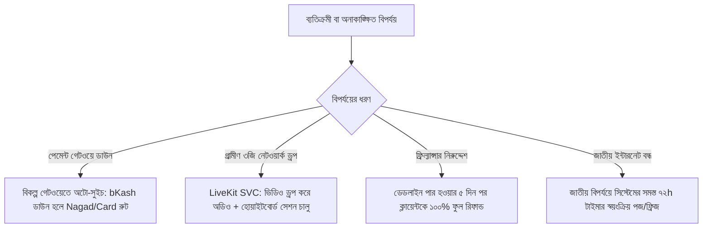

# 📋 পূর্ণাঙ্গ রিকোয়ারমেন্ট ভ্যালিডেশন রিপোর্ট (Requirement Validation Matrix)
## 🇧🇩 TVET Freelancing & Live Skill-Training SaaS Platform

**ডকুমেন্ট ভার্সন:** 1.0.0  
**রেফারেন্স ডকুমেন্ট:** `prd.md` (v1.2.0)  
**বিশ্লেষক:** Senior Product Analyst & Lead Business Analyst  
**তারিখ:** সেপ্টেম্বর ২০২৬  
**উদ্দেশ্য:** সিস্টেম ডিজাইন, ব্যাকএন্ড আর্কিটেকচার ও কোডিং শুরুর পূর্বে `prd.md`-এর সকল ফাংশনাল ও নন-ফাংশনাল প্রয়োজনীয়তার নিবিড় যাচাইকরণ (Validation), মিসিং ফ্লো চিহ্নিতকরণ, এজ-কেস ও এরর হ্যান্ডলিং কাঠামো প্রস্তুতকরণ।

---

## ১. 🔀 Missing Flow (অনুপস্থিত ও অপূর্ণাঙ্গ ইউজার ফ্লোসমূহ)

| ফ্লো আইডি | অনুপস্থিত/অসম্পূর্ণ ফ্লো | সমস্যা ও প্রয়োজনীয়তা | প্রস্তাবিত স্ট্যান্ডার্ড সলিউশন ফ্লো |
| :--- | :--- | :--- | :--- |
| **MF-01** | **অ্যাকাউন্ট ডিঅ্যাক্টিভেশন ও ডিলিট ফ্লো (Account Deactivation / Deletion)** | ব্যবহারকারী (Freelancer/Client) অ্যাকাউন্ট ডিলিট করতে চাইলে তার সক্রিয় এসক্রো অর্ডার বা ওয়ালেটে থাকা ফান্ডের কী হবে তা উল্লেখ নেই। | **রুল:** активный `ESCROW_LOCKED` বা `IN_PROGRESS` অর্ডার থাকলে ডিলিট রিকোয়েস্ট ব্লক থাকবে। ওয়ালেটে উইথড্রয়েবল ব্যালেন্স থাকলে আগে bKash/Bank-এ পে-আউট বাধ্যতামূলক। ডেটাবেসে soft-delete (`isDeleted: true`) হবে এবং আর্থিক অডিট ট্রেইলের জন্য লেজার রেকর্ড ১ বছর সংরক্ষিত থাকবে। |
| **MF-02** | **সরাসরি গেটওয়ে রিফান্ড ফ্লো (Payment Channel Reverse Refund)** | ডিসপিউট বা ক্যান্সেলেশনে ক্লায়েন্টকে রিফান্ড দেওয়ার সময় টাকা কীভাবে পৌঁছাবে (সরাসরি bKash/Nagad গেটওয়ে দিয়ে নাকি প্ল্যাটফর্ম ওয়ালেট ক্রেডিট হিসেবে)? | ক্লায়েন্টের পছন্দ অনুযায়ী দুটি বিকল্প: <br>১. **Instant Platform Wallet Balance** (ভবিষ্যতের কাজের জন্য সরাসরি রি-ইউজযোগ্য, ০% প্রসেসিং ফি)। <br>২. **Direct Source Refund** (bKash/Nagad/SSLCommerz রিফান্ড API কল করে ৩-৫ কার্যদিবসে মূল অ্যাকাউন্টে ফেরত পাঠানো)। |
| **MF-03** | **ইনস্টিটিউট থেকে শিক্ষক অব্যাহতির ফ্লো (Instructor Offboarding / De-linking)** | পলিটেকনিক বা TTC থেকে কোনো ইনস্ট্রাক্টর চাকরি ছেড়ে দিলে বা বদলি হলে তার পরিচালিত ক্লাসরুম ও কোর্সের কী হবে? | `INSTITUTE_ADMIN` শিক্ষককে De-link করতে পারবেন। শিক্ষকের তৈরি করা সমস্ত ব্যাচ রুটিন, ক্লাসের রেকর্ডিং ও CBT&A লগবুক প্রতিষ্ঠানের স্বত্বাধিকার (`tenantId`) হিসেবে অক্ষুণ্ণ থাকবে। নতুন ইনস্ট্রাক্টরকে উক্ত ব্যাচে Re-assign করার স্বয়ংক্রিয় উইজার্ড চালু হবে। |
| **MF-04** | **শিক্ষার্থীর প্রতিষ্ঠান পরিবর্তন ফ্লো (Student Institute Migration)** | পলিটেকনিক শিক্ষার্থী এক ক্যাম্পাস/টিটিসি থেকে অন্য ক্যাম্পাসে মাইগ্রেশন করলে তার পূর্বের CBT&A মূল্যায়ন রেকর্ড স্থানান্তরের ফ্লো। | স্টুডেন্টের NID/BTEB রেজিস্ট্রেশনের বিপরীতে একটি কেন্দ্রীয় গ্লোবাল প্রোফাইল থাকবে। নতুন প্রতিষ্ঠান রিকোয়েস্ট পাঠালে পূর্ববর্তী প্রতিষ্ঠান অনুমোদন দিলে CBT&A কম্পিটেন্সি ডাটা নতুন `tenantId`-তে সিঙ্ক হবে। |
| **MF-05** | **SaaS সাবস্ক্রিপশন ল্যাপস ও গ্রেস পিরিয়ড ফ্লো (Subscription Grace Period & Downgrade)** | কোনো পলিটেকনিক/TTC মাসিক SaaS ফি সময়মতো পরিশোধ না করলে তাদের পোর্টাল কি সাথে সাথে বন্ধ হয়ে যাবে? | **ফ্লো:** রিনিউয়াল মিস হলে ৭ দিনের **Grace Period** থাকবে (সম্পূর্ণ অ্যাক্সেস সচল)। ৭ দিন পর **Read-Only Mode** (শিক্ষার্থীরা ক্লাস দেখতে পারবে কিন্তু নতুন ব্যাচ/ল্যাব তৈরি বন্ধ)। ৩০ দিন পর সাব-ডোমেন সাময়িক সাসপেন্ড কিন্তু ডাটা ব্যাকআপ ১২ মাস সংরক্ষিত থাকবে। |
| **MF-06** | **ডিসপিউট আপিল ফ্লো (Dispute Arbitration Appeal Flow)** | সুপার অ্যাডমিন আরবিট্রেটর রায় দেওয়ার পর কোনো পক্ষ সংক্ষুব্ধ হলে আপিল করার কোনো সুযোগ আছে কি না। | অ্যাডমিন সিদ্ধান্তের পর ৪৮ ঘণ্টার মধ্যে ১ বার **"Request Final Review"** বাটন সক্রিয় থাকবে, যেখানে নতুন অতিরিক্ত ডকুমেন্ট/প্রমাণ আপলোড সাপেক্ষে চিফ আরবিট্রেটর চূড়ান্ত রিভিউ দেবেন। |

---

## ২. ⚠️ Edge Cases (প্রান্তিক জটিল পরিস্থিতি ও কর্নার কেস)

### EC-01: ৭২ ঘণ্টার অটো-অ্যাপ্রুভালের শেষ মুহূর্তে রিভিশন রিকোয়েস্ট (Last-Minute Revision Request)
* **পরিস্থিতি:** ট্রেইনার কাজ জমা দেওয়ার ৭১ ঘণ্টা ৫৯ মিনিটে ক্লায়েন্ট অসম্পূর্ণ বা অযৌক্তিক রিভিশন রিকোয়েস্ট পাঠিয়ে টাইমার রিসেট করে দিল।
* **সমাধান:** 
  1. ক্লায়েন্টকে রিভিশন চাইতে হলে ন্যূনতম ১০০ ক্যারেক্টারের সুনির্দিষ্ট কারণ ও চেকলিস্ট পূরণ করতে হবে।
  2. প্রতি অর্ডারে টায়ার অনুযায়ী সর্বোচ্চ ১–৩টি রিভিশন অনুমোদিত। রিভিশন লিমিট শেষ হয়ে গেলে ক্লায়েন্টকে কাজ গ্রহণ করতে হবে অথবা আনুষ্ঠানিক ডিসপিউট ওপেন করতে হবে।

### EC-02: ডেলিভারি টাইমার বাঁচাতে ত্রুটিপূর্ণ বা খালি ফাইল আপলোড (Fake/Empty File Delivery)
* **পরিস্থিতি:** ফ্রিল্যান্সার ডেডলাইন ফেইল হওয়া থেকে বাঁচতে খালি বা করাপ্টেড জিপ ফাইল আপলোড করে ডেলিভারি মার্ক করল।
* **সমাধান:** 
  * ফাইল সাইজ ভ্যালিডেশন (ন্যূনতম ১ KB-এর বেশি এবং নির্দিষ্ট ফরম্যাট: `.dwg`, `.dxf`, `.step`, `.sldprt`, `.zip`, `.pdf`)।
  * ক্লায়েন্ট ২৪ ঘণ্টার মধ্যে "Invalid/Empty File" রিপোর্ট করলে ডেলিভারি বাতিল হয়ে আগের ডেডলাইনেই কাউন্টডাউন চালু হবে এবং ফ্রিল্যান্সারের প্রোফাইলে ফ্ল্যাগ পড়বে।

### EC-03: লাইভ ক্লাসে বিদ্যুৎ বা নেটওয়ার্ক বিভ্রাটে উপস্থিতির ঘাটতি (Network Dropout During Live Lab)
* **পরিস্থিতি:** ৮০%+ উপস্থিতির শর্তে QR সার্টিফিকেট দেওয়া হয়, কিন্তু গ্রামীণ এলাকায় বিদ্যুৎ চলে যাওয়ায় ছাত্র ৭৫% উপস্থিত থাকতে পারল।
* **সমাধান:** 
  * লাইভ ক্লাসে অংশ নিতে না পারা শিক্ষার্থীরা পরবর্তী ৪৮ ঘণ্টার মধ্যে ক্লাউড রেকর্ডিং ১০০% দেখলে এবং ক্লাসের শেষে দেওয়া একটি ৩-প্রশ্নের কুইজ পাস করলে স্বয়ংক্রিয়ভাবে উপস্থিতি অ্যাডজাস্ট হয়ে যাবে।

### EC-04: একই সাথে মাল্টিপল ডিভাইস থেকে ব্যালেন্স উইথড্রয়াল (Concurrent Double Spending Attack)
* **পরিস্থিতি:** ফ্রিল্যান্সারের ওয়ালেটে ৳৫,০০০ আছে। সে দুটি ব্রাউজার ট্যাব থেকে একই মিলিসেকেন্ডে ৳৫,০০০ করে দুটি উইথড্রয়াল রিকোয়েস্ট ট্রিগার করল।
* **সমাধান:** 
  * MongoDB Atlas Multi-Document ACID ট্রানজেকশনে `SELECT FOR UPDATE` সমতুল্য ডিস্ট্রিবিউটেড মিউটেক্স লক (`Redis Distributed Lock / Redlock`) প্রয়োগ করা হবে।
  * প্রথম রিকোয়েস্ট ওয়ালেটের স্টেট `PROCESSING_PAYOUT`-এ নিয়ে যাবে, ফলে দ্বিতীয় রিকোয়েস্ট "Insufficient with-drawable balance" এরর রিটার্ন করবে।

### EC-05: কোর্স ফি কালেকশনের পর ব্যাচ বাতিল হওয়া (Batch Cancellation Post Fee Collection)
* **পরিস্থিতি:** পলিটেকনিক অনলাইন স্পেশাল ব্যাচের জন্য ৫০ জন ছাত্র থেকে ২,০০০ টাকা করে ফি নিল, কিন্তু শিক্ষক অসুস্থ হওয়ায় ব্যাচ বাতিল করা হলো।
* **সমাধান:** 
  * ইনস্টিটিউট অ্যাডমিন ব্যাচ ক্যানসেল করার সাথে সাথে সিস্টেম স্বয়ংক্রিয় ব্যাচ রিফান্ড পাইপলাইন চালু করবে। 
  * প্রতিটি ছাত্রের ওয়ালেট বা মূল bKash নম্বরে স্বয়ংক্রিয়ভাবে ১০০% ফি ক্রেডিট হয়ে যাবে এবং প্ল্যাটফর্মের ৫% ফি রিভার্স হবে।

---

## ৩. 🛠️ Error Handling (ত্রুটি ব্যবস্থাপনা ও রিকভারি মেকানিজম)

| এরর কোড / সিনারিও | ট্রিগার হওয়ার কারণ | সিস্টেমের রেসপন্স ও ফলব্যাক লজিক | ব্যবহারকারীকে দেখানো বার্তা (UI Message) |
| :--- | :--- | :--- | :--- |
| **ERR_PAY_GATEWAY_TIMEOUT** | bKash/Nagad গেটওয়েতে টাকা কেটে নিয়েছে কিন্তু সার্ভারে কলব্যাক আসেনি। | ব্যাকএন্ড থেকে গেটওয়ের `Query Payment API` দিয়ে স্টেটাস রি-চেক করা হবে। ট্রানজেকশন সফল হলে এসক্রো সক্রিয় হবে, ব্যর্থ হলে ৫ মিনিটে অটো-রিট্রাই জব চালু হবে। | *"আপনার লেনদেনটি গেটওয়েতে যাচাই করা হচ্ছে। অনুগ্রহ করে ২ মিনিট অপেক্ষা করুন। অর্থ কর্তন হয়ে থাকলে তা স্বয়ংক্রিয়ভাবে যোগ হবে।"* |
| **ERR_PORICHOY_API_DOWN** | সরকারি Porichoy API ডাউন বা রেসপন্স টাইমআউট ($> ১০$ সেকেন্ড)। | সাইন-আপ আটকে থাকবে না। স্ট্যাটাস `KYC_PENDING_MANUAL` হবে। ব্যাক-অফিস অ্যাডমিন প্যানেলে ম্যানুয়াল NID ক্রস-চেকিং কিউতে চলে যাবে। | *"স্বয়ংক্রিয় পরিচয় যাচাই সার্ভার বর্তমানে ব্যস্ত। আমাদের টিম ২৪ ঘণ্টার মধ্যে আপনার তথ্য যাচাই করে অ্যাকাউন্ট সক্রিয় করবে।"* |
| **ERR_LIVEKIT_SFU_DISCONNECT** | লাইভ ক্লাসরুম চলাকালীন লাইভকিট মিডিয়া নোড রিস্টার্ট বা ব্রডকাস্ট ক্র্যাশ। | ক্লায়েন্ট SDK স্বয়ংক্রিয়ভাবে এক্সপোনেনশিয়াল ব্যাকঅফ দিয়ে ৫ বার রিকানেক্ট চেষ্টা করবে। ব্যর্থ হলে সেকেন্ডারি ক্লাস্টার নোডে রি-রুট হবে। | *"ভিডিও সার্ভারের সাথে সংযোগ বিচ্ছিন্ন হয়েছে। পুনঃসংযোগ স্থাপন করা হচ্ছে... (চেষ্টা ১/৫)"* |
| **ERR_STORAGE_QUOTA_EXCEEDED** | সাবস্ক্রাইবার প্রতিষ্ঠানের ক্লাউড স্টোরেজ সীমা (যেমন: ৫০ GB) ১০০% পূর্ণ। | আপলোড রিকোয়েস্ট ব্লক হবে (HTTP 403), তবে চলমান লাইভ ক্লাস বন্ধ হবে না। অ্যাডমিনের স্ক্রিনে ব্যানার আসবে। | *"আপনার প্রতিষ্ঠানের ক্লাউড স্টোরেজ সম্পূর্ণ পূর্ণ। নতুন ক্লাস রেকর্ড সংরক্ষণ করতে দয়া করে স্টোরেজ টিয়ার আপগ্রেড করুন।"* |
| **ERR_CHAT_CONTACT_LEAK** | চ্যাটবক্সে ক্লায়েন্ট/ফ্রিল্যান্সার ফোন নম্বর বা bKash নম্বর পাঠিয়েছে। | মেসেজ পাঠানো ব্লক হবে (HTTP 422)। ডেটাবেসে অডিট লগ ইনসার্ট হবে এবং সতর্কবার্তা ফ্ল্যাশ করবে। | *"নিরাপত্তার স্বার্থে চ্যাটবক্সে মোবাইল নম্বর, ব্যাংক বা বিকাশ তথ্য আদান-প্রদান সম্পূর্ণ নিষিদ্ধ। প্ল্যাটফর্মের বাইরে লেনদেন করলে আর্থিক ক্ষতির দায়িত্ব প্ল্যাটফর্ম নেবে না।"* |

---

## ৪. 🛡️ Security & Compliance (নিরাপত্তা ও কমপ্লায়েন্স কন্ট্রোল)

```mermaid
flowchart LR
    Request[ইনকামিং HTTP/WebSocket রিকোয়েস্ট] --> WAF[Cloudflare WAF & DDoS Protection]
    WAF --> Helmet[Express Helmet: CSP, HSTS, XSS Protection]
    Helmet --> RateLimiter[Redis IP & UID Rate Limiter]
    RateLimiter --> Auth[Firebase Token Signature Verification]
    Auth --> TenantGuard[Multi-Tenant Isolation Guard: req.tenantId]
    TenantGuard --> RBAC[Role & Permission Validator]
    RBAC --> Controller[Business Logic / Database ACID Engine]
```



### ৪.১ ক্লায়েন্ট-সাইড অ্যান্টি-পাইরেসি ওয়াটারমার্ক প্রটেকশন
* **ঝুঁকি:** ব্রাউজারের DevTools দিয়ে ইন্সপেক্ট করে HTML/DOM ওয়াটারমার্ক উপাদানটি `display: none` করে স্ক্রিন রেকর্ড করা সম্ভব।
* **প্রতিরোধ মেকানিজম:**
  1. লাইভ ক্লাসরুমের ওয়াটারমার্ক সাধারণ DOM এলিমেন্ট হিসেবে থাকবে না; এটি সরাসরি HTML5 Canvas-এ WebRTC ভিডিও ফ্রেমের সাথে পিক্সেল-লেভেলে ব্লেন্ড হয়ে রেন্ডার হবে।
  2. ব্রাউজারে F12, Right-Click, PrintScreen ও DevTools ওপেন ইভেন্ট ডিটেক্ট করলে ভিডিও স্ট্রিমে সাময়িক ব্ল্যাক স্ক্রিন ইন্টারাপ্ট হবে।

### ৪.২ ইনপুট স্যানিটাইজেশন ও NoSQL ইনজেকশন গার্ড
* MongoDB Operator Injection প্রতিরোধে `express-mongo-sanitize` মিডলওয়্যার ব্যবহার বাধ্যতামূলক, যাতে কুয়েরি প্যারামিটারে `$gt`, `$ne`, `$where` ইত্যাদি নিষিদ্ধ থাকে।
* অর্ডার স্ট্যাটাস আপডেট করার ক্ষেত্রে কড়া প্যারামিটার হোয়াইটলিস্টিং:
  ```typescript
  // Allowed state transitions strictly mapped
  const VALID_TRANSITIONS: Record<OrderStatus, OrderStatus[]> = {
    ESCROW_LOCKED: ["IN_PROGRESS", "CANCELLED_BY_ADMIN"],
    IN_PROGRESS: ["DELIVERED", "DISPUTED"],
    DELIVERED: ["APPROVED", "REVISION_REQUESTED", "AUTO_APPROVED", "DISPUTED"],
    REVISION_REQUESTED: ["DELIVERED", "DISPUTED"],
    DISPUTED: ["REFUNDED", "RESOLVED_SPLIT", "RELEASED_TO_SELLER"],
    APPROVED: ["SETTLED"],
    AUTO_APPROVED: ["SETTLED"]
  };
  ```

### ৪.৩ পেমেন্ট গেটওয়ে ওয়েবহুক স্পুফিং রোধ (Webhook Cryptographic Verification)
* **ঝুঁকি:** হ্যাকাররা নকল `POST /api/v1/payments/bkash/callback` পাঠিয়ে বিনা টাকায় অর্ডার `PAID` করিয়ে নিতে পারে।
* **প্রতিরোধ:** 
  1. গেটওয়ের পাঠানো প্রতিটি কলব্যাকের হেডার সিগনেচার (HMAC-SHA256 Secret) দিয়ে ভ্যালিডেট করতে হবে।
  2. কলব্যাকের তথ্যের ওপর ভিত্তি করে সরাসরি স্ট্যাটাস পরিবর্তন করা যাবে না; সার্ভার নিজে ব্যাকগ্রাউন্ডে bKash Payment Query API কল করে পেমেন্টের স্ট্যাটাস `Completed` যাচাই করার পরই এসক্রো লক নিশ্চিত করবে।

### ৪.৪ সংবেদনশীল ব্যক্তিগত তথ্যের এনক্রিপশন (Data at Rest)
* ব্যবহারকারীর NID নম্বর, জন্মতারিখ এবং ব্যাংক অ্যাকাউন্ট নম্বর ডেটাবেসে সাধারণ টেক্সট (Plain Text) হিসেবে রাখা সম্পূর্ণ নিষিদ্ধ।
* এগুলো **AES-256-GCM** অ্যালগরিদম ব্যবহার করে এনক্রিপ্ট করে সংরক্ষণ করতে হবে। এনক্রিপশন কি (`ENCRYPTION_KEY`) পরিবেশ ভেরিয়েবলে (Environment Variable / Secrets Manager) সুরক্ষিত থাকবে।

---

## ৫. ✅ Validation Rules (ইনপুট ভ্যালিডেশন ও ডেটা ইন্টিগ্রিটি ম্যাট্রিক্স)

| ফিল্ডের নাম | প্রযোজ্য স্থান | ভ্যালিডেশন নিয়মাবলী ও রেজেক্স (Regex) | ব্যর্থ হলে এরর রেসপন্স |
| :--- | :--- | :--- | :--- |
| **মোবাইল নম্বর** | সাইন-আপ ও পে-আউট | ফরম্যাট: `^(?:\+?88)?01[3-9]\d{8}$` (বাংলাদেশি ভ্যালিড অপারেটর নম্বর)। | *"সঠিক ১১ ডিজিটের বাংলাদেশি মোবাইল নম্বর প্রদান করুন।"* |
| **জাতীয় পরিচয়পত্র (NID)** | KYC ভেরিফিকেশন | ১০ ডিজিটের স্মার্ট কার্ড অথবা ১৩/১৭ ডিজিটের সাধারণ NID। কোনো স্পেশাল ক্যারেক্টার গ্রহণযোগ্য নয়। | *"সঠিক ১০, ১৩ বা ১৭ ডিজিটের NID নম্বর প্রদান করুন।"* |
| **BTEB রেজিস্ট্রেশন ও রোল** | BTEB ট্র্যাক KYC | রোল: ৬ ডিজিটের সংখ্যা; রেজিস্ট্রেশন: ৮-১০ ডিজিটের সংখ্যা। | *"কারিগরি বোর্ডের সঠিক রোল ও রেজিস্ট্রেশন নম্বর লিখুন।"* |
| **গিগ ও কাস্টম অফার প্রাইসিং** | মার্কেটপ্লেস | সর্বনিম্ন গিগ মূল্য: ৳৩০০; সর্বোচ্চ গিগ মূল্য: ৳১,৫০,০০০। পূর্ণসংখ্যা হতে হবে। | *"অর্ডারের মূল্য ন্যূনতম ৳৩০০ হতে হবে।"* |
| **মাইলস্টোন প্রাইসিং** | উচ্চমূল্যের কাজ | প্রতিটি মাইলস্টোনের মূল্য ন্যূনতম ৳২,০০০ এবং সকল মাইলস্টোনের যোগফল মোট মূল্যের সমান হতে হবে। | *"সকল মাইলস্টোনের যোগফল মোট কন্ট্রাক্ট মূল্যের সমান হতে হবে।"* |
| **ইনস্টিটিউট সাব-ডোমেন** | SaaS অনবোর্ডিং | `^[a-z0-9](?:[a-z0-9-]{1,28}[a-z0-9])$` (৩-৩০ ক্যারেক্টার, রিজার্ভড শব্দ নিষিদ্ধ: `api`, `admin`, `mail`, `superadmin`, `billing`) | *"সাবডোমেনে শুধু ছোট হাতের ইংরেজি অক্ষর, সংখ্যা ও হাইফেন ব্যবহারযোগ্য।"* |
| **ফাইল আপলোড এক্সটেনশন** | ডেলিভারি ও KYC | গ্রহণযোগ্য: `.pdf`, `.zip`, `.rar`, `.dwg`, `.dxf`, `.step`, `.sldprt`, `.jpg`, `.png`। এক্সিকিউটেবল (`.exe`, `.bat`, `.sh`, `.js`) সম্পূর্ণ নিষিদ্ধ। | *"এই ফাইল ফরম্যাটটি অনুমোদিত নয়। ড্রয়িং ফাইল বা জিপ ফরম্যাটে আপলোড করুন।"* |

---

## ৬. 🔑 Permission Matrix (RBAC & Multi-Tenant Access Control)

| ফিচার / এন্ডপয়েন্ট | `SUPER_ADMIN` | `INSTITUTE_ADMIN` | `INSTITUTE_INSTRUCTOR` | `FREELANCER` | `CLIENT` | `STUDENT` | `ENTERPRISE_RECRUITER` |
| :--- | :---: | :---: | :---: | :---: | :---: | :---: | :---: |
| **গিগ তৈরি ও কাস্টম অফার পাঠানো** | ❌ | ❌ | ❌ | ✅ | ❌ | ❌ | ❌ |
| **গিগ অর্ডার ও এসক্রো ফান্ডিং** | ❌ | ❌ | ❌ | ❌ | ✅ | ❌ | ✅ |
| **অর্ডার ডেলিভারি ও ফাইল সাবমিশন** | ❌ | ❌ | ❌ | ✅ | ❌ | ❌ | ❌ |
| **ডেলিভারি অনুমোদন ও রিভিশন চাওয়া** | ❌ | ❌ | ❌ | ❌ | ✅ | ❌ | ✅ |
| **ডিসপিউট আরবিট্রেশন ও ফান্ড স্প্লিট** | ✅ | ❌ | ❌ | ❌ | ❌ | ❌ | ❌ |
| **উইথড্রয়াল রিকোয়েস্ট (Balance Payout)** | ❌ | ❌ | ❌ | ✅ | ❌ | ❌ | ❌ |
| **ইনস্টিটিউট হোয়াইট-লেবেল কনফিগারেশন** | ❌ | ✅ | ❌ | ❌ | ❌ | ❌ | ❌ |
| **ট্রেড, ব্যাচ ও শিফট তৈরি** | ❌ | ✅ | ❌ | ❌ | ❌ | ❌ | ❌ |
| **CBT&A লগবুক মূল্যায়ন (C / NYC)** | ❌ | ✅ | ✅ | ❌ | ❌ | ❌ | ❌ |
| **১-ক্লিক SEIP/ASSET সরকারি অডিট এক্সপোর্ট**| ❌ | ✅ | ❌ | ❌ | ❌ | ❌ | ❌ |
| **টিউশন ফি কালেকশন ও লেজার দেখা** | ❌ | ✅ | ❌ | ❌ | ❌ | ❌ | ❌ |
| **লাইভ সেন্ট্রাল ল্যাব স্ট্রিম ব্রডকাস্ট** | ❌ | ❌ | ✅ | ✅ | ❌ | ❌ | ❌ |
| **লাইভ ক্লাস দেখা ও QR সার্টিফিকেট প্রাপ্তি**| ❌ | ❌ | ❌ | ❌ | ❌ | ✅ | ❌ |
| **অ্যালামনাই গ্র্যাজুয়েট ট্যালেন্ট সার্চ** | ❌ | ✅ | ❌ | ❌ | ❌ | ❌ | ✅ |

* **মাল্টি-টেন্যান্সি গার্ড পলিসি:** প্রতিটি ডাটাবেস কুয়েরিতে `tenantId` বাধ্যতামূলক। উদাহরণস্বরূপ, ঢাকা পলিটেকনিকের অ্যাডমিন কোনোভাবেই চট্টগ্রাম পলিটেকনিকের শিক্ষার্থীর তথ্য বা অডিট এক্সপোর্ট দেখতে পারবেন না (`tenantId: req.user.tenantId`)।

---

## ৭. 🔔 Notification Architecture & Event Matrix (নোটিফিকেশন ম্যাট্রিক্স)

| ইভেন্ট ট্রিগার | প্রাপক | চ্যানেল (SMS / Push / Socket / Email) | নোটিফিকেশন মেসেজ টেমপ্লেট |
| :--- | :--- | :--- | :--- |
| **অর্ডার চালু ও এসক্রো লক** | Freelancer | Push + In-App Socket + SMS | *"অভিনন্দন! [Client Name] আপনার গিগে ৳[Amount]-এর অর্ডার করেছেন। এসক্রোতে ফান্ড লক হয়েছে। কাজ শুরু করুন।"* |
| **কাজ ডেলিভারি সম্পন্ন** | Client | Push + In-App Socket + Email | *"[Freelancer Name] আপনার অর্ডার ডেলিভারি দিয়েছেন। কাজ পর্যালোচনা করুন। আগামী ৭২ ঘণ্টার মধ্যে অনুমোদন না দিলে স্বয়ংক্রিয়ভাবে ফান্ড রিলিজ হবে।"* |
| **অটো-অ্যাপ্রুভাল কাউন্টডাউন অ্যালার্ট** | Client | SMS + Push (২৪ ও ৭০ ঘণ্টায়) | *"সতর্কবার্তা: আপনার অর্ডারের ৭২ ঘণ্টার অটো-অ্যাপ্রুভালের আর মাত্র ২ ঘণ্টা বাকি আছে। প্রয়োজন হলে রিভিশন চান অথবা কাজ অনুমোদন করুন।"* |
| **ফান্ড উইথড্রয়েবল হওয়া (৪৮h পর)**| Freelancer | Push + In-App Socket | *"আপনার অর্ডারের ফান্ড সফলভাবে ক্লিয়ার হয়েছে! ৳[Amount] এখন আপনার উত্তোলনযোগ্য ওয়ালেটে প্রস্তুত।"* |
| **লাইভ ক্লাস শুরুর রিমাইন্ডার** | Student & Instructor | Push + In-App (১৫ মিনিট পূর্বে) | *"আপনার লাইভ প্র্যাকটিক্যাল ল্যাব '[Topic Name]' ১৫ মিনিটের মধ্যে শুরু হতে যাচ্ছে। প্রস্তুত থাকুন।"* |
| **ডিসপিউট টিকেট ওপেন** | Super Admin & Both Parties | Email + Push + In-App Socket | *"অর্ডার #[ID]-তে একটি বিরোধ তৈরি হয়েছে। উভয় পক্ষের চ্যাট হিস্ট্রি ও ডেলিভারি ফাইল এভিডেন্স লকারে সংরক্ষিত হয়েছে।"* |
| **SaaS ক্লাউড স্টোরেজ সতর্কতা** | Institute Admin | Email + In-App Banner (৯৫% পূর্ণ হলে) | *"জরুরি: আপনার প্রতিষ্ঠানের ক্লাউড স্টোরেজ ৯৫% পূর্ণ হয়েছে। নিরবচ্ছিন্ন ব্যবহারিক ক্লাস নিশ্চিত করতে টিয়ার আপগ্রেড করুন।"* |
| **NSDA সনদের মেয়াদ সতর্কতা** | Freelancer | Email + SMS (৩০ দিন ও ৭ দিন পূর্বে) | *"আপনার NSDA NTVQF লেভেল সনদের মেয়াদ আগামী [Date]-এ শেষ হবে। ব্যাজ সচল রাখতে নতুন সনদ আপলোড করুন।"* |

---

## ৮. ⚡ Exception Handling (ব্যতিক্রমী পরিস্থিতি ও ফলব্যাক মেকানিজম)



### ৮.১ পেমেন্ট গেটওয়ের সম্পূর্ণ অচলাবস্থা (Gateway Fallback Cascade)
* যদি bKash গেটওয়ে টানা ৩টি ট্রানজেকশনে টাইমআউট দেয়, সিস্টেমের হেলথচেক সার্ভিস স্বয়ংক্রিয়ভাবে চেকআউট পেজে bKash-কে "Temporarily Busy" দেখিয়ে গ্রাহককে Nagad বা SSLCommerz দিয়ে পেমেন্ট করার জন্য উৎসাহিত করবে।

### ৮.২ ইন্টারনেটের চরম ধীরগতিতে ক্লাসরুম ফলব্যাক (Adaptive Media Degradation)
* যখন কোনো শিক্ষার্থীর সংযোগ স্পিড $< 128\text{ kbps}$-এ নেমে যায়, LiveKit SFU স্বয়ংক্রিয়ভাবে ভিডিও স্ট্রিম রিসিভ করা বন্ধ করে দেবে। 
* শিক্ষার্থী কোনো প্রকার বাফারিং ছাড়া শুধু ট্রেইনারের কথা (Opus Audio @ 16 kbps) এবং ইন্টারেক্টিভ সার্কিট বোর্ডের ভেক্টর ড্রয়িং দেখতে পাবে, যাতে প্রান্তিক গ্রাম থেকেও ক্লাস সম্পন্ন করা যায়।

### ৮.৩ ফ্রিল্যান্সার কাজ না দিয়ে নিষ্ক্রিয় হয়ে পড়া (Seller Abandonment)
* যদি ফ্রিল্যান্সার কোনো ফাইল ডেলিভারি না দিয়ে অর্ডার ডেডলাইনের পর টানা ৫ দিন (১২০ ঘণ্টা) কোনো চ্যাট বা রেসপন্স না করে, তবে সিস্টেম সরাসরি অর্ডারটি বাতিল করে ক্লায়েন্টের অ্যাকাউন্টে ১০০% টাকা রিফান্ড করবে এবং ফ্রিল্যান্সারের "On-time Delivery Score" ২৫% কমিয়ে দেবে।

### ৮.৪ জাতীয় বিপর্যয় বা সাধারণ ইন্টারনেট ব্ল্যাকআউট (National Emergency Clock Freeze)
* বাংলাদেশে অতীতে ঘটে যাওয়া ইন্টারনেট ব্ল্যাকআউট বা জাতীয় দুর্যোগের মতো পরিস্থিতিতে সুপার অ্যাডমিন প্যানেলে একটি **"Emergency System Freeze"** টগল থাকবে। এটি সক্রিয় করলে সকল চলমান অর্ডারের ডেলিভারি ডেডলাইন এবং ৭২ ঘণ্টার অটো-অ্যাপ্রুভাল কাউন্টডাউন সাময়িকভাবে স্থগিত থাকবে, যাতে ইন্টারনেট না থাকার কারণে কোনো ক্লায়েন্ট বা ফ্রিল্যান্সার অন্যায্যভাবে ক্ষতিগ্রস্ত না হয়।

---

## ৯. 🏁 সারসংক্ষেপ ও পরবর্তী পদক্ষেপ (Next Action Steps)

এই রিকোয়ারমেন্ট ভ্যালিডেশন ম্যাট্রিক্সের মাধ্যমে `prd.md`-এর প্রতিটি সূক্ষ্ম কারিগরি ও ব্যবসায়িক দিক সম্পূর্ণ সুরক্ষিত করা হয়েছে।

1. **`plan.md` আপডেট ও সিঙ্ক:** ভ্যালিডেশন ম্যাট্রিক্সের ৮টি বিষয় (বিশেষ করে Webhook Cryptographic Check, Canvas Watermark, এবং Emergency Freeze) ডেভেলপমেন্ট পরিকল্পনায় অন্তর্ভুক্ত করা।
2. **ডাটাবেস স্কিমা ডিজাইন:** Mongoose/MongoDB মডেলে `VALID_TRANSITIONS`, ডাবল-এন্ট্রি ব্যালেন্স ট্র্যাকিং ও `tenantId` ইন্ডেক্সিং নিশ্চিত করা।
3. **API কন্ট্রোলার প্রটোটাইপিং:** স্পেসিফিকেশন অনুযায়ী নোটিফিকেশন ও এরর হ্যান্ডলিং কোডবেসে ইমপ্লিমেন্ট করা।
